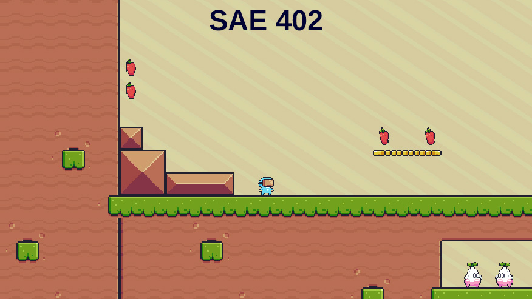
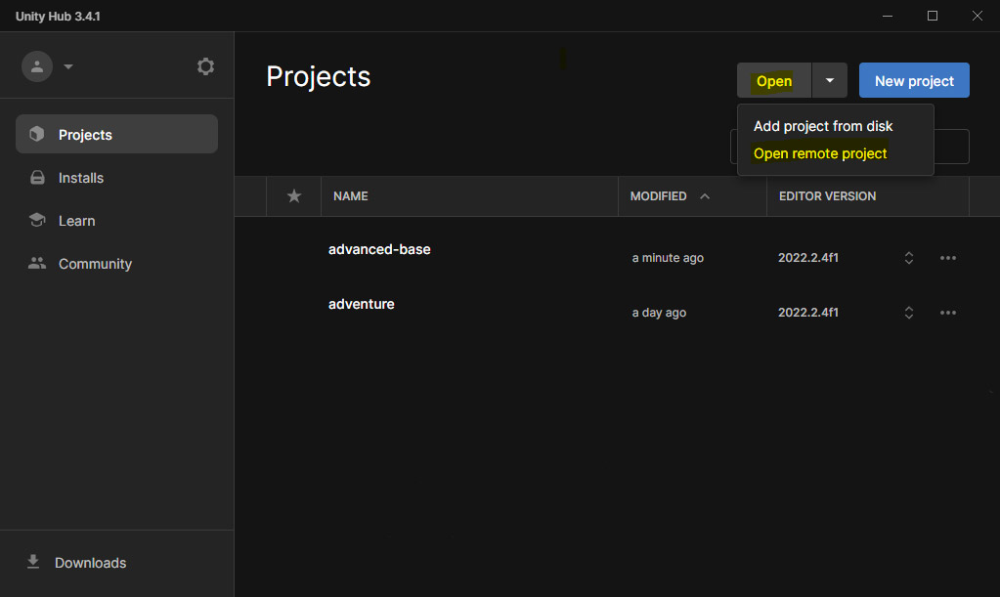
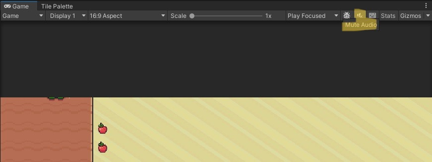

# SAE 402 - Concevoir un dispositif interactif
> _Les consignes pourront être modifiées et peuvent aborder des notions qui n'ont pas pu être vues en cours pour des questions de temps. La cas échéant ne prenez pas en compte ces consignes. Toutefois rien ne nous empêche d'essayer._

> **Note : Le projet a été développé avec une ancienne version d'Unity. Néanmoins, vous serez en capacité de l'ouvrir avec une version plus récente. Il est donc inutile de perdre du temps à installer une ancienne version d'Unity.**

> **Note 2 : Si vous avez besoin d'un rappel sur certains composants vus en cours, vous avez un [document à disposition.](../travaux-pratiques/numero-1/ressources/unity/MEMO-COMPOSANTS.md)**

> **Note 3 : Le projet utilise la [technologie URP](https://unity.com/srp/universal-render-pipeline), de ce fait, il est possible d'utiliser d'ajouter des lumières pour ajouter des effets. A noter qu'il y a déjà une lumière globale dans la scène "Level1" (MainLight)**

> **Note 4 : Merci de bien lire l'ensemble des consignes avant de poser des questions sur le projet.**

Dans le cadre du cours de création et design interatif, nous avons pu découvrir le logiciel Unity, il permet de réaliser des jeux vidéo de toutes sortes en 2D ou 3D. Le but de cette SAE sera donc de renforcer vos connaissances et d'en découvrir de nouvelles. Le tout dans le but de valider les Apprentissages Critiques (AC) suivants : 

- AC 23.02 | Définir une iconographie (illustrations, photographies, vidéos)
- AC 23.03 | Intégrer, produire ou développer des interactions riches ou des dispositifs interactifs
- ~~AC 23.04 | Imaginer, écrire et scénariser en vue d'une communication multimédia ou transmédia~~
- AC 23.06 | Élaborer et produire des animations, des designs sonores, des effets spéciaux, de la visualisation de données ou de la 3D

Vous ne partirez pas d'un nouveau projet mais d'un jeu de plate-formes existant.
> [Télécharger le projet](https://download-directory.github.io/?url=https%3A%2F%2Fgithub.com%2FDanYellow%2Fcours%2Ftree%2Fmain%2Fcreation-et-design-interactif-s4%2Fsamples%2Fadvanced-base)

> Pour ouvrir le projet, il faudra passer par Unity Hub. Ensuite, cliquer sur le bouton `Open` et sélectionner `Add Project From Disk` puis **le dossier** contenant le projet. 

L'import de projets se fait depuis l'Unity Hub, et non depuis le logiciel Unity.

> **Pour rappel, le projet a été développé avec une ancienne version d'Unity. Toutefois, vous serez en capacité de l'ouvrir avec une version plus récente. N'allez pas perdre du temps à installer une ancienne version d'Unity.**

Le projet possède déjà quelques mécaniques de jeu. Parmi ces mécaniques, vous trouverez :
- Gestion des déplacements du joueur
    - Déplacements horizontaux
    - Multi sauts
- Suivi du joueur par la caméra
- Ennemis :
    - Des fleurs qui tirent des projectiles à cadence variable quand on entre dans sa zone de trigger (BoxCollider2D)
    - Des pierres qui se divisent en deux lorsqu'on leur saute dessus
    - Des escargots qui projetent leur carapace quand ils sont touchés (non présents dans la scène mais dans les prefabs)
- Pièges :
    - Des rhinocéros qui foncent sur le joueur
    - RockHead : Une pierre qui fonce à intervalle régulier à des endroits fixes. La mécanique est semblable aux thwomps dans l'univers des jeux Super Mario
    - Scie : Statique ou mobile se déplaçant sur un circuit défini
    - Chaine : Une boule à épines qui pivote autour d'un axe défini
- Un ensemble de ScriptableObject de type évènementiels ou variables (Assets/Scripts/ScriptableObjects) :
    - Pause / Relance du jeu
    - Nombre de points de vie des ennemis de base
    - Tremblement de la caméra
    - Mort du joueur
    - ...
- Système de pause (Appui sur le bouton Echap)
- Un gestionnaire de bruitages / Musique
    - Les bruitages (par exemple, les pommmes à leur récupération) sont gérés via des ScriptableObject de type évènementiel `Assets/ScriptableObjects/Events/Values/OnSFXAudioChannel`

> Des Scripts pour l'éditeur Unity sont dans le projet, ils permettent de tester directement, en **Play mode**, les ScriptableObjects de type évènement `Assets/ScriptableObjects/Events/Values/`. Pratique.

Pensez donc bien à observer le code / le projet fournit pour travailler dans de bonnes conditions. Ce projet Unity contient quatre scènes (dossier `Assets/Scenes`) :
- Un menu d'accueil **[que vous devrez compléter voir plus bas](#liste-des-choses-impératives-à-faire-vous-devez-toutes-les-faire)** (MainMenu)
- Un niveau qui devra faire office de premier niveau (Level1)
- Une scène dite de bootstrap, elle sert, dans les grandes lignes, à précharger les éléments communs à toutes les scènes, par exemple, la gestion du son (_Preload)
    - [Plus d'explications sur le fonctionnement la scène de bootstrap - anglais](https://stackoverflow.com/questions/35890932/unity-game-manager-script-works-only-one-time/35891919#35891919)
    - Note : Vous n'avez pas besoin de la modifier
- Une scène de debug pour tester des fonctionnalités rapidement (Debug)
    - Inutile de la mettre dans le build final (à enlever dans le menu `File > Build Settings`)

> Le projet contient quelques Assets (`Assets/Imports`) qui n'ont pas forcément été utilisés, vous pouvez les utiliser, si vous le souhaitez. Les autres assets de cet univers, vous les avez récupérés lors du premier TP, mais si vous ne les avez plus, ils se trouvent ici : [Télécharger les assets](https://download-directory.github.io/?url=https%3A%2F%2Fgithub.com%2FDanYellow%2Fcours%2Ftree%2Fmain%2Fcreation-et-design-interactif-s4%2Ftravaux-pratiques%2Fnumero-1%2Fressources%2Funity)

Pour faciliter le développement, des raccouris (qui ne seront pas présents dans la version de build) ont été mis en place :
- Touche R : Relance le niveau actuel
- Touche M : Relance le dernier checkpoint (cette méthode est juste appelée, elle ne fait rien. Nous la ferons ensemble)
- Touche K : Change le mode d'affichage de l'onglet "Game" entre fenêtré et plein écran d'ans l'éditeur
- Touche L : Arrête le mode "Play"
- Touche 0 (pas celle du pavé numérique) : Permet d'accéder à la salle "Debug" pour s'assurer que les données sont correctement passées entre les scènes

# Commandes du jeu
- Flèches gauche et droite (touches q et d) : déplacement du joueur
- Flèche vers le bas (touche "s") : déplacement rapide vers le sol (en hauteur). Passer à travers certaines plate-formes
- Barre espace : Saut
- Pause / relance : Touche échap

## Liste des choses impératives à faire. **Vous devez toutes les faire**
- Compléter le niveau du projet en permettant au joueur de passer au niveau suivant
    - Il y a déjà des trophées (prefab) qui servent de fin de niveau, il faudra juste les compléter
- Compléter l'écran d'accueil (écran qui permet de commencer le jeu)
    - L'écran doit contenir : 
        - Le logo de l'université
            - Plusieurs versions sont déjà présentes dans le projet dans le dossier `Assets/Imports/Logos` à vous de choisir
        - Le nom du jeu
          - Vous devez en trouver un
          - Le logo peut être fait sous Photoshop ou autre puis intégré sous forme d'image dans Unity ou tout simplement du texte
        - De quoi commencer le jeu au premier niveau
            - Il y a déjà un bouton, il faut ajouter la fonction pour charger le premier niveau grâce au `GameObject` CurrentSceneManager
        - Un bouton pour permettre de quitter le jeu
        - Les développeurs / développeuses du jeu, le nom de la formation et l'année scolaire courante
    - Pour rappel, ici il faudra utiliser un Canvas
- Ajouter un nouveau niveau (décors, ennemis et mécaniques compris)
    - Vous pouvez utiliser le thème que vous souhaitez pour la décoration. Vous pouvez donc importer de nouvelles tilemaps ou utiliser celles déjà présentes dans le projet
    - Vous pouvez récupérer des mécanismes/ennemis déjà présents dans le premier niveau
     - Il est **impératif** d'avoir dans vos niveaux supplémentaires la prefab "CurrentSceneManager"
    - **Il doit être possible de terminer ce nouveau niveau**. Quand le niveau termine (au choix) :
        - Afficher les crédits
        - Retourner au menu principal
    - Vous pourrez trouver des inspirations ici :
        - [https://pixelfrog-assets.itch.io/pixel-adventure-1](https://pixelfrog-assets.itch.io/pixel-adventure-1)
        - [https://pixelfrog-assets.itch.io/pixel-adventure-2](https://pixelfrog-assets.itch.io/pixel-adventure-2)
- Ajouter un écran des crédits [(voir contenu attendu)](#contenu-de-lécran-des-crédits)
- Afficher dans la splash page de jeu le logo de l'université (voir menu `Project Settings > Player > Logo`)
    - [Didacticiel en anglais sur la personnalisation de la splash page](https://www.youtube.com/watch?v=BY40xbA5qYQ)
- Compléter le menu Pause
    - Il est déjà possible de mettre le jeu en pause en appuyant sur la touche "Echap"
    - La gestion du menu pause est faite grâce à un ScriptableObject (`Assets/ScriptableObjects/Events/Events/OnTogglePauseEvent`)
    - Libre à vous d'ajouter d'autres options dans le menu de pause comme relancer le niveau ou encore retourner au menu principal via un bouton
    - Le menu Pause doit **au minimum** contenir un bouton pour relancer le jeu et revenir au menu principal
    > Le menu Pause contient du texte. Toutefois, il est possible qu'il ne s'affiche pas. C'est lié à des packages Unity manquants. Pour ce faire, allez dans le menu d'Unity : `Window > TextMeshPro > Import TMP Essential Ressources.` Ceci va afficher une fenêtre, cliquez sur le bouton "Import" en bas à droite.  
- Afficher un indicateur du nombre de points de vie
    - Optionnel : possibilité de proposer le regain de vie
    - Note : Vous pouvez également décider qu'au moindre dégât le joueur meurt immédiatement
> La gestion des points de vie du joueur est gérée via un ScriptableObject. Qui gère à la fois le nombre de points de vie actuels et maximum. A noter que la valeur des points de vie actuels est "clampée", autrement dit, elle ne peut pas être inférieure à 0 ni supérieure au nombre de points de vie maximum définis. Si vous le souhaitez, vous pouvez supprimer ce comportement.

- Terminer la gestion de la mort du personnage. A l'heure actuelle, il y a :
    - un évènement (OnPlayerDeath) sur le GameObject "Player" (utilisable depuis l'onglet `Assets` en Play Mode)
    - une animation de mort du personnage (testable avec la touche N du clavier)
    - "Suppression" du Rigidbody2D associé (Passage de "Simulated" à "Non simulated"). Le personnage traverse les murs à la mort
    - La mort instanée si le joueur est écrasé par un RockHead ou que ses points de vie atteignent 0
    - **A vous de faire le reste** (liste non exhaustive)
      - Bloquer les mouvements du joueur
      - Afficher un écran de "Fin de partie"
      - ...
- Rajouter un ennemi parmi ceux proposés
    - Dans l'archive que vous avez récupéré au début des cours, il y a un dossier `ressources/unity/sprites/platformer/Enemies`
        - N'oubliez pas qu'il y déjà des scripts décrivant des comportants appliquables à un ennemi : Patrouille (EnemyPatrol), Tir (EnemyShooting + ObjectPooling), Santé (Enemy)... à vous de les réutiliser, au besoin, pour votre nouvel ennemi
        - Voir [gestion des ennemis](#gestion-des-ennemis) pour en savoir plus
- Remplacer les carrés bleus qui font office de checkpoints par un sprite plus approprié
    - Il y a un sprite dédié dans le projet (`Assets/Imports/Scripts/Misc/Checkpoint*`) 

## Liste des choses à faire au choix. Vous devez au moins en faire une (**deux si vous êtes plus de trois dans votre groupe**)
- Ajouter une musique. Vous pourrez en trouver sur ces sites :
    - http://dig.ccmixter.org/games
    - https://www.playonloop.com/royalty-free-music/video-game-chiptune-music/
    - https://github.com/OpenSourceMusic
    - https://opengameart.org/
    - Rappel : la musique est gérée au niveau de la scène _Preload
- Des bruitages lors d'actions (sauts, tir...)
    - Vous avez un exemple de fonctionnement de bruitage dans la Prefab "Apple"
    - Pourquoi pas ne pas réaliser vous-même ces bruitages ?
- Ajouter une attaque "impact" alors qu'on appuie sur la flèche du bas durant un saut
    - Il faudra utiliser la méthode [Physics2D.OverlapAreaAll() (ou Physics2D.OverlapCircleAll())](https://docs.unity3d.com/ScriptReference/Physics2D.OverlapAreaAll.html) pour savoir qui a été touché dans une zone spécifique
    - Le joueur descend déjà plus vite si on appuie sur la flèche bas ou la touche S durant un saut
- Animer les checkpoints (Les carrés bleus dans le niveau)
    - Il y a un sprite dédié dans le projet (`Assets/Imports/Scripts/Misc/Checkpoint*`) 
- **Créer un** prop de votre choix (ennemi, bonus, panneau...) et l'intégrer dans le jeu
    - Pas besoin que votre props colle avec la direction artistique (DA) du jeu
    - Ce n'est pas du grand art qui est attendu. Si nous n'êtes pas à l'aise avec le dessin, un simple panneau est suffisant
    - Vous pouvez utiliser le logiciel gratuit [LibreSprite](https://libresprite.github.io/#!/) pour réaliser votre création en pixelart. Sinon, il y a Photoshop
- Expliquer comment le jeu fonctionne (les contrôles, mécaniques...)
    - Vous pouvez réaliser cette tâche via un niveau de didacticiel, un menu dédié ou tout simplement du texte affiché directement dans la scène
        - Il y a un sprite avec les différents contrôles et boutons dans les Assets que vous avez téléchargé. Si le sprite ne vous convient pas, vous pouvez également en télécharger un sur le site [thoseawesomeguys](https://thoseawesomeguys.com/prompts/), néanmoins les images sont séparées, il est préférable de tout fusionner en un sprite. Il est possible de générer des sprites avec un site comme [images-sprite-sheet-generator](https://codeshack.io/images-sprite-sheet-generator/)  
- Proposer une traduction de votre jeu en anglais (ou une autre langue)
    - Il existe le package gratuit "Localization" qui vous permet de gérer ceci. Voici un tutorial (en anglais) expliquant comment intégrer et utiliser le package.
        - Voir le tutoriel sur le [package Localization](https://www.youtube.com/watch?v=qcXuvd7qSxg)
    - Pensez bien à sauvegarder les préférences de l'utilisateur grâce au `PlayerPrefs`
- Ajouter une secousse de la caméra pour les actions suivantes :
    - Mort du joueur
    - Blessure du joueur
    
    Cette fonctionnalité est déjà présente notamment dans le fichier `Assets/Scripts/RockHead.cs` avec le ScriptableObject évènementiel de type `CameraShakeEventChannel`.
- Téléporter le joueur au dernier endroit où il a eu pied quand il tombe au lieu de le téléporter au dernier checkpoint le cas échéant
- Afficher, lorsqu'un niveau est terminé, le temps mis par le joueur pour terminer le niveau et d'autres statistiques (nombre d'ennemis éliminés, nombre de sauts...)
- Mettre en place un piège parmi ceux présents dans le dossier `sprites/platformer/Traps`
    - A vous de gérer le comportement : Est-ce que ça bouge ? Quels dégâts sont infligés ?
    - Note : Il y a un script dans le dossier `Assets/Scripts/Utils` nommé `Trap` qui gère de façon simple les dégâts sur le joueur
- Proposer au joueur de choisir un personnage. Ce choix peut être fait :
    - Au début du jeu, juste avant de commencer un niveau
    - Après chaque mort du joueur
    - Pour éviter de faire les animations pour chaque personnage Unity propose un système : https://www.youtube.com/watch?v=6mNak-mQZpc - anglais
        - Note : Comparé à la vidéo, l'interface d'Unity a un peu changé, mais le principe reste le même

    > Libre à vous de proposer des caractérisques différentes entre chaque personnage
- Générer des particules quand le personnage change de direction durant une course (Il existe des didactiels en ligne pour vous aider)
- Mettre en place des plateformes qui se déplacent automatiquement sur un chemin balisé via des GameObject. Il y a déjà un script `Scripts/Utils/WaypointManager.cs` pour vous aider à mettre en place ce système
- Indiquer visuellement l'état de santé du joueur (couleur, vitesse d'animation...)
- Ajouter des blocs qui peuvent être cassé quand le joueur les touche avec la tête (en sautant donc). Certains peuvent être cachés et même contenir des objets
    - Si le temps nous le permet, nous le ferons en cours ensemble
- Cacher les tuiles qui cachent les zones secrètes au lieu d'utiliser les masques déjà présents

> N'oubliez pas : **c'est votre jeu**. N'hésitez pas à ajouter d'autres fonctionnalités, les possibilités sont infinies : score, chronomètre, boss, objets à récupérer... Faites preuve d'imagination, ce projet peut être un très beau moyen de valoriser vos CV. Ne vous limitez pas parce que c'est un devoir. Tentez des choses, l'école est l'occasion de tenter des trucs en sécurité mais surtout apprendre de nouvelles choses.

## Fonctionnalités que nous développerons ensemble
Pour vous permettre de commencer sur de bonnes bases, nous travaillerons (et réfléchirons) ensemble sur les fonctionnalités suivantes. Ceci vous permettra d'avoir plus d'assurance dans l'utilisation d'Unity et de découvrir de nouveaux composants. 

Etant donné que le projet est en groupe ET que nous allons tous développer ces fonctionnalités, certains développerons ces fonctionnalités "pour rien".

### Recommencer au dernier checkpoint
Dans la classe `Scripts/Managers/CurrentSceneManager`, vous trouverez les fonctionnalités qui doivent être présentes pour que ça fonctionne correctement. Nous allons utiliser un ScriptableObject de type évènementiel pour notifier tous les composants qui doivent réagir à cet évènement.

### Système de ventilateurs
Nous rajouterons un _prop_ qui permettra au joueur de s'élever dans le ciel. Le sprite que nous allons utiliser est déjà dans le projet dans le dossier `Assets/Imports/Sprites/Misc/Fan`. Cette fonctionnalité sera l'occasion de découvrir le composant [`Area Effector 2D`](https://docs.unity3d.com/Manual/class-AreaEffector2D.html). Et de permettre aux joueurs finir le niveau en atteignant le trophée sur-élevé.
> Le terme "prop" provient du jargon cinématographique, il désigne un accessoire utilisé par les acteurs. Ensuite, il a été transposé dans le monde du jeu vidéo où le sens n'a pas changé. Ainsi tout accessoire est nommé "prop". [En savoir plus](https://fr.wikipedia.org/wiki/Accessoire#Cin%C3%A9ma).

### Blocs
Comme dans les jeux vidéo Super Mario, nous essayerons (si le temps nous le permet) de mettre en place des blocs qui peuvent être touchés par le joueur quand il les atteint avec sa tête en sautant. Ces blocs, selon, pourront contenir des `GameObject` ou même être invisibles. Cette fonctionnalité sera l'occasion de découvrir le _GameObject Brush_ de la fenêtre Tile Palette.

## Contenu de l'écran des crédits 
> Mettez juste le pseudo de la personne + le site où vous avez trouvé la ressource.
- https://pixelfrog-assets.itch.io/pixel-adventure-2
- https://pixelfrog-assets.itch.io/pixel-adventure-1
- https://opengameart.org/content/8bit-style-music
- Et vous bien évidemment 
    - Pensez également à mettre le logo de l'université (déjà importé dans le dossier `Assets/Imports/Logos`) + l'année + le nom de la formation

### Ressources graphiques / musicales gratuites utilisables, source non exhaustive
- https://www.kenney.nl/assets
- https://www.itch.io
- https://opengameart.org/
- https://www.youtube.com/@NCALIB

## Gestion des ennemis
La gestion des ennemis s'articule autour de deux scripts `Assets/Scripts/Enemy` et `Assets/Scripts/EnemyDamageManager`, ces deux scripts sont **indispensables** pour que vos ennemis puissent réagir aux dégâts pris. De plus, ils devront avoir le layer "Enemies", sinon, ils ne prendront pas de dégâts quand le joueur leur sautera dessus. Le script `Assets/Scripts/Enemy` peut accepter un ScriptableObject de type `FloatVariable` représantant le nombre de points de vie.

# Console de debug
Pour vous aider dans votre productivité, une console de débuggage a été rajoutée dans le jeu. Placée dans la Prefab `DebugConsole`, elle s'affiche/cache via la touche `F12`. Elle permet notamment de charger un niveau spécifique via son nom ou encore de soigner le joueur. La liste des commandes est affichage en écrivant la commande "help".

# Utilisation de git
Lors du rendu du projet, vous devrez rendre le lien github de votre projet. Il est donc indispensable de créer un dépôt pour le projet, seul un membre du groupe doit le faire. Pour évitez des problèmes lors des premiers commits suivez les étapes suivantes :

1. Créez le projet sur github
1. Ajoutez les autres membres de votre groupe en tant que collaborateurs (Settings > Collaborators (premier élément dans la liste à gauche)) - Ceci peut se faire plus tard
1. Clonez votre dépôt sur votre ordinateur avec le lien **ssh**
    - Elle ressemble à ceci `git@github.com:mon_pseudo/mon_depot.git`
1. Copiez-collez tous les fichiers du projet de la SAE dans votre dépôt
    - Le projet contient déjà un fichier `.gitignore`, inutile de le créer
1. Ajoutez tous les fichiers à l'historique de git avec la commande `git add -A`
1. Commitez puis poussez les modifications `git commit -am "Premier commit"` puis `git push origin`

Note : Malheureusement git n'est pas trop adapté pour Unity surtout quand on édite à plusieurs la même scène. Toutefois, il existe quelques astuces pour éviter les (gros) conflits lorsqu'on travaille à plusieurs : 
- Créer des Prefabs : L'idée est de séparer sa scène en plusieurs prefabs et chacun édite sa propre prefab
    - Il est possible d'imbriquer des prefabs
- Utiliser des scènes dites "additives" : Un peu plus compliqué à mettre en place et nécessite du code en plus pour appeler une scène dans une autre
Quoiqu'il en soit, vous trouverez des explications sur ces méthodes : [ici](https://gist.github.com/j-mai/4389f587a079cb9f9f07602e4444a6ed#-git-workflow)
    > Nous vous conseillons plutôt d'utiliser la méthode des prefabs, plus simple à mettre en place

    > [Conseils et recommendations concernant Unity et git](https://unity.com/how-to/version-control-systems)

    > Unity propose également son propre outil de gestion de version (Unity Version Control) qui propose une version gratuite limitée en terme d'utilisateurs. [En savoir plus - anglais](https://unity.com/solutions/git)

# Astuces et conseils
- Le code fournit essaye le plus possible d'éviter un couplage trop fort entre les composants notamment en créeant des scripts dédiés pour chaque fonctionnalité et en utilisant les Scriptable Objects. Essayez de continuer sur cette voie !
- Un GameObject est réutilisé à plusieurs reprises ? Pensez aux Prefabs
- Variables, classes, commentaires sont écrits en anglais. Continuez ainsi. En programmation, on écrit plutôt en anglais, et ce, quelque soit le pays où vous développerez
- Pour vous éviter des quiproquos, nous vous suggèrons chaleureusement à définir une convention de code ainsi que nommer très clairement vos variables
    - Par exemple : N'appelez pas une variable "a". Vous connaîtrez son sens lors de sa création, mais rien ne dit que ça sera le cas une semaine plus tard ou pour un autre membre de votre groupe
    - Il existe des conventions de code déjà établies, l'idée n'est pas de les suivre à la lettre, vous pouvez prendre certains points, mais restez cohérent
        - [Conventions de code C# par Unity - anglais](https://unity.com/how-to/naming-and-code-style-tips-c-scripting-unity)
        - [Conventions de code C# par Microsoft](https://learn.microsoft.com/fr-fr/dotnet/csharp/fundamentals/coding-style/coding-conventions)
        - [Conventions de code C# par Google](https://google.github.io/styleguide/csharp-style.html)
- Si vous avez du mal à visualiser le niveau que vous devez faire, pourquoi ne pas le faire sur papier avant ?

- Besoin d'inspirations pour votre UI ? Vous avez le site [gameuidatabase](https://www.gameuidatabase.com/). Il rencense les UI des nombreux jeux vidéo.
- Le projet utilise déjà TextMeshPro. N'oubliez pas qu'il est possible d'utiliser du code proche du HTML pour personnaliser votre texte (couleur, taille...).
    - [Voir liste non exhaustive des balises TextMeshPro](https://docs.unity3d.com/Packages/com.unity.textmeshpro@4.0/manual/RichText.html)
    - Si vous avez oublié les bases de TextMeshPro, [vous avez cette vidéo en anglais.](https://www.youtube.com/watch?v=gVialGm65Yw)
- N'oubliez pas d'ajouter les niveaux supplémentaires que vous avez ajouté dans la partie "Scenes in build" dans la fenêtre "Build Settings". [Voir document sur le BUILD](https://github.com/DanYellow/cours/blob/main/creation-et-design-interactif-s4/travaux-pratiques/numero-1/ressources/unity/BUILD.md)
- **Testez bien votre jeu avant le rendre, nous ne debugerons pas votre jeu.**

# Travail en groupe
Nous vous conseillons de ne pas faire un groupe excédent trois membres. Si vous souhaitez être plus **(cinq maximum).** Vous devrez effectuer quelques tâches supplémentaires en plus de celles déjà demandées :
- Ajouter un niveau supplémentaire (portant le total de niveaux à trois dans le jeu final)
- Ajouter un nouvel ennemi au choix (avec comportements)
- Réaliser deux fonctionnalités (au lieu d'une) dans la partie ["Liste des choses à faire au choix"](#list-extras)

Ces ajouts sont là pour s'assurer que tout le monde travaille équitablement sur le projet. 

# Votre liste à faire
- [x] Lire les consignes
- [ ] Former votre groupe (3 à 5 max), plus tôt vous le ferez, plus tôt vous pourrez commencer à travailler sereinement
- [ ] Initialiser le projet sur github. [Voir partie sur git](#utilisation-de-git)
- [ ] Respecter les attentes
- [ ] Tester le jeu avant de le rendre
- [ ] Générer une archive contenant :
    - **Votre build pour Windows ou MacOS du jeu (pas de build WebGL)**
        - Pensez à tester le build final de votre jeu. Il faut faire un build de production, **l'option "Développement Build" ne doit pas être cochée**
            - [Voir didacticiel sur la génération d'un build](https://github.com/DanYellow/cours/blob/main/creation-et-design-interactif-s4/travaux-pratiques/numero-1/ressources/unity/BUILD.md)
        - Un fichier texte avec le lien du projet git + les fonctionnalités supplémentaires que vous avez ajouté ([partie "Liste des choses à faire au choix"](#liste-des-choses-à-faire-au-choix-vous-devez-au-moins-en-faire-une-deux-si-vous-êtes-plus-de-trois-dans-votre-groupe))

# FAQ - Foire Aux Questions

- **Quand j'ai ouvert le projet pour la première fois, j'ai eu une scène vide. Pourquoi ?**

    **C'est normal,** dans certains cas Unity peut lancer un projet sur une scène "vide". Les scènes du projet sont dans le dossier `Assets/Scenes`. Si ça arrive, il vous suffira juste d'ouvrir une scène de ce dossier. Pour rappel, il y a quatre scènes dans le dossier :

    - Un menu d'accueil **que vous devrez compléter voir plus bas** (MainMenu)
    - Un niveau qui devra faire office de premier niveau (Level1)
    - Une scène dite de bootstrap, elle sert, dans les grandes lignes, à précharger les éléments communs à toutes les scènes, par exemple, la gestion du son (_Preload)
        - [Plus d'explications sur le fonctionnement la scène de bootstrap - anglais](https://stackoverflow.com/questions/35890932/unity-game-manager-script-works-only-one-time/35891919#35891919)
            - Note : Vous n'avez pas besoin de la modifier
    - Une scène de debug pour tester des fonctionnalités rapidement (Debug)
        - Inutile de la mettre dans le build final (à enlever dans le menu `File > Build Settings`)

- **Est-il possible de réaliser ce travail seul(e) ?**

    **Il est possible réaliser cette SAE en solitaire.** Cependant, nous vous déconseillons de le faire car la charge de travail est assez conséquente et en cas d'imprévus qui vous empêchent de travailler dans de saines conditions, il sera très compliqué pour nous de vous noter correctement. De plus, le travail collaboratif vous incitera plus à utiliser git et mieux vous organiser dans votre code.
- **Est-il possible de rendre mon jeu jouable avec une manette de jeu ?**
    
    **Ce n'est pas demandé, mais vous pouvez le faire.** Après, si vous le faites, pensez bien à adapter votre UI si jamais vous affichez des touches de manettes. Si vous souhaitez gérer une manette, nous vous conseillons très fortement d'utiliser l'Input System d'Unity, il permet de gérer plus facilement les entrées manettes (et clavier).

    - Note : l'utilisation du system nécessitera également une réécriture de certains bouts de code
    - [Voir didacticiel sur l'Input System - anglais](https://www.youtube.com/watch?v=24-BkpFSZuI)
- **Je n'entends pas le son en mode Edit, pourquoi ?**

    Il faut l'activer dans la barre de menus de l'onglet "Game" (voir capture ci-dessous).
    

    En recliquant dessus, vous le désactiverez.
- **J'ai trouvé un super design / son / bruitage, mais je n'ai pas les droits, est-ce possible quand même de l'utiliser ?**
    
    Vous pouvez, toutefois, si possible, évitez, d'autant plus qu'un site comme itch.io propose des milliers d'assets de qualité et gratuit. Ainsi que d'autres sites listés plus haut.
- **Est-ce que j'ai le droit de modifier le code existant (ajout de propriétés, méthodes...) ?**

    **Vous avez tout à fait le droit.** Si une fonctionnalité ne sied pas à votre besoin final, modifiez-la ou même supprimez-la. Le niveau de base a été réalisé pour vous fournir une base de travail et d'exemples, bien qu'il doive faire office de premier niveau dans votre jeu.
- **Sommes-nous obligés d'utiliser les Scriptables Objects ?**

    **Non.** Toutefois, nous vous conseillons fortement de ne pas vous en passer. Ils sont très utiles et limitent très fortement le couplage de votre code et donc des crashs en cas de référence manquante. Pour rappel, un couplage fort implique de nombreuses dépendances et surtout des difficultés à extraire un GameObject / Composant d'une scène sans embarquer avec lui d'autres GameObjects non nécessaires ailleurs. Encore une fois, ce n'est pas obligatoire, mais préférez leur utilisation. [Vous avez toujours le document à sur sujet si vous avez un trou de mémoire.](https://github.com/DanYellow/cours/blob/main/creation-et-design-interactif-s4/travaux-pratiques/numero-1/ressources/unity/SCRIPTABLE-OBJECTS.md)
- **Puis-je effectuer un projet à partir de zéro ?**

    **Non**, utilisez le projet qu'on vous fournit. Si vous souhaitez commencer un projet à partir de zéro, faites ça plutôt dans le cadre d'un projet personnel.

- **En cours, nous avons affiché la vie du joueur sous forme de barre. Est-il possible de faire autrement ?**

    **Oui.** A partir du moment où l'information reste claire, il n'y a pas de problème.

- **Est-il possible de mettre des propriétés/méthodes de classe en privé ?**

    **Oui.** Durant le cours, nous avons tout mis en public, mais si vous estimez qu'une des propriétés/méthodes doit être privée, n'hésitez pas. C'est même préférable, ceci vous évitera de modifier par inadvertance vos classes. D'ailleurs, dans le projet, le mot-clé `private` est utilisé ainsi que l'attribut `[SerializeField]` qui permet de rendre accessible une propriété dans l'onglet Inspector sans pour autant la rendre accessible à d'autres classes.
    - [En savoir plus sur `[SerializeField]`](https://docs.unity3d.com/ScriptReference/SerializeField.html)

