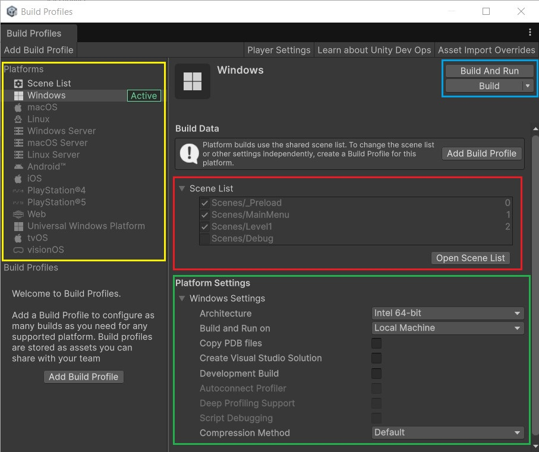
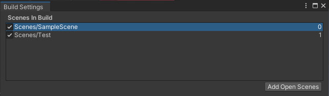
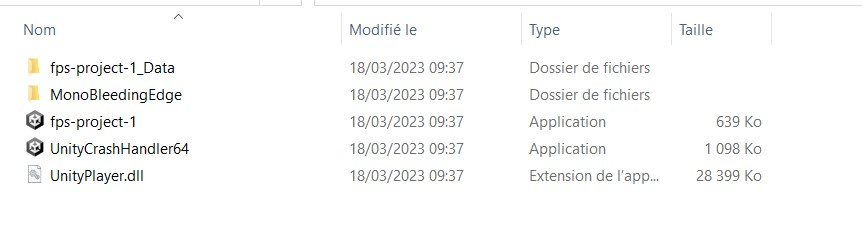

Pour permettre à des tiers de jouer à votre jeu, il va falloir créer un build. Autrement dit une version de votre jeu qui peut être lancée sans avoir besoin d'Unity. La méthode montrée ici est valable quelque soit le type de jeu qui vous développerez. Notez également qu'un build (ou compilation) durera plus ou moins longtemps dépendamment le jeu que vous ferez.

> Note : Sauf indication contraire, les étapes montrées sont les mêmes sur Windows, MacOS et Linux.

# Créer un build

Pour ce faire, il faut aller dans le menu `File > Build Profiles`, ceci va ouvrir une fenêtre au premier plan.

On peut décomposer cette fenêtre en quatre grandes parties que nous allons détailler :
- Scene List - en rouge
- Platforms - en jaune
- Platform Settings - en vert
- Build (Les trois boutons en bas) - en bleu

## Scene List
Cette partie désigne les scènes (ou niveaux) qui seront présents dans votre build. Ainsi, il est possible de créer des scènes à titre de test et ne jamais les mettre dans votre build. Si la partie est vite, Unity ne pourra pas créer de build. Pour modifier la liste, il vous suffit de cliquer sur le bouton "Open Scene List".

Pour les rajouter, deux choix s'offrent à nous :
- Cliquer sur le bouton "Add Open Scenes" qui ajoutera toutes les scènes ouvertes présentement
- Glisser-déposer depuis l'onglet "Project" les scènes dont vous avez besoin

Une fois les scènes ajoutées, vous devriez avoir quelque chose comme ceci :
|  |
|:--:|
| *En mettant la scène "SampleScene" en premier, c'est cette scène qu'Unity chargera après avoir affiché les logos d'introduction* |

Deux choses à noter dans cette interface :
- A gauche, les cases à cocher, elles indiquent quelles scènes seront présentent dans le Build. La case cochée indiquant sa présence.
- A droite, un nombre, il indique l'ordre de chargement des scènes, plus le chiffre est petit, plus tôt sera chargée la scène. Assurez-vous donc d'avoir votre scène de menu de jeu en premier position (valeur 0), car charger en premier le dernier niveau, ce n'est pas la meilleure des choses à faire.
Vous pouvez réordonner l'ordre des scènes à votre discrétion en effectuant un glisser-déposer.

## Platforms et Platform Settings
Ces deux parties sont liées, en changeant la partie "Platforms", la partie "Platform Settings" changera en fonction. Certaines options étant propres à une plateforme.

Par ailleurs, dépendamment de la plateforme choisie, il se peut que nous n'ayez pas le module associé (la plateforme est grisée), vous devrez donc l'installer en passant par Unity Hub. En sélectionnant la plateforme en défaut un bouton "Install with Unity Hub" s'affichera, cliquez dessus.

|  |
|:--:|
| *En absence du module "Android", nous devons l'installer grâce à l'Unity Hub.* |

Parmi les plateformes, nous trouvons (liste non exhaustive) :
- Windows, Mac, Linux : Pour jouer sur votre ordinateur. Unity s'adaptera en fonction de votre ordinateur. Vous ne pouvez pas faire un build Windows sur MacOS et inversement
- WebGL : Pour réaliser une version compatible navigateur de votre jeu. Attention tout de même concernant cette plateforme, vous pouvez rencontrer des problèmes si votre jeu use de trop d'effets complexes. **De plus, votre jeu ne peut pas se lancer sans serveur**, il faudra impérativement le mettre en ligne ou utiliser NodeJS / WAMP (ou autre) pour le lancer
- Android : A destination des plateformes Android (télés, smartphones, tablette...)
- PS4 / PS5 : Pour les consoles PS4 et PS5. A noter qu'il vous faudra une licence payante obtenue auprès de Sony ainsi qu'une console dite de "debug". Si les deux conditions ne sont pas remplies, vous ne pourrez pas tester votre jeu sur PS4 ou PS5

> Quelque soit la plateforme, il y a l'option "Developpement Build", décochée par défaut, elle vous permet d'accéder aux outils de Profilage, outils qui vous permettent d'analyser l'exécution du code. Il ne faut pas activer l'option dans un build qui vise à être publié.

## Build
Dernière partie : le build. Il y a trois options dans cette zone :
- Player Settings : Ouvre une nouvelle fenêtre où vous pourrez affiner certains détails comme les différents logos ou la couleur d'arrière-plan lors du lancement du jeu
    - [En savoir plus sur Player Settings](PLAYER-SETTINGS.md)
- Build / Clean build : Nous allons le détailler plus bas
- Build and run : Fait un build du jeu puis le lance directement

### Build / Clean build
L'option "Build" est une liste déroulante qui contient également l'option "Clean build". Dans les deux cas, cliquer sur cette option affichera l'explorateur de votre système d'exploitation pour savoir où compiler le build.

Nous vous conseillons très fortement de mettre vos builds dans un dossier nommé "Builds" et contenu dans votre projet Unity, donc au même niveau que le dossier "Assets". Pour la simple et bonne raison que par défaut, le fichier `.gitignore` d'Unity exclut le dossier "Builds" (et son contenu) car vous n'avez aucun intérêt à versionner vos builds vu que le code source l'est déjà.

A partir de là, c'est à vous de scruturer le contenu du dossier "Builds".

Concernant l'option "Clean Build", c'est une propositon de build plus longue que l'option "Build". En effet pour permettre aux développeurs / développeuses d'obtenir plus rapidement une nouvelle itération de leur jeu, Unity fait un nouveau build uniquement avec les parties qui ont été modifiées entre chaque build. Si jamais dans le nouveau build il y a des bugs, l'option "Clean Build" peut être la solution.

[En savoir plus sur le "Clean Build" dans la documentation d'Unity](https://docs.unity3d.com/Manual/incremental-build-pipeline.html#creating-non-incremental-builds)

Sachez qu'à chaque changement de plateforme, le bouton "Build" sera remplacé par "Switch Platform" sur lequel il faudra impérativement cliquer pour pouvoir faire un build sur une platforme différente.

Une fois le build effectué, Unity ouvrira son emplacement dans l'explorateur de votre navigateur.
|  |
|:--:|
| *Si je souhaite lancer mon jeu il faudra cliquer sur "fps-project-1.exe", "fps-project-1" est le nom de mon jeu, il a été définit dans le menu Player Settings".* |

#### Windows - Créer un exécutable
Vous remarquerez qu'il y a plusieurs fichiers. En effet, sous Windows Unity ne produit pas un seul et unique exécutable (fichier .exe) mais un ensemble de fichiers dont la nomenclature est importante. Si vous voulez partager votre jeu, à l'heure actuelle, il faudra fournir la totalité des fichiers générés. Chose qui peut être un peu fastidieuse.

Pour pallier à ce problème, il nous est donné la possibilité de créer gratuitement un fichier exe pour votre jeu grâce au logiciel Inno setup.
- [Télécharger Inno Setup](https://jrsoftware.org/isdl.php)
- [Voir didactiel (en français) sur Inno Setup](https://www.youtube.com/watch?v=lH9h4POpq0A)

> Dans le cadre de la SAE, il n'est pas utile de créer un exécutable. Assurez-vous juste de créer votre build Windows ou MacOS (qui aura été testé) et en faire une archive.

[En savoir plus sur la fenêtre "Build Settings" en général dans la documentation d'Unity](https://docs.unity3d.com/Manual/BuildSettings.html)
