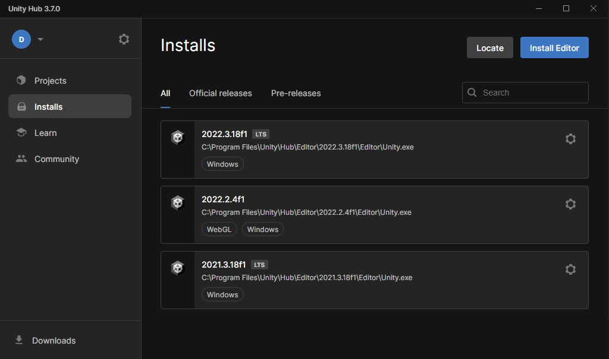
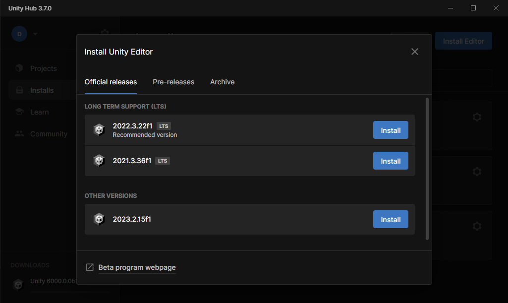
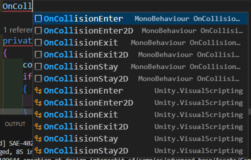

# Installation Unity 

Unity est un logiciel "gratuit" permettant de développer des jeux vidéo aussi bien 2D que 3D. VOus pouvez le télécharger sur le site officiel. Il vous faudra créer un compte, créez un compte personnel.

- [Télécharger Unity Hub](https://unity.com/fr/download)
> Note : Sur le site, vous ne pouvez pas télécharger Unity directement, il faut técharger Unity Hub qui téléchargera Unity pour vous. Dans le cadre du cours, nous utiliserons une version supérieure à 2022.X.X. Vous pouvez télécharger Unity 6, mais dans le cadre du cours nous ne l'utiliserons pas.

Une fois Unity Hub installé et lancé. Allez dans la rubrique "Installs" et cliquez sur le bouton "Install Editor".
|  | 
|:--:| 
| *Dans cette capture, nous avons déjà des versions d'Unity d'installées (3). Il est possible d'avoir plusieurs versions d'Unity sur son ordinateur* |

Une fenêtre va s'ouvrir dans Unity, sélectionnez le bouton "Install" d'une des versions 2022.X.X proposée...

...et une autre fenêtre va s'ouvrir. Elle demande ce que vous souhaitez installer en plus de la version d'Unity sélectionnée à l'étape précédente.

|  | 
|:--:| 
| *Pour gagner du temps au niveau du téléchargement, décochez le téléchargement de "Microsoft Visual Studio". Nous n'en aurons pas besoin pour le cours. Nous utiliserons VS Code à la place.* |

## Problèmes de connexion
Dans certains cas, il se peut que vous n'arriviez pas à vous connecter à votre compte Unity. Unity Hub arguant que votre licence a expiré et si vous tentez de la recréer, ceci échoue. Ce problème est lié au Pare-Feu de Windows qui peut bloquer les requêtes d'Unity sur certains réseaux comme celui de l'IUT. Si ceci arrive, il y a un didacticiel sur le site d'Unity.
- [Accéder au didacticiel](https://docs.unity3d.com/Packages/com.unity.live-capture@2.0/manual/setup-network.html#manual-firewall-rule-configuration)

Une fois l'opération effectuée, pensez à vous déconnecter d'Unity Hub puis vous reconnecter.

# Configuration d'Unity et VS Code
Il est possible de développer en C# avec n'importe quel logiciel. Toutefois, nous vous recommendons d'utiliser un logiciel qui gère Unity, ceci vous permettra d'avoir l'auto-complétion des différentes méthodes et classes pour ainsi être plus productif et éviter les erreurs.

> Si vous utilisez Visual Studio (pas VS Code, c'est différent) tout sera géré nativement après avoir installé Unity, il faut quand même sélectionner les extensions liées à Unity lors de l'installation. 

Pour définir VS Code comme IDE par défaut pour Unity. Suivez les étapes suivantes :
- MacOS : 
  - Cliquez sur `Unity` en haut à gauche dans la barre de statut
  - Sélectionnez `Settings`, une fenêtre va apparaître
  - Sélectionnez `External Tools` dans le menu à gauche 
  - Sélectionnez la liste déroulante du choix `External Script Editor` et choissiez votre VS Code 
- Windows :
  - Cliquez sur le menu `Edit > Preferences`
  - Sélectionnez `External Tools` dans le menu à gauche 
  - Sélectionnez la liste déroulante du choix `External Script Editor` et choissiez votre IDE VS Code

[Plus d'informations ici](https://learn.unity.com/tutorial/set-your-default-script-editor-ide#)

Si tout a bien été pris en compte, votre IDE devrait s'ouvrir si vous allez dans le menu : `Assets > Open C# Project`.

# Configuration de C# et VS Code
Par défaut, VS Code ne connaît pas les méthodes propres à Unity. Unity propose beaucoup de classes en tout genre et il est facile de faire une erreur de frappe causant ainsi une erreur à la compilation. Pour vous éviter ce problème, il faudra installer le SDK .NET qui est disponible gratuitement sur le site de Microsoft.

- [Télécharger le SDK .NET](https://dot.net/core-sdk-vscode)

> **IMPORTANT** : Vous devez effectuer l'installation avec le logiciel VS Code **fermé**. Sinon l'installation échouera de façon silencieuse et vous devrez recommencer en n'oubliant pas de désinstaller le SDK .NET avant.

Et pour vous assurer que vous avez bien l'auto-complétion des méthodes d'Unity commencez à écrire "OnColli", votre logiciel devrait vous faire des propositions dont "OnCollisionExit2D" ou "OnCollisionEnter".

|  | 
|:--:| 
| *Ici, VS Code me propose des méthodes quand je commence à écrire. Ceci signifie que le SDK .NET s'est bien installé* |