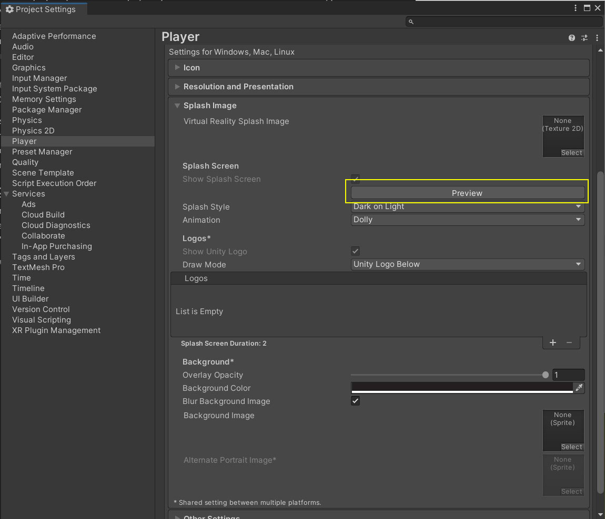

# Player Settings

Accessible depuis la fenêtre du menu `File > Build Settings` ou `Edit > Project Settings > Player`. Ce menu permet de modifier certains éléments concernant les informations globales sur jeu comme son nom ou encore son icône. Dans ce document, nous allons traiter des parties qui pourront vous intéresser. Si vous cherchez d'amples informations, il y a la documentation d'Unity qui entre en détails sur chacun des points du menu.
- [Accéder à la documentation de Player du menu Project Settings - anglais](https://docs.unity3d.com/Manual/class-PlayerSettings.html)

Si certaines options sont propres à chaque plateformes, d'autres sont globales et ne doivent être remplies qu'une seule fois :
- Company Name : Nom de votre studio
- Product Name : Nom de votre jeu, c'est ce nom qu'aura votre exécutable lors du build et sera affiché dans la barre de tâches de votre système d'exploitation
- Version : Version de votre jeu. Il est préférable de l'incrémenter à chaque build. A noter qu'il est possible de créer un script pour augmenter la valeur automatiquement. Généralement, on met à jour le numéro de valeur selon la nomenclature SemVer (Semantic Versionning).   
    - [En savoir plus sur SemVer](https://putaindecode.io/articles/semver-c-est-quoi/)
- Default Icon : Image qui représente votre jeu, elle peut s'afficher sur le bureau de Windows, par exemple. Notez tout de même qu'il est possible de surcharger cette valeur en fonction de la plateforme
- Default Cursor : Image qui représentera le curseur de la souris dans votre jeu. Cette option ne s'appliquera que sur les plateformes qui supportent l'option et est liée à l'option suivante "Cursor Hotspot"
- Cursor Hotspot : Représente le décalage entre le pointeur de la vraie souris et le pointeur définit dans l'option "Default Cursor"

Nous n'allons pas décrire toutes les options car la documentation le fait très bien et que vous n'aurez pas forcément besoin de toutes ces options. Avant d'aller dans les détails de l'option "Splash Image", applicable sur presque toutes les plateformes, sachez qu'il est possible de modifier les valeurs de Player Settings depuis le code également.

## Splash image

L'option Splash image représente la séquence affichée durant le chargement du jeu. Lorsque vous n'avez pas une licence professionnelle d'Unity, le Splash Image contient toujours la mention "Made with Unity", d'où le fait que l'option "Show Splash Screen" est cochée et désactivée.

Néanmoins, il vous est donné la possibilité de personnaliser cette séquence. Par exemple, vous pouvez rajouter de nouveaux logos dans la zone "Logos" ou encore changer la couleur du fond (option Background Color).

Pour voir vos modifications, il n'est pas utile de compiler le jeu. Il vous suffit de cliquer sur le bouton "Preview" et vous verrez le Splash Image dans l'onglet Game.

Il y a d'autres options pour la partie "Splash Image", à vous d'expérimenter un peu pour voir ce qu'elles font.