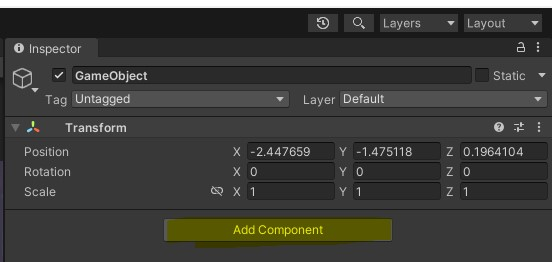

# Découverte d'Unity (et de C#)

Nous l'avons vu précédemment, Unity est un logiciel qui a été pensé pour rendre accessible le développement de jeux vidéo pour tout le monde. Il se veut complet et gère une bibliothèque complète qui propose notamment la gestion de la physique ou encore de modèles 3D. Mais si ce n'est pas assez, il est possible d'ajouter de nouvelles fonctionnalités grâce à l'asset store.
- [Accéder à l'asset store](https://assetstore.unity.com/)
> L'asset store propose des outils en tout genre qui peuvent se greffer à Unity tels que des outils pour le logiciel ou encore des personnages clés en main pour vos jeux. Notez bien que tout n'est pas gratuit sur l'asset store.

Pour permettre le développement de jeux vidéo, Unity se repose sur le langage C# (à prononcer see-sharp), c'est un langage orienté objet fortement typé. Autrement dit, le langage se base sur des classes et chaque élément doit avoir un type et n'a pas le droit d'en changer contrairement à javascript. Si le typage peut être contraignant il permet d'être plus discipliné dans sa façon de coder. Il est donc important de connaître les bases du langage. A noter que le but du cours n'est pas de vous apprendre le C# mais Unity. Ce dernier implémente ses propres fonctions qui ne sont pas disponibles si vous faites du C# seul. Toutefois nous verrons certains concepts du langage au fur et à mesure des cours. Néanmoins, si vous souhaitez creuser le sujet, voici une série de vidéos en français :
- [Liste de lecture sur les bases de C# par Tuto Unity FR](https://www.youtube.com/playlist?list=PLUWxWDlz8PYLKlr6F_fwCs02DH1g2hrgS) - Nous vous conseillons de regarder au moins les trois premières vidéos. Ceci devrait vous prendre un peu moins de 35 minutes.

> **Petit point sur les didacticiels en ligne concernant Unity :** S'il y en a beaucoup et permettent d'accomplir des choses impressionantes, le code montré n'est pas forcément le mieux optimisé, **faites attention.** La programmation de jeux vidéo, en plus d'être complexe, est un domaine où l'optimisation est importante. Un jeu qui a des soucis de performances, ce n'est pas une bonne chose pour l'utilisateur final. La vidéo suivante (en anglais) illustre très bien le problème de certains didactiels.
> [](https://www.youtube.com/watch?v=BJvoaBeqVm0 "clickbaited") <br>
> Après si vous avez suffisamment d'expérience, vous pouvez corriger le code proposé dans un didactiel.
> <hr>
>
> Évitez également de suivre un tuto du type "faire le jeu XXX de à A-Z en moins de 4 heures", si vous obtiendrez bien le résultat escompté, vous n'aurez rien appris autre que copier-coller du code, une fois la vidéo terminée, il est peu probable que vous soyez apte à refaire la même chose sans exemples.
> Nous vous conseillons plutôt de regarder didacticiels (vidéos ou textes) montrant comment réaliser une tâche en particulier pour ensuite l'implémenter, l'adapter à vos besoins. Voici une liste non exhaustive de chaînes Youtube du genre :
> - [Christina Creates Games - anglais](https://www.youtube.com/@ChristinaCreatesGames/videos)
> - [PitiIT - anglais](https://www.youtube.com/@PitiITNet/videos)
> - [Mina Pêcheux - anglais/français](https://www.youtube.com/@minapecheux/videos)
> - [Tarodev - anglais](https://www.youtube.com/@Tarodev/videos)
> - [bendux - anglais](https://www.youtube.com/c/bendux/videos)
> - [Jason Weimann - anglais](https://www.youtube.com/@Unity3dCollege/videos)
> - [BMo - anglais](https://www.youtube.com/@BMoDev/videos)


## Variables 
Comme tout langage de programmation le C# permet de créer des variables, la syntaxe est la suivante (sans les crochets):
```cs
[type] [nom de variable] = [valeur];
```
- type : Définit la nature d'une variable. Autrement dit, les actions que peut effectuer la variable. Par exemple, si on crée une varible de type entier (int), il n'est pas possible d'utiliser des méthodes liées à une chaîne de caractères (string). Notez bien qu'en C#, contrairement au javascript, **le typage est obligatoire et immuable**. Un entier ne peut pas devenir une chaîne de caractères et vice-versa. Durant le cours, nous aurons l'occasion de voir plein de types et même de créer les nôtres, mais de base vous avez les types suivants (liste non exhaustive) :
    - int : nombre relatif (-20, -1, 5, 74, 479...)
    - string : chaîne de caractères ("Bonjour, c'est le cours d'Unity")
    - float : nombre irrationnel (1/3, 25/8, -7/9...)
        - **En C#, les floats doivent être suffixés par un "f".** Par exemple, `float myFloat = 5.6f;`
    - bool : booleéan (`true` / `false`)
    ...
- nom de variable : si le nom est arbitraire, certains sont interdits et bien évidemment on nommera nos variables avec un nom explicite, c'est pratique pour s'y retrouver
- valeur : valeur que la variable va stocker. Elle peut être nulle grâce au mot-clé `null`

Voici des exemples de variables :
```cs
// Un entier
int nbYearsBUT = 3;
// Une chaîne de caractères
string playerName = "player1";
// Un tableau de chaînes de caractères
string[] listFormations = {"MMI", "TC", "GE2I", "MT2E"};
```

> Si vous souhaitez définir une constante (variable dont la valeur ne peut pas changer au cours du temps), il suffit juste de mettre "const" devant le type de la variable. Exemple : `const string cours = "Unity"`.

### Liste ou tableau ?
Petit point : En C# (et d'autres langages de programmation), il existe une différence entre les tableaux et les listes. Si les deux permettent de contenir un ensemble d'éléments **du même type**, il existe une subtile différence : la taille d'un tableau (array) est finie. Une fois défini, il n'est pas possible d'ajouter ou retirer des éléments à un tableau (c'est possible, mais très coûteux en performance). Alors qu'une liste a une dimension dynamique. Ce qui fait qu'une liste occupe plus de place en mémoire (RAM) qu'un tableau, de ce fait, utilisez le bon type pour la bonne situation. 

```cs
// Equivalent du code ci-dessus mais avec une liste, nous pouvons donc ajouter ou retirer des éléments grâce aux méthodes .Add() et .Remove() ou même en remplacer à un index précis grâce à la méthode .Insert(int index, valeur).
List<string> listFormations = new List<string>(){"MMI", "TC", "GE2I", "MT2E"};
```
- [Différence Liste et Tableau en C# - anglais](https://www.shekhali.com/c-array-vs-list)

> Autre point important : Il existe une autre différence entre les listes et les tableaux en C#. Pour accéder au nombre d'éléments, on utilisera la propriété "Length", là où on utilisera la propriété "Count" pour les listes. Étrange mais c'est comme ça.

## Fonctions

Outils idéaux pour limiter la réutilisation du code et le rendre plus lisible, les fonctions en C# ont une syntaxe relativement proche de ce que vous avez vu jusqu'à présent.
```cs
[type de retour] NomDeFonction([paramètres ([type] paramètre1), ([type] paramètre2)])
{
    // Instructions
}
``` 

- Type de retour : le principe est le même que le type de variable sauf que c'est ce que la fonction va retourner. Si votre fonction ne doit rien retourner, on mettra la valeur `void`
    - > Une fonction peut retourner plusieurs type à la fois, mais il est préférable de limiter vos retours de fonctions (ou méthodes) à un type à la fois
- NomDeFonction : Comme les variables, le nom est arbitraire mais certains noms sont interdits et bien évidemment on nommera nos fonctions avec un nom explicite. A noter qu'en C# les fonctions sont écrites en PascalCase [(plus d'informations sur PascalCase)](https://tech-lib.fr/pascalcase/), par convention
- Les paramètres : tout comme les variables, ils doivent avoir un type et sont séparés par une virgule. **Pour rappel, les paramètres d'une fonction ne sont accessibles que dans la fonction qui les définit**

Par exemple, une fonction qui affiche dans la console la somme de deux entiers. **Elle ne renvoie rien** :
```cs
void Addition(int num1, int num2)
{
    int sum = num1 + num2;
    Debug.Log("Résultat somme : " + sum);
}
```

> La méthode `Debug.Log()` permet d'afficher textes et valeurs dans la console d'Unity (Window > General > Console). Notez que si vous voulez afficher une chaîne de caractères dans la méthode (ou n'importe où ailleurs), **il faut impérativement utiliser des guillemets doubles (")**. De plus, toutes les instructions en C# doivent impérativement se terminer par un point-virgule (;), **il est obligatoire**.
> - [Voir documentation de la méthode Debug.Log()](https://docs.unity3d.com/ScriptReference/Debug.Log.html) 
> 
> Si jamais vous souhaitez afficher le contenu d'un tableau (ou une liste) sur une ligne dans la console, vous pouvez utiliser l'instruction suivante : `string.Join(",", __tableau__);`. A noter que la virgule passée en premier paramètre peut être remplacée par un autre caractère.


Voici le même exemple, mais cette fois-ci, **notre fonction retourne le résultat** :
```cs
// On précise qu'on retourne un entier avec int avant le nom de la fonction
int Addition(int num1, int num2)
{
    return num1 + num2;
}

int sum = Addition(5, 6);
Debug.Log("Résultat somme : " + sum);
```
On remarque qu'en plus d'avoir le mot-clé "return" dans la fonction, "void" a été remplacé par "int" car notre fonction retourne une variable de type entier (int).

Dans ce document, nous n'allons pas voir les `if/else` ou encore boucles `for` ou `while` car la syntaxe est la même comparée aux autres langages que vous avez pu voir jusqu'à présent. Toutefois si vous avez un trou de mémoire, sachez que la chaîne Youtube Tuto Unity FR aborde ces sujets dans sa liste de lecture "Apprendre le C#".
- [Voir liste de lecture sur les bases de C# par Tuto Unity FR](https://www.youtube.com/playlist?list=PLUWxWDlz8PYLKlr6F_fwCs02DH1g2hrgS) 

> Comme les noms de variables, les noms de fonctions doivent avoir un nom unique au sein de la même classe

# Script Unity de base

```cs
using System.Collections;
using System.Collections.Generic;
using UnityEngine;

public class MyClass : MonoBehaviour
{
    // Appelée avant le premier appel de la méthode "Update"
    void Start()
    {
        // Les commentaires peuvent être précédés de deux barres obliques (//) ou entre "/*" "*/". 
        // Cette dernière façon permet de faire des commentaires sur plusieurs lignes
    }

    // Appelée une fois par frame (ou image affichée)
    void Update()
    {
    }
}
```
Ci-dessus vous avez une classe de base, de type MonoBehavior, à chaque fois que vous allez créer un nouveau script depuis Unity, vous aurez au minimum le code ci-dessus (sans les commentaires en français). Vous pouvez bien évidemment supprimer ou ajouter des lignes en fonction de vos besoins. 

> ~~**Le nom de classe (ici MyClass) et le nom du fichier doivent toujours correspondre (casse comprise) sinon Unity lèvera une erreur.**~~ Dans notre cas, la classe MyClass est contenue dans un fichier appelé MyClass.cs. On s'assurera qu'une classe a le même nom que le fichier.
>
> **Pour des questions d'organisation, on mettra tous nos scripts Unity dans un dossier Scripts/ contenu lui-même dans le dossier Assets/,** ce dernier est déjà généré par Unity lorsque vous créez un nouveau projet. Notez également qu'à chaque fois que vous sauvegardez vos scripts et retournez sur Unity, il fera une vérification du code et toute erreur trouvée rendra impossible la compilation (mode `Play` ou `ctrl/cmd + p`).

### Déclaration de classe : `public class MyClass : MonoBehaviour`
Cette ligne nous permet de définir notre classe. Le mot-clé `public` nous permet d'accéder à notre classe partout dans notre projet. Nous verrons plus loin dans le document que le terme "public" peut être remplacé par d'autres mot-clés. Ensuite nous avons le type, ici `class`, nous définissons donc une classe qui a pour nom "MyClass". La synaxe `: MonoBehaviour` désigne l'héritage. Autrement dit, notre classe `MyClass` possède les caractéristiques de la classe `MonoBehaviour`, c'est ce qui nous permet d'utiliser les méthodes `Start()` ou `Update()`. Car la class `MonoBehaviour` contient déjà ces méthodes avec leur comportement.

### Méthode : `Start() {}`
La méthode Start() est appelée lorsque le script est instancié, autrement dit quand le `GameObject` apparaît dans la scène (visible ou non). Par exemple, dans un jeu vous pourriez y définir les points de vie de départ d'un personnage.

> `GameObject`, quézako ?
>
> Un `GameObject` est un élément présent sur la scène, donc qui peut être visible à l'écran : personnages, décors, boutons, barre de vie... Il sert de conteneur pour vos scripts et composants. **A noter qu'un script doit impérativement être attaché à un `GameObject`, sinon il ne sera jamais exécuté.**

### Méthode : `Update() {}`
La méthode Update est appelée toutes les frames/images. Ainsi si votre jeu tourne à 60 images par seconde (ou fps/frames per second), ceci signifie que la méthode Update() sera appelée 60 fois durant une seule et unique seconde, et ce, pour chaque script possédant la méthode `Update()`. Notez tout de même que dépendamment de la puissance de l'appareil qui exécute votre jeu, la méthode `Update()` ne sera pas forcément appelée 60 fois par seconde, ça peut être plus ou moins.
Parallèlement, c'est dans cette méthode que vous vérifierez les touches appuyées. Par exemple :

```cs
/* [...] */
void Update()
{
    // Ici on appelle le contenu du "if"
    // quand la touche V du clavier est appuyée
    if (Input.GetKeyDown(KeyCode.V))
    {
        // Mes instructions
        Debug.Log("J'ai appuyé sur la touche V");
    }
}
```
> ** **Attention** **
>
> Ne mettez **jamais, jamais** une boucle infinie comme `while(true) {}` dans la méthode `Update()`, Unity plantera à coup sûr car vous faites une imbrication de boucles infinies. Ceci vous forcera également à redémarrer le logiciel et perdre votre travail si vous n'aviez pas sauvegardé.

<details>
  <summary style="font-size: 1.2rem">Animations et méthodes Update() - Cliquez pour ouvrir</summary>
Plus haut, il est indiqué que la fréquence d'appel de la fonction `Update()` dépendra de la puissance de l'appareil qui fait tourner le jeu, ça dépendra aussi des aléas du jeu ou du système. Ainsi si votre jeu demande beaucoup de ressources ou votre ordinateur fait tourner un autre logiciel gourmand, votre jeu peut ralentir, chose qu'on appelle le lag. Ceci aura une incidence sur vos animations.

Exemple, vous souhaitez déplacer un élément de gauche à droite dans une fenêtre qui a une largeur de 600px en 5 secondes. Trouver la vitesse est relativement simple : $v = {d \over t}$. Dans votre cas, ceci donnera $v = {600px \over 5sec} = 120 pixels/seconde$. 
Maintenant que nous avons la vitesse pour l'ensemble du trajet, il vous faut la vitesse pour chaque image (frame), on partira du principe que notre appareil fait tourner notre scène à 60 images par seconde. Si on souhaite connaitre la distance, nous effectuons le calcul suivant : $$120 pixels/seconde * {1 \over 60} seconde/image = 2 pixels/image$$

Donc maintenant on sait que notre élément va se déplacer à 2pixels/image. Super. Toutefois que se passe-t-il si notre jeu tourne à 30fps ou encore plus bas ? Eh bien, notre animation va ralentir. Si on passe à 30 images / seconde, la vitesse de notre animation va être deux fois plus lente.

Pour pallier à ce problème, il est toujours conseillé d'effectuer ses animations en appliquant la variable `Time.deltaTime`, elle représente le temps écoulé entre deux images. En l'utilisant, Unity s'assure que toutes les animations se feront à la même vitesse, et ce, quelque soit l'appareil utilisé.


<p style="text-align: center">Ici on voit que dans la colonne "Delta movement" les mouvements ont la même vitesse</p>

[Voici un article qui explique ce concept avec des animations (en anglais), ça traite du moteur de jeu Godot, mais le principe reste le même](https://kidscancode.org/godot_recipes/4.x/basics/understanding_delta/index.html)

<hr>
</details>

Enfin, notez les choses suivantes sur les classes :
- Les méthodes telles que `Start()` ou `Update()` sont propres à la classe `MonoBehaviour`, de ce fait, elles sont automatiquement appelées
- Toutes les classes n'ont pas à hériter de `MonoBehaviour`
    - Nous aurons l'occasion de réaliser des classes n'héritant pas de MonoBehaviour dans ce cours
- Il est possible de définir plusieurs classes dans le même fichier
- Vous pouvez définir des propriétés propres à une classe. On les met au début de la classe pour les retrouver plus facilement. Nous aurons l'occasion de voir ceci durant le cours
- `MonoBehaviour` possède d'autres méthodes (nous en utiliserons d'autres), prenez bien en compte que ces méthodes ont un ordre d'appel
    - [Voir ordre d'exécution des méthodes de `MonoBehaviour` (anglais)](https://docs.unity3d.com/Manual/ExecutionOrder.html)

# Exercice
Dans le but de découvrir le C#, vous allez écrire quelques lignes de code. **Retenez bien qu'Unity ne peut exécuter un script que s'il est lié à un GameObject ou un script lui-même lié à un GameObject.**
Créez un `GameObject` depuis le panneau "Hierarchy" `Clic droit > Create Empty` ou encore depuis le menu `Game Object > Create Empty`. Puis dans la fenêtre "Inspector", cliquez sur "Add Component" et écrivez le nom de votre script (au choix) puis cliquez sur "New script" ensuite "Create and Add" (le script sera automatiquement ajouté au dossier `Assets/`).

 

---
Avant d'écrire vos premières lignes de C#, pensez bien à installer toutes les dépendances nécessaires à VS Code pour qu'il puisse fonctionner avec Unity de façon optimale.

- [Accéder au didactiel configuration VS Code et C#](./INSTALLATION.md#configuration-de-c-et-vs-code)

---

**Réalisez les tâches suivantes (n'oubliez pas de retourner le résultat - dans le cas d'une méthode / fonction - et l'afficher avec la méthode `Debug.Log()`) :** 
- Un nombre décimal
    - A définir dans la fonction `Start()`
- Une chaîne de caractères
    - A définir dans la fonction `Start()`
- Un tableau contenant des nombres
    - A définir dans la fonction `Start()`
- Une fonction qui **retourne** "Bonjour" + la chaine de caractères passée en paramètre
    - N'oubliez pas d'appeler la fonction et d'utiliser le mot-clé "return"
- Une fonction qui **retourne** un entier passé en paramètre et le multiplie par lui-même
    - N'oubliez pas d'appeler la fonction et d'utiliser le mot-clé "return"
- Une fonction qui fait ce que vous souhaitez mais qui est appelée quand on appuie sur une touche
    - L'appel de la fonction devra impérativement être fait au sein de la méthode `Update()`, sinon ça ne fonctionnera pas (voir exemple plus haut)
    - [Documentation Unity de la liste des touches accessibles - anglais](https://docs.unity3d.com/ScriptReference/KeyCode.html)

> N'oubliez pas de lier votre script à un GameObject. **Sinon, votre code ne sera jamais exécuté.**
> N'oubliez pas qu'une fonctione ne peut pas être appelée en dehors d'une autre fonction.

Cette petite mise en bouche n'est là que pour vous faire prendre la main sur le langage C#. Durant ce cours, nous aurons l'occasion de faire un petit jeu en 2D où nous aborderons les notions suivantes (liste non exhaustive) :
- Gestion des sprites 2D
- Déplacement du joueur
- Gestion du son / physique
- Animation
- ScriptableObject

## Propriétés de classes
Au sein d'une classe, les variables définies en dehors d'une fonction ont une portée qui leur est spécifique. Autrement dit, elles n'existent que dans un contexte que vous aurez défini. Ces variables sont appelées **propriétés de classes**. Elle peuvent être globales ou non à votre projet. Leur syntaxe est semblable aux variables à la différence que vous pouvez définir leur accessibilité. Exemple :

```cs
[niveau d’accessibilité] [type] [nom de variable] = valeur;
```
- Niveau d’accessibilité : Peut avoir la valeur "protected", "public", "private" et autres. Dans le cadre du cours nous utiliserons principalement :
    - public : On peut la lire (et la modifier) depuis n'importe où dans notre projet. Le fait qu'elle soit publique rend possible sa modification depuis l'onglet "Inspector" d'Unity
    - private : **la propriété n'est accessible qu'au sein de la classe** qui la définit et seule cette dernière peut la modifier et y accéder
        - Par défaut, les méthodes et les propriétés sont privées en C#, mais pensez à le préciser.
- Type et nom de variable : On l'a vu précemment
- Valeur : Facultatif, une propriété de classe peut ne pas être définie au début et l'être plus tard dans le code. A noter que si vous définissez une valeur par défaut pour une propriété et que vous définissez une valeur pour cette même propriété dans l'`Inspector`, c'est cette dernière qui sera prise en code

> Note : Ce n'est pas une bonne pratique de tout mettre en "public". Rendre tout "public" rend possible à n'importe quelle classe la possibilité d'en modifier une autre. Ce qui peut rendre le debuggage très compliqué. Toutefois pour rendre les choses simples, nous utiliserons le mot-clé "public" dans le cadre du cours. Mais nous vous encourageons très fortement à utiliser "private" quand c'est possible.
> - [Pour en savoir plus (anglais)](https://www.youtube.com/watch?v=pD27YuJG3L8)
> - [Documentation sur les niveaux d'accessibilité](https://learn.microsoft.com/fr-fr/dotnet/csharp/programming-guide/classes-and-structs/access-modifiers)

> Note 2 : cette notion d’accessibilité est également applicable aux classes et aux fonctions au sein d'une classe (qu'on appelle "méthode")

Par convention, ces propriétés de classes sont définies au début d'une classe. Exemple :
```cs
/* [...] */
public class MyClass : MonoBehaviour
{
    // Ces propriétés sont accessibles partout au sein de notre classe "MyClass"
    public string universityName = "CY Paris Université";
    private int nbYearsBUT = 3;

    void Start()
    {
        // Note : Avec le caractère $, il est possible d'afficher une variable dans une chaîne de caractères
        Debug.Log($"nbYearsBUT {nbYearsBUT}");

        // On appelle la méthode MyPrivateMethod
        MyPrivateMethod();
    }

    public void MyMethod() {
        nbYearsBUT = 7;
    }

    private void MyPrivateMethod() {
        nbYearsBUT = 5;
    }
    /* [...] */
}
```
Il existe d'autres conventions de programmation liée à Unity / C#, vous n'avez pas forcément besoin de les suivre à la lettre mais de rester cohérent dans votre projet.
- [Ensemble de conventions de programmation en C# / Unity - anglais](https://unity.com/how-to/naming-and-code-style-tips-c-scripting-unity)

> Le formattage de texte est possible avec des balises ressemblant à du HTML. Ainsi en écrivant `Debug.Log("<color=red>Message :</color> Texte formatté.")`, une partie du texte sera rouge dans la console.

Enfin, n'oubliez pas qu'Unity est outil très complet, nous n'aurons pas l'occasion de tout voir durant ce cycle de cours. Alors n'hésitez pas à vous renseigner un peu sur le web pour développer le jeu qui vous plait. Utilisez les outils (gratuits) mis à votre disposition pour créer des ressources pour vos créations :
- [Tiled Map Editor](https://thorbjorn.itch.io/tiled)
- [libresprite (version gratuite et moins complète d'aesprite)](https://libresprite.github.io/#!/)
- [Générateur de spritesheets](https://codeshack.io/images-sprite-sheet-generator/)
- [Convertisseur image -> police d'écriture](https://yal.cc/r/20/pixelfont/)

Il existe également des sites pour récupérer des ressources gratuites de qualité variable :
- [https://itch.io/](https://itch.io/)
- [https://opengameart.org/](https://opengameart.org/)
- [https://www.mixamo.com/ - Ressources 3D gratuites - Nécessite d'avoir un compte Adobe](https://www.mixamo.com/)

Nous verrons dans les grandes lignes l'interface d'Unity. Néanmoins, si vous avez besoin, à l'avenir, d'un rappel ou de découvrir de nouvelles choses : 
- [Voir présentation de l'interface d'Unity par Tuto Unity FR (français)](https://www.youtube.com/watch?v=Ef6KMvYNwj8)

Voici des liens liés aux raccourcis d'Unity, ils pourront vous être utiles :
- [https://www.evercast.us/blog/unity-hotkeys-shortcuts (anglais)](https://www.evercast.us/blog/unity-hotkeys-shortcuts)
- [Liste des raccourcis](https://docs.unity3d.com/2017.3/Documentation/Manual/UnityHotkeys.html)
- [Documentation sur la personnalisation des raccourcis](https://docs.unity3d.com/Manual/ShortcutsManager.html)
- Il y a également le menu dédié accessible via `Edit > Shortcuts` (Windows) ou `Unity > Shortcuts` (MacOS)

> Point important : Pour vous éviter des déconvenues lors de la réouverture de votre travail. Nous vous conseillons très fortement de fermer (et sauvegarder) Unity avant d'éteindre votre ordinateur. Car Unity ne sauvegarde pas automatiquement votre projet (pas officiellement) et vous pourriez perdre quelques heures de travail précieuses.

# Notes

Vous serez noté(e) sur votre utilisation de git lors de nos TP. A la fin, vous devrez envoyer le lien de votre dépôt git. Pour éviter d'avoir une mauvaise note, nous vous invitons à commiter régulièrement, un commit, c'est gratuit. 

De plus, seuls les dossiers suivants doivent être poussés :

- Assets/
- Packages/
- ProjectSettings/
- UserSettings/

> Note : Dans le cas où vous souhaitez copier un projet Unity sur une clef usb / disque dur ce sont ces mêmes dossiers qu'il faudra copier. Le reste, s'il est manquant, Unity le recréera.

Pour éviter de mettre dans votre dépôt des fichiers / dossiers inutiles vous devez mettre un fichier .gitignore à la racine du projet. 

- [Télécharger le fichier .gitignore pour Unity](https://github.com/github/gitignore/blob/main/Unity.gitignore)
  - Il faudra penser à renommer le fichier `Unity.gitignore` en `.gitignore` (avec le point devant)


