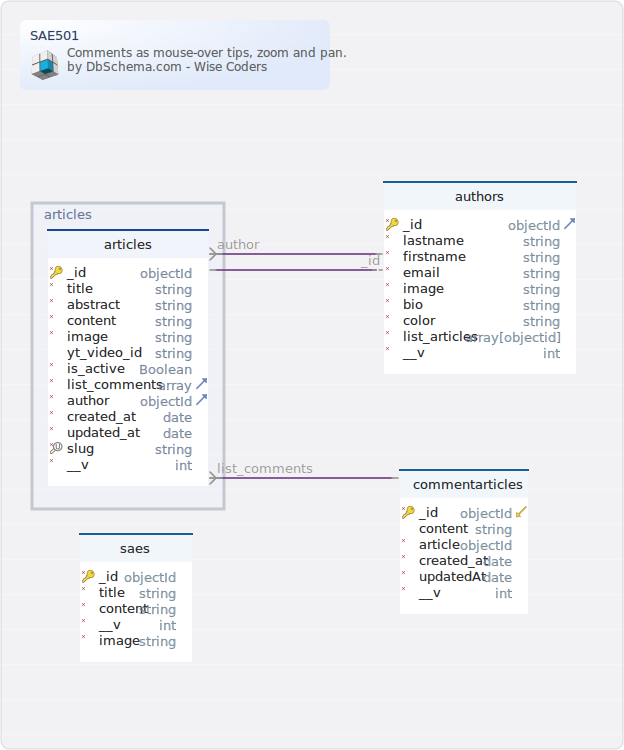

# Base de données et requêtes

Jusqu'à présent, vous avez pu manipuler des bases de données dites "relationelles" avec des outils comme MySQL. Néanmoins, il faudt savoir qu'il existe d'autres systèmes de gestion de base de données comme celles dites "NoSQL".

NoSQL pour "Not only SQL" (« pas seulement SQL » en anglais) désigne un système de gestion de base de données où les données sont stockées de **façon non structurées**. Dépendamment du système, les données sont stockées de façon différentes. Par exemple, avec MongoDB, les données sont stockées dans des documents, une sorte de fichier lui-même contenu dans une collection qu'on peut assimiler à un dossier. Les données sont très peu structurées d'où le nom "NoSQL".

Les systèmes NoSQL, comparés aux SGBDR, possèdent l'avantage de pouvoir gérer des millions d'entités sans problèmes là où un système de gestion de bases de données relationnelle (SGBDR) montrerait des faiblesses. De plus, en NoSQL, il est possible, à la volée de changer le schéma de données, ce qui vous permet de définir le modèle de données au fur et à mesure. Enfin, le NoSQL s'avère bien plus performant que les SGBDR pour la montée en charge. Avec MySQL, si vous avez un gros traffic, il vous faudra un plus gros serveur, donc vous coûtera plus cher. Alors qu'en NoSQL la montée en charge se gère en ajoutant de nouveaux serveurs, bien moins chers.

Ces avantages ne se font pas sans concessions, premièrement en NoSQL, il n'y a pas de notion d'id, ce qui rend certaines requêtes complexes impossibles, faire des imbrications de clauses `WHERE` peut provoquer de gros problèmes de performances. Toutefois, le NoSQL **peut** compenser ceci en restant performant sur de l'embedding (voir lien "MongoDB Schema Design Best Practices").

- [En savoir plus sur le NoSQL](https://www.oracle.com/fr/database/nosql/what-is-nosql)
- [MongoDB Schema Design Best Practices](https://www.mongodb.com/developer/products/mongodb/mongodb-schema-design-best-practices/)

# Installation

Dans le cadre de la SAÉ 501, nous avons fait le choix d'utiliser MongoDB (très utilisé dans le monde professionnel et open source), l'outil n'étant pas natif, il faudra l'installer **(regardez bien les notes plus bas avant de télécharger).**
- [Télécharger MongoDB](https://www.mongodb.com/try/download/community)

> **Notes pour les utilisateurs de Windows :**
> - Téléchargez le fichier .msi **pas l'archive .zip**
> - Lors de l'installation de MongoDB, il vous est proposé de télécharger MongoDBCompass, faites-le, ça vous épargnera de le faire plus tard

> **Notes pour les utilisateurs de MacOS :**
> - Certaines commandes listées dans le fichier README ne sont plus pertinentes depuis macOS Catalina (10.15). De ce fait, nous vous conseillons de créer un dossier `data/db/` dans le même dossier que vous avez dezippé MongoDB. Et d'ajouter le paramètre `--dbpath=data/db` à la commande qui permet de lancer le serveur MongoDB. Ce qui donne de la commande `mongod --dbpath=data/db` 
> - Installez MongoDB en passant par brew au lieu de télécharger l'archive avec les fichiers binaires. [Vous trouverez les instructions sur le site officiel](https://www.mongodb.com/docs/manual/tutorial/install-mongodb-on-os-x/#install-mongodb-community-edition). Ceci va rendre les commandes de mongodb globales au système et vous pourrer lancer votre serveur depuis n'importe où avec la commande `mongod --dbpath=chemin/vers/bdd`. Faites juste attention à ne pas commiter votre base de données. Pour éviter ceci, exécutez la commande de lancement du serveur à **l'extérieur du projet**
> - **Le serveur NoSQL ne se lance pas automatiquement.** Si vous arrêtez / redémarrez votre ordinateur, il faudra relancer le serveur MongoDB.

Pour visualiser votre base NoSQL, nous vous conseillons le logiciel MongoDB Compass, il est gratuit. C'est l'équivalent, pour MongoDB, de PhpMyAdmin.
- [Télécharger MongoDB Compass](https://www.mongodb.com/try/download/compass)
    - Il faut télécharger "MongoDB Compass Download (GUI)", il faut défiler un peu sur la page pour trouver le lien
    - Son installation est proposée durant son installation sous Windows

# Base de données et requêtes - suite

Une base MongoDB s'articule autour de collections ("équivalent" de tables en SGBDR). Le projet de la SAE en contient cinq que voici :



Dans ce schéma, il n'y a que quatre collections, la cinquième concerne les messages envoyés depuis la page "contact", nous la ferons ensemble, les champs dépendront des besoins du projet.

Une collection contient des schémas, ces schémas ont une syntaxe proche de ce que vous avez vu en MySQL avec un ensemble de champs de divers types. Les différences résident dans la présence du champ "_id" qui remplace "id" en MySQL, ici "_id" n'est pas un nombre qui s'incrémente à chaque nouvelle entrée mais une chaîne de 24 caractères aléatoires (nombres et lettres) qui sert de clé primaire, donc plus performante pour faire une recherche dans une collection. Le champ "__v" est ajouté via Mongoose, il sert à garder une trace de la version de votre document. 

- [En savoir plus sur la clé "__v"](https://web.archive.org/web/20190903082251/https://aaronheckmann.tumblr.com/post/48943525537/mongoose-v3-part-1-versioning)

Avec la SAÉ 501, nous allons manipuler MongoDB à travers [Mongoose](https://github.com/Automattic/mongoose), c'est un ODM (Object Data Modeling), il nous permettra de manipuler notre base de données NoSQL à travers des objets et classes, ce qui est plus simple à manipuler comparé aux requêtes. Le concept des ODM n'est pas propre à MongoDB, il en existe en NoSQL et en SGBDR, dans ce dernier cas, on ne parlera pas d'ODM mais d'ORM (Object Relation Mapper). Doctrine étant l'un des ORM les plus connus, il est proposé par défaut avec le framework PHP Symfony.

Voilà à quoi ressemble un schéma avec Mongoose :

```js
// Importation de mongoose
import mongoose, { Schema } from "mongoose";

// Création d'un schéma, le type est indispensable pour chaque champ
// Mongoose gère les champs suivants : https://mongoosejs.com/docs/schematypes.html
const saeSchema = new Schema({
  title: String,
  content: String,
  image: String,
});

// Transformation de notre schéma en Model, classe exploitable pour créer des documents
// Note : "SAE" correspond au nom de la collection dans MongoDB, ce nom sera toujours mis en majuscule et au pluriel 
export default mongoose.model("SAE", saeSchema);
```

Voici la version simplifiée du schéma d'une SAE dans le projet, dans le fichier original (`code/database/models/sae.js`). Il est également possible de valider votre champ grâce à des règles personnalisées (longueur, valeur minimale, requis, etc.).

Une fois notre modèle défini, nous pouvons l'instancier pour créer des documents de type SAE dans notre projet. Exemple : 

```js
import SAE from './models/sae.js';

const createSAE = async () => {
    // Contient les données à envoyer sous forme d'objet
    const payload = {}
    // On prépare un document de type SAE
    const ressource = new SAE(payload);

    try {
        // On crée notre document, l'action est asynchrone d'où la présence obligatoire du mot-clé "await"
        await ressource.save();
        // Ça s'est bien passé
    } catch (error) {
        // Ça s'est mal passé
    }
}
```
Ce code simplifié, issu du fichier `code/server/api-router/sae.js`, nous permet de créer une SAE dans la collection associée (saes).

Nous ferons ensemble la collection "messages", elle nous permettra de sauvegarder les messages crées depuis le formulaire de contact.

> Vous remarquerez que nous n'avons pas fourni un fichier de base de données, c'est normal. Mangoose crée les collections s'il ne les trouve pas. La première requête de chaque collection créera la collection en même temps.

# Requêtes
Pour créer ces messages, il faudra créer des routes. Le projet respecte la philosophie du CRUD (Create, Read, Update, Delete), conséquemment, dépendamment des besoins, il y a une route permettant de créer, récupérer, mettre à jour et supprimer un document. La gestion de requêtes des composées de deux parties :
- API : Réalisée avec [axios](https://www.npmjs.com/package/axios). Appelée par les pages et pour supprimer un document
    - Toutes les routes commencent par `/api` suivi du nom de la collection. Ex : `api/saes` concerne tout ce qui est lié aux SAES
- Backend : Appelle l'API pour afficher son contenu dans les pages

Exemple :

```js
// api.js - version simplifiée
router.get(`/saes`, async (req, res) => {
    // Récupère tous les documents de la collection "saes"
    const listRessources = await SAE.find()
        .orFail()
        .catch(() => {
            return {};
        });

    // Retourne un objet JSON contenant nos données
    return res.status(200).json({
        data: listRessources,
    })
});

// backend.js
router.get(`/saes`, async (req, res) => {
    const options = {
        method: "GET",
        url: `http://localhost:{PORT}/api/saes`,
    };

    let result = null;
    try {
        // Fait une requête vers l'API...
        result = await axios(options);
    } catch (e) {}
    // ...pour ensuite injecter le résultat dans un template nunjucks
    res.render("pages/back-end/saes/list.njk", {
        list_saes: result.data,
    });
});
```

Mongoose propose plusieurs manières de requêter la base de données, dépendamment ce que vous souhaitez faire.

### Tout rechercher - Model.find()
Permet de récupérer tous les éléments correspondants à un critère. La méthode `find()` peut prendre en premier paramètre un objet correspondant aux prédicats de recherche. Exemple :
```js
// Ici on récupère dans notre modèle tous les documents ayant exactement la valeur 18 pour la propriété "age"
await Model.find({ age: 18 });
```

### Chercher un élément par _id - Model.findById()
Récupère un élément ayant comme valeur d'_id, l'_id passé en argument. Exemple :
```js
// Ici on récupère dans notre modèle ayant pour _id "507f1f77bcf86cd799439011"
await Model.findById("507f1f77bcf86cd799439011");
```
A noter que dans certains cas, passer un _id sous forme de chaîne de caractères ne fonctionne pas. Il faudra caster cette chaîne en ObjectId grâce au constructeur `new mongoose.Types.ObjectId()`.
```js
const searchID = new mongoose.Types.ObjectId("507f1f77bcf86cd799439011");
await Model.findById(searchID);
```

### Chercher un élément par critères - Model.findOne()
Récupère un élément correspondant aux prédicats passés sous forme d'objet (comme pour `find()`). Exemple :
```js
// Ici on récupère le premier modèle ayant comme valeur "Croatia" pour le champ "country" ET "mmi" pour le champ "formation"
await Model.findOne({ country: 'Croatia', formation: "mmi" });
```
Si vous souhaitez appliquer des conditions exclusives, vous pouvez utiliser le mot-clé [$or](https://www.mongodb.com/docs/manual/reference/operator/query/or/) de la façon suivante :
```js
// Même exemple que plus haut, mais on cherche cette fois-ci le modèle qui possède la valeur "Croatia" pour le champ "country" OU "mmi" pour le champ "formation"
await Model.findOne({ $or: [{ country: 'Croatia', formation: "mmi" }] });
```

> Vous pouvez égalemet appliquer un "OU" dans vos requêtes grâce à la méthode [`or()`](https://mongoosejs.com/docs/api/query.html#Query.prototype.or()).
- [Accéder à la liste des requêtes](https://mongoosejs.com/docs/queries.html)

Les requêtes d'API du projet sont testables grâce au logiciel gratuit Postman, une collection de requêtes sont présentes dans le fichier "SAE501.postman_collection.json". Vous en saurez plus sur l'utilisation de Postman avec les explications associées.
- [Voir explications sur l'utilisation de Postman](./POSTMAN.md)

De plus, le projet intégre un Swagger qui liste toutes les api du projet, il est accessible uniquement avec le serveur de développement via la route /api-docs ou /swagger. Nous vous proposons de manipuler l'API avec Swagger ou Postman, c'est à vous de voir, mais nous vous conseillons très fortement d'évaluer les deux solutions pour, ne serait-ce, découvrir de nouveaux outils.