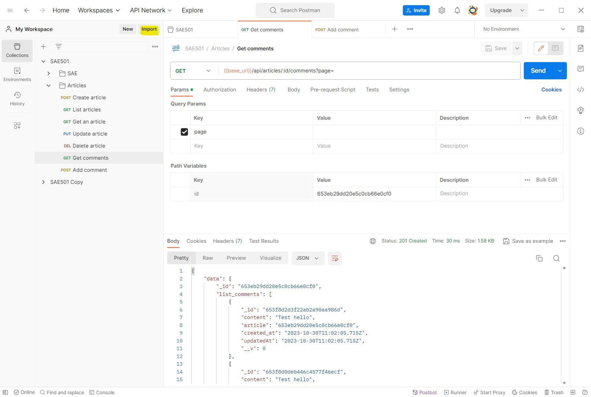
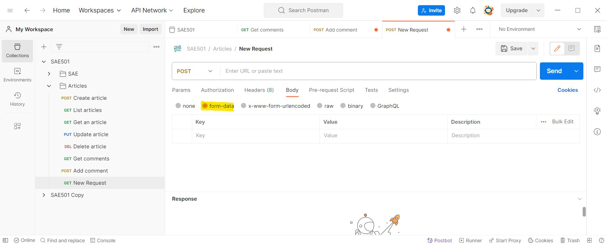
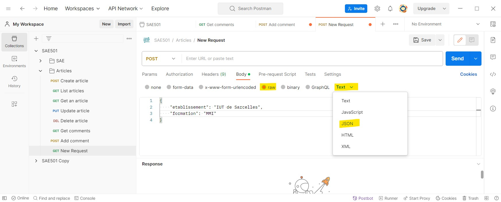

# Postman

Postman est un logiciel freemium permettant de tester des API. L'avantage premier de Postman, c'est qu'on n'a pas besoin de front-end pour tester, inutile d'effectuer un parcours utilisateur en entier pour vérifier si un élément en particulier fonctionne. De plus, il est possible de rejouer ses requêtes à l'envie avec différents paramètres 
- [Télécharger Postman](https://www.postman.com/)
> A tester, mais il semble qu'il est impossible d'importer une collection sans créer un compte Postman. Et vous aurez besoin d'importer une collection

## Importer une collection
> Une collection est un ensemble de requêtes d'API, elle est stockée au format JSON. Vous pouvez créer la vôtre, mais dans cette SAE, vous en avez déjà une que vous pourrez éditer en ajoutant vos requêtes relatives aux messages.

Pour importer une collection, il faut suivre les étapes suivantes :

1.

Cliquez sur le bouton import et selectionnez votre fichier de collection, `SAE501.postman_collection.json` pour la SAE

2. _Et voilà_

## Accéder / créer une requête

Sur la gauche, vous avez vos collections, elles peuvet être divisées en sous-dossiers. Pour créer un dossier, il suffit de survoler un dossier ou collection et cliquer sur les trois points qui sont apparus, il y a une option "Add folder". Dans ce même menu sous le nom "Add request", vous pouvez créer une nouvelle requête, une nouvelle façon d'accéder à votre API.

- Bleu : Nom de la requête. Éditable en cliquant dessus ou en faisant `ctrl/cmd + e`
- Jaune : Méthode de la requête. Éditable en cliquant dessus (où il y a la flèche)
- Vert : Url de la requête. L'url peut prendre des placeholders. Il suffit de prefixer le paramètre par deux-points (:). Exemple : `http://localhost:7777/api/:id/:gallery_id`. Ceci va créer un nouveau tableau dans l'onglet "Params" permettant de changer de façon plus simple la valeur des paramètres "id" et "gallery_id"
> En plus des placeholders, l'url peut accepter des variables, elles sont déjà utilisées dans les requêtes de la collection que vous avez récupéré. Ces variables sont accessibles en cliquant sur une collection, onglet "Variables".
- Orange : Les paramètres d'url (ceux qu'on trouve après le caractère "?"). Ainsi que les paramètres de placeholder s'ils sont présents (voir point du dessus)
- Rose : Corps de la requête, envoyés quand la requête est de type "POST"
- Violet : Réponse de l'API
- Bouton "Send" : Exécute la requête

### Corps de requête

Dans le cas où vous faites une requête de type POST (création d'élément) ou PUT (mise à jour d'élément), le contenu de la requête sera dans le corps (body), il y a plusieurs façons de l'envoyer. Nous n'aborderons que deux méthodes : "form-data" et "raw"

#### form-data

On utilisera form-data quand la requête peut attendre un fichier (formulaire enctype="multipart/form-data"), par exemple la création d'une SAE, là. Pour construire notre requête, il faudra tout simplement remplir le tableau avec nos clés (colonne "Key") et valeurs (colonne "Value"). La valeur de "Key" est l'équivalent de l'attribut "name" pour un élément de formulaire en HTML. La colonne "Description" est là à titre indicatif, ce n'est pas envoyé au serveur.

> **Attention à ne pas insérer par erreur un retour à la ligne dans le nom du clé, surtout à la fin. Ceci engendra à coup sûr une erreur, Postman vous aide en affichant une icône assez discrète à côté du champ dans la cellule en question.**

Enfin, il est possible de changer le type d'un champ en survolant une cellule de la colonne "Key", par défaut, les champs sont de types "Text", mais il est possible de changer en type "File" pour uploader un vrai fichier.

#### raw

Le format raw permet d'envoyer du contenu "brut", par exemple, ajouter un commentaire à un article ou pour vous créer un message dans le cadre du projet. Postman gère plusieurs types de formats raw, dans le cadre de la SAE, on utilisera uniquement le format "JSON".

Pour finir, il est possible d'utiliser la bibliothèque faker avec Postman, faker permet de générer des valeurs aléatoires pour un type spécifique de données textuelle ou numéraire (couleur, prénom, adresse, heure...). Pour utiliser une variable de faker, il faut juste la mettre entre deux paires d'accolades ({{}}). [La liste des variables se trouve ici.](https://learning.postman.com/docs/writing-scripts/script-references/variables-list/)
> 
> Ici nous générons un court texte pour la clé "content"
Faker est déjà utilisé dans le projet, dans le but de créer à coup sûr une nouvelle entité unique.