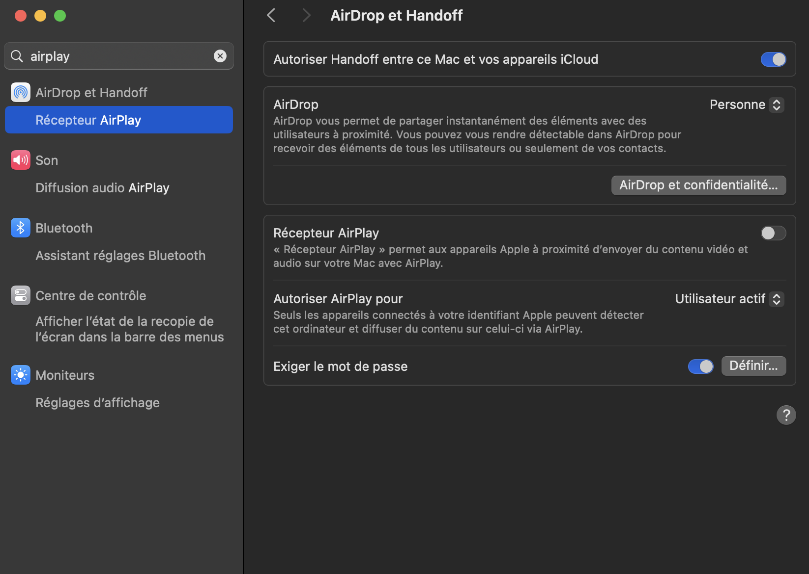

# SAE 501 - Développer pour le web ou Concevoir un dispositif interactif

_Les consignes pourront être modifiées._

- [SAE 501 - Développer pour le web ou Concevoir un dispositif interactif](#sae-501---développer-pour-le-web-ou-concevoir-un-dispositif-interactif)
  - [Contexte de la SAÉ](#contexte-de-la-saé)
  - [Structure du projet](#structure-du-projet)
    - [Dossier database/](#dossier-database)
    - [Dossier public/](#dossier-public)
    - [Dossier server/](#dossier-server)
      - [server/api-router/](#serverapi-router)
    - [Dossier src/](#dossier-src)
      - [src/components/](#srccomponents)
      - [src/data/](#srcdata)
    - [src/layouts/](#srclayouts)
    - [src/pages/](#srcpages)
    - [scripts/](#scripts)
    - [styles/](#styles)
  - [Mise en place](#mise-en-place)
    - [Pré-requis](#pré-requis)
    - [Installation](#installation)
    - [Utilisation - Mode développement](#utilisation---mode-développement)
    - [Utilisation - Mode production](#utilisation---mode-production)
  - [Flash messages](#flash-messages)
  - [Utilisation de git](#utilisation-de-git)
  - [eslint](#eslint)
  - [Tâches à effectuer](#tâches-à-effectuer)
    - [Site BUT et administration](#site-but-et-administration)
    - [Site BUT](#site-but)
    - [Administration](#administration)
  - [Notes et astuces](#notes-et-astuces)
  - [FAQ - Foire Aux Questions](#faq---foire-aux-questions)


## Contexte de la SAÉ
Vu en S1 et S2, le site dédié au BUT Métiers du Multimédia et de l'Internet (MMI) fait son retour. Dans la SAÉ 105, vous aviez pu découvrir le HTML et le CSS, puis en S2 appliquer vos connaissances en PHP/MySQL sur ce même site. Cette fois-ci en S5, vous allez travailler une nouvelle fois sur ce site, mais avec des technologies bien plus modernes : nunjucks, vite, express... Dans le but de valider les Apprentissages Critiques (AC) suivants : 

**R5.DWeb-DI.06 | Développement back avancé**
- AC34.02 | Développer à l’aide d’un framework de développement côté serveur

**R5.DWeb-DI.05 | Développement front avancé**
- AC34.02 | Développer à l’aide d’un framework de développement côté client
- AC34.03 : Intégrer, produire ou développer des interaction riches ou des dispositifs interactifs
- AC35.02 : Maîtriser la qualité en projet Web ou multimédia

> N'oubliez pas d'ajouter les fichiers "nunjucks" au plugin Emmet dans les préférences de VSCode (normalement ceci a été fait lors de notre TP sur nunjucks). Pour rappel : `File > Preferences > Settings > Recherchez "Emmet" > Ajoutez "nunjucks" avec la valeur "html" dans la partie "Emmet: Include Languages"`. [Et le plugin Nunjucks ajoutera la coloration syntaxique.](https://marketplace.visualstudio.com/items?itemName=ronnidc.nunjucks). [Pour le formattage des fichiers .njk, vous pouvez utiliser l'extension Nunjucks Template Formatter](https://marketplace.visualstudio.com/items?itemName=okitavera.vscode-nunjucks-formatter)

Ce projet sera à faire en binôme ou en trinôme. Votre rendu devra être mis sur Moodle avant la date butoir, **cette date sera donnée ultérieurement.** Un seul rendu est nécessaire par groupe, celui du chef d'équipe. Des points pourront être retirés ou la note nullifée si le devoir est rendu en retard. **Le rendu se fera sous la forme d'un lien, le lien de votre dépôt git.**

Vous partirez du code fourni et contenu dans le dossier `"code/"`. Vous trouverez plus bas la liste des choses à réaliser. 

> - [Télécharger le code de départ la SAE](https://download-directory.github.io/?url=https%3A%2F%2Fgithub.com%2FDanYellow%2Fcours%2Ftree%2Fmain%2Fdeveloppement-front-s5%2Fsae-501)
>
> - [Accéder à la maquette Adobe XD](https://xd.adobe.com/view/95c93a87-3bd9-475d-8adf-6d6937baace9-c09a/)

Le projet se structure de la façon suivante (structure non exhaustive) :

## Structure du projet
```
code/
├── database/
├── public/
│   ├── fonts/
│   ├── images/
│   ├── styles/
│   └── uploads/
├── server/
│   ├── api-router/
│   ├── back-end-router/
│   ├── front-end-router.js
│   ├── debug-router.js
│   ├── index.js
│   └── uploader.js
└── src/
    ├── components/
    │   ├── front-end/
    │   └── back-end/
    ├── data/
    │   └── menu.json
    ├── layouts/
    │   ├── front-end/
    │   └── back-end/
    ├── pages/
    ├── scripts/
    │   ├── main.backend.js
    │   └── main.frontend.js
    └── styles/
```

La structure est un peu plus complexe que celle avec laquelle vous avez travaillé en S1/S2. Le projet se base principalement sur les outils vitejs et express. Regardons en détails tout ça.

### Dossier database/
Le dossier `database/` gère la gestion de la base de données NoSQL du projet. Vous trouverez plus de détails sur la technologie NoSQL dans le [fichier MONGODB-NOSQL](./MONGODB-NOSQL.md). Vous aurez besoin de télécharger [MongoDB](./MONGODB-NOSQL.md#installation), et pour des questions de confort [MongoDB Compass](https://www.mongodb.com/try/download/compass), les deux sont gratuits.

### Dossier public/
Le dossier `public/` contient toutes les ressources qui n'ont pas à être gérées par vite, si vous avez un fichier CSS que vous n'importerez pas dans un fichier javascript, c'est ici qu'il faudra le mettre.
> Lorsqu'un fichier nunjucks ou css charge une ressource du dossier `public/`, il faut partir du principe que le fichier nunjucks ou css est, **virtuellement**, dans le dossier `public/`. Ainsi le chemin ne devra pas contenir `public/` et devra commencer par un slash (/)

Dans le dossier `public/`, on y trouve également le dossier `uploads/`, là où les fichiers uploadés seront placés, **vous ne devez pas le supprimer**. De plus, ce dossier n'est pas commité, les fichiers que vous uploaderez resteront sur votre ordinateur.

### Dossier server/
Jusqu'à présent, vous avez travaillé avec des serveurs Apache et la technologie PHP. Dans cette SAÉ, nous avons décidé de remplacer le PHP par nodejs et express. express est un framework permettant de développer des applications web grâce à nodejs.

Dans le dossier `server/`, le fichier `index.js` sert de point d'entrée et lance le serveur. Au sein du dossier on trouve le routing du projet.

Autrement dit, ces fichiers définissent comment le serveur doit réagir quand on accède à une url spécifique avec une méthode spécifique, c'est souvent le chargement d'une page web. Par exemple :
```js
// front-end-router.js
router.get(["/hello", "/mon-blog.html"], async (_req, res) => {
  res.render("pages/index.njk", { title: "hello" });
});
```
Le code ci-dessus indique que lorsqu'on accède à l'url `/hello` ou `/mon-blog.html` avec la méthode GET, on charge le template `pages/index.njk` en injectant la variable "title". Ici on affiche une page, mais on peut imaginer un appel d'API ou encore la création d'un fichier, tout dépendra de vos besoins. Notez bien qu'il faut que votre route ait un "res" sinon votre ressource moulinera indéfiniment dans le vide. 

> Note : les chemins des templates partent de la racine du projet. Il est donc inutile de mettre '../' dans vos chemins.

Une route peut également prendre également des paramètres, il suffit de préfixer le nom du paramètre par deux-points (:). Exemple :
```js
// front-end-router.js
router.post("/user/:id/:gallery", async (req, res) => {
    // On récupère le paramètre id et gallery dans l'url.
    const paramId = req.params.id;
    const paramGallery = req.params.gallery;
    res.render("pages/index.njk", { title: "hello" });
});
```
Dans l'exemple ci-dessus, les deux paramètres sont obligatoires. Il est possible de les rendre facultatifs grâce à un point d'interrogation (?), syntaxe issue des expressions régulières (regexes). Exemple :
```js
// front-end-router.js
// Le paramètre "gallery" est facultatif mais pas "id"
router.post("/user/:id/:gallery?", async (req, res) => {
    const paramId = req.params.id;
    const paramGallery = req.params.gallery;

    // On récupère une chaîne de requête (query string) nommée "per_page"
    const perPage = Number(req.query?.per_page) || 7;
    res.render("pages/index.njk", { title: "hello" });
});
```
> Attention tout de même, il n'est pas conseillé de rendre un paramètre optionnel de cette façon. Le mieux est de le placer en chaîne de requête (query string).

La gestion des paramètres possède d'autres fonctionnalités comme la gestion des expressions régulières (Regex), vous en saurez plus dans la documentation ou les fichiers fournis.
- [Accéder à la documentation du routing avec express](https://expressjs.com/fr/guide/routing.html)
- [Exemples regex dans routes - anglais](https://www.kevinleary.net/blog/regex-route-express/)

Retenez les points suivants :
- Si vous faites un lien entre des pages du site, il faudra faire le lien vers la route et non vers le fichier nunjucks, sinon, vous aurez certainement une erreur 404
- Lorsque vous souhaitez ajouter une nouvelle page, en plus du fichier, il faudra également rajouter la nouvelle route. Aidez-vous des exemples dans les fichiers de routing. Dans le projet, il y a trois types de routes :
    - frontend : partie accessible à tous. Fichier `server/front-end-router.js`
    - backend : partie accessible aux administrateurs. **Toutes les routes commencent par "/admin", vous ne devez pas le mettre dans la route vous-même**. Dossier `server/back-end-router/`
    - api : appels permettant de récupérer des données de la base de données. **Toutes les routes commencent par "/api", vous ne devez pas le mettre dans la route vous-même.** Dossier `server/api-router/`

#### server/api-router/
Le projet tourne autour d'une API respectant le CRUD. Pour rappel, le CRUD fonctionne de la façon suivante :
- C - Create : Création d'une ressource. Représenté par la méthode HTTP `POST`
- R - Read : Lecture d'une ressource. Représenté par la méthode HTTP `GET`
- U - Update : Mise à jour d'une ressource. Représenté par la méthode HTTP `PUT`
- D - Delete : Suppression d'une ressource. Représenté par la méthode HTTP `DELETE`

Vous pourrez trouver tous les détails de l'API dans le swagger du projet via la route `/swagger` our `/debug/swagger` et également la tester grâce à Postman. Un document de présentation de Postman est présent dans le projet. Cette API CRUD est appelée par le back-end-router en fonction des actions effectuées. 
- [Accéder à la présentation de Postman](./POSTMAN.md)

### Dossier src/
C'est dans ce dossier où se trouve toute la partie front-end, la structure ressemble plus ou moins à celle préconisée par vituum, mais, le projet ne l'utilise pas. Il y a donc certaines fonctionnalités vues en TP qui ne seront pas accessibles.

#### src/components/
Il contient vos composants nunjucks réutilisables, pour des questions d'organisation, nous vous conseillons fortement de placer vos composants dans le bon dossier (front ou back-end).

#### src/data/
Ce dossier fonctionne comme ce que vous aviez pu voir en TP, ainsi tout fichier json présent dans le dossier sera automatiquement injecté dans tous les fichiers nunjucks du projet. A l'heure actuelle, il y a un fichier menu.json qui est déjà exploité pour afficher le menu de la partie front-end. 

Egalement, il est possible de charger un fichier json propre à un template, il suffit juste qu'il ait le même nom que le template avec l'extension ".json". Exemple : /pages/contact.njk -> /pages/contact.njk.json.

### src/layouts/
Le dossier `layouts/` est destiné pour les gabarits partagés entre vos pages, il y en a déjà un pour le frontend et backend du site respectivement. Le moteur de template utilisé est nunjucks, les fichiers sont compilés à la volée par le serveur node.

### src/pages/
Vous placerez ici les pages qui seront affichées à l'utilisateur final, ce dossier peut avoir des sous-dossiers, il faudra juste faire attention au chemin quand vous les appelerez dans vos routes. A noter que quand vous appelerez ces pages dans les routeurs, le chemin ne doit pas contenir "src/". Regardez les routes déjà existantes pour vous aider.

### scripts/
Contient les points d'entrées de vos bundles vite, ils seront compilés par vite lors de l'exécution de la commande `npm run build`. Le backend possède l'entrée `main.backend.js` et le frontend l'entrée `main.frontend.js`. Si vous pouvez créer des dossiers et des fichiers dedans, vous ne devez pas modifier le nom des fichiers **à la racine** déjà présents. Les fichiers "main.backend.js" et "main.frontend.js" servant de point d'entrée.

### styles/
Contient le CSS du projet. Le projet importe déjà [tailwindcss](https://tailwindcss.com/docs/installation), le fait que nous utilisions avec nodejs fait que vous avez accès à l'auto-complétion des classes tailwind. Il vous suffit de commencer à écrire le nom d'une classe tailwindcss ou de faire `ctrl/cmd + espace` et VSCode fera des propositions. Vous pouvez bien utiliser tailwindcss pour l'intégration de la partie front et backend du projet. Pas utile d'être 100% iso avec la maquette fournie. Pour vous aider avec la complétion de code, il existe le plugin gratuit VSCode [Tailwind CSS IntelliSense](https://marketplace.visualstudio.com/items?itemName=bradlc.vscode-tailwindcss), il indique également les incohérences dans le code, les classes CSS antinomiques, par exemple.

Par ailleurs, des modifiers tailwind personnalisés ont été ajoutés dans le fichier tailwind.config.js, ils permettent notamment de cibler des écrans tactiles / non-tactiles.

> Le projet n'utilise pas SCSS, à la place, nous avons fait le choix d'utiliser le <a href="https://developer.mozilla.org/en-US/docs/Web/CSS/CSS_nesting/Using_CSS_nesting" target="_blank">CSS Nesting</a>. Ceci permet d'utiliser l'imbrication de sélecteurs CSS. Toutefois SCSS est installé, vous pouvez l'utiliser si vous souhaitez.

> Par sa séparation en trois grandes entités (serveur, templates et données), le projet applique le patron de conception [MVC (Modèle Vue Contrôleur)](https://fr.wikipedia.org/wiki/Mod%C3%A8le-vue-contr%C3%B4leur), standard dans le monde du développement. Ce modèle limite le code spaghetti car chaque partie a un rôle qui lui est propre. Et chacune d'elle est plus ou moins agnostique. 

## Mise en place

### Pré-requis
- node >= 18.11 (utilisez la commande `node -v` pour voir votre version)
  - Si jamais, pour diverses raisons, vous ne pouvez pas installer une version 18.11+ de nodejs, utilisez nvm pour pouvoir utiliser plusieurs versions de nodejs sur votre ordinateur
    - [Installer nvm](https://github.com/nvm-sh/nvm#installing-and-updating)
- mongodb (voir [MONGODB-NOSQL.md](./MONGODB-NOSQL.md#installation) pour l'installation)

### Installation
1. [Récupérer le projet](https://download-directory.github.io/?url=https%3A%2F%2Fgithub.com%2FDanYellow%2Fcours%2Ftree%2Fmain%2Fdeveloppement-front-s5%2Fsae-501)
2. Installer les dépendances
   ```sh
   npm install
   ```

### Utilisation - Mode développement
1. Lancer le serveur
   ```sh
   # La commande va lancer les serveurs express et vite
   npm start
   ```
Par défaut, le site tourne sur le port 3900, mais vous pouvez le changer grâce à un fichier env/.env.dev.local (voir fichier env/.env.dev.dist pour exemples).
Le serveur se relance à chaque modification de fichiers et rafraîchit également le navigateur. De plus, le serveur est exposé sur le réseau, vous pouvez donc accéder au projet depuis n'importe quel appareil sur le même réseau, ça sera pratique pour tester le mode responsive sur vos terminaux mobiles.

> **N'éditez pas le fichier env/.env.dev.dist, faites-en une copie que vous nommerez .env/.env.dev.local.** Une bannière d'alerte sera affichée si vous ne créez pas de fichier env/.env.dev.local.

### Utilisation - Mode production
1. Compiler les assets gérés par vite
   ```sh
   # La commande va compiler les assets vite dans le dossier dist/
   npm build
   ```
2. Lancer le serveur de production
   ```sh
   npm prod
   ```
> Note : Même s'il y a une tâche de production, vous ne serez pas en capacité d'uploader votre site chez un hébergeur, par défaut, ils ne gèrent pas nodejs, et le déploiement de projets node nécessite quelques modifications supplémentaires que nous n'aurons pas l'occasion de voir. Cependant, si vous souhaitez, temporairement, exposer votre site, vous pouvez utiliser un outil gratuit comme [localtunnel](https://localtunnel.github.io/www/). Vous avez également le service freemium Glitch qui permet de mettre votre site en ligne. [Le site mdn propose un didacticiel (en anglais) pour déployer votre site avec Glitch et MongoDB.](https://developer.mozilla.org/en-US/docs/Learn/Server-side/Express_Nodejs/deployment)

## Flash messages
Pour améliorer l'expérience du site un système de flash message a été mis en place. Un flash message est un message stocké dans la session de l'utilisateur et affiché qu'**une seule fois.** après sa création. Ce concept n'est pas propre à express, on le trouve également dans d'autres frameworks côté serveur. Lors de l'édition ou la création d'une SAE avec succès, une bannière s'affiche, c'est un flash message. Nous vous conseillons de les utiliser également pour les autres formulaires.

Ils sont déjà implémentés lors de la création, l'édition et la suppression d'une SAE grâce à l'utilisation des node_modules [express-flash](https://www.npmjs.com/package/express-flash) et express-session. Vous pouvez trouver un exemple [ici](https://peeyushjss.medium.com/guide-to-send-flash-messages-using-nodejs-b4f83d4b0bd7) pour voir comment ça fonctionne dans l'ensemble (script + html).

## Utilisation de git 
Lors du rendu du projet, vous devrez rendre le lien github de votre projet. Il est donc **indispensable** de créer un dépôt pour le projet, seul un membre du groupe doit le faire. Pour éviter des problèmes lors des premiers commits, suivez les étapes suivantes :

1. Un membre du groupe crée le projet sur github
1. Ajoutez les autres membres de votre groupe en tant que collaborateurs (Settings > Collaborators (premier élément dans la liste à gauche)) 
   - Ceci peut se faire plus tard
2. Clonez votre dépôt sur votre ordinateur (ssh ou https)
3. Copiez-collez tous les fichiers du projet de la SAE dans votre dépôt récemment cloné
    - Le projet contient déjà un fichier `.gitignore`, inutile d'en créer un de vôtre côté
4. Ajoutez tous les fichiers à l'historique de git avec la commande `git add -A`
5. Commitez puis poussez les modifications `git commit -am "Premier commit"` puis `git push origin`

> Note : Un commit, c'est gratuit. Pensez à le faire régulièrement (tout en ajoutant les fichiers récemment ajoutés à l'historique de git) ceci vous permet d'avoir plusieurs points de sauvegarde, vous permettant ainsi de revenir en arrière à des points plus précis.

Si vous avez oublié comment fonctionne git. Vous avez un mémo qui rappelle les commandes de base.
- [Accéder au mémo sur les commandes de base de git](https://github.com/DanYellow/cours/blob/main/integration-web-s2/sae-203/LISEZ-MOI-GIT.md)

## eslint
Dans une volonté de produire une code de qualité et constant, le projet intègre un linter. C'est un outil d'analyse de code et lève les différentes erreurs présentes. Dépendemment du langage, différents types d'erreurs seront levées. Dans l'environnement javascript, une variable non utilisée, ou une condition dupliquée peut être notifiée comme problème. Dans le projet, c'est eslint qui a été utilisé, c'est le plus répandu en javascript. Les problèmes sont affichés à chaque sauvegarde d'un fichier javascript (back-end et front-end) dans votre Terminal (pas la console du navigateur).

> Quand une erreur / alerte s'affiche, vous pouvez effectuer un ctrl / cmd + clic sur l'erreur dans le terminal de VS Code pour atterrir à l'endroit du problème dans le fichier.

eslint permet, via le paramètre "fix", de corriger **certaines** erreurs de code après chaque sauvegarde de votre projet, si et seulement si, le projet est lancé.

> Si vous souhaitez activer l'auto-correction des fichiers via eslint, il est possible de le faire via le fichier .env et la variable `IS_ESLINT_AUTO_FIX_ENABLED`. 

Pour exécuter uniquement le linter, il y a la commande `npm run lint`. La commande `npm run lint:fix`. Vous permet de corriger certaines erreurs.

En plus de la configuration de base d'eslint, le plugin stylistic a également été rajouté, il vérifie le formattage du code (indentation, virgules, etc.).
- [Accéder à la documentation d'esling stylistic](https://eslint.style/)

Le projet possède, parfois, des variables non utilisées, pour éviter de polluer la console avec des alertes inutiles, une modification a été faite dans la configuration d'eslint (fichier eslint.config.js) pour que les variables qui commencent par un underscore (_) soient ignorées. Exemple :
```js
// Sera ignoré par eslint
const _myIgnoredVar = 42;

// Ne sera pas ignoré par eslint
const myIgnoredVar = 42;
```

Notez qu'eslint possède trois niveaux de contrôle : 
- error / 2 : lève une erreur en cas de problème. Dans certaines configurations, on peut même bloquer la commande `git push` ou la compilation du code
- warn / 1 : lève une alerte en cas de problème
- off / 0 : désactive la règle

La configuration d'eslint peut être modifiée à l'envie dans le fichier eslint.config.js. [Vous pourrez trouver toutes les règles sur le site d'eslint.](https://eslint.org/docs/latest/rules/). Celles avec l'icône ✅ sont actives dans le projet.

> Il existe l'extension gratuite eslint pour VS Code pour avoir des indications dans le code.
> - [Télécharger l'extension eslint pour VS Code](https://marketplace.visualstudio.com/items?itemName=dbaeumer.vscode-eslint)

Enfin dans la partie debug de l'administration, il y a une partie eslint affichant un rapport des problèmes trouvés par l'outil. Ce rapport est partagé en deux parties : 
- Server : Représente la partie back-office (api inclue)
- Front-end : Représente la partie front-office
  
D'ailleurs, vous y trouverez quelques problèmes car ils ont été laissés volontairement dans le code.

> Déconseillé mais sachez qu'il est possible d'exclure certaines lignes d'eslint grâce à des commentaires.
> [Vous trouverez plus d'informations dans la documentation.](https://eslint.org/docs/latest/use/configure/rules#disabling-rules)

## Tâches à effectuer

- [x] Lire les consignes
- [ ] [Télécharger le code de départ la SAE](https://download-directory.github.io/?url=https%3A%2F%2Fgithub.com%2FDanYellow%2Fcours%2Ftree%2Fmain%2Fdeveloppement-front-s5%2Fsae-501)
- [ ] Installer les dépendances [(voir partie "mise en place")](#mise-en-place)
- [ ] S'approprier le code, faire des tests comme ajouter de nouvelles routes et pages...
- [ ] Initialiser le projet sur github [(voir partie "utilisation de git")](#utilisation-de-git)
- [ ] **Ne pas modifier la page "a-propos", elle est complète et déjà responsive**

### Site BUT et administration
- [ ] Gérer l'erreur 404
    - Il existe moult didacticiels en ligne qui montrent comment gérer ceci avec express. Attention : votre route de 404 doit être la dernière route de votre fichier, sinon, celles qui suivront ne seront jamais appelées
- [ ] Rendre le site responsive (tailwind est là pour vous aider)
    - Il n'y a pas de maquette responsive, à vous de vous adapter. Utilisez votre expérience ainsi ce que vous avez vu cours pour proposer la meilleure expérience possible
    - [Accéder à la documentation des modifiers responsive de tailwindcss](https://tailwindcss.com/docs/responsive-design)
- [ ] Mettre un favicon
    - Il n'a pas besoin d'être géré par vite, mettez-le dans le dossier /public
    - Il peut être différent entre le site BUT et l'administration
- [ ] Respecter les normes d'accessibilité web (font-size en rem, contrastes...)
  - Quand vous utilisez la pseudo-classe ":hover", pensez toujours à mettre également la pseudo-classe ":focus-visible"
    - Il y a la mixin SCSS ":hocus" qui réunit les deux, il y a également un modifier tailwindcss "hocus:" qui remplit le même rôle. Il fonctionne également pour les groupes
- [ ] Ajouter une validation côté client des formulaires
    - Vous pouvez utiliser un outil comme [validator.js](https://github.com/validatorjs/validator.js) (déjà installé, voir `code/database/models/author.js`)
- [ ] Afficher le nom des membres de l'équipe (site BUT et/ou administration)
- [ ] Chaque page à une valeur de &lt;title> unique
  - Si la valeur n'est pas présente, il est indiqué "TITRE MANQUANT" dans le navigateur
  - Il y a un bloc nunjucks `````` dédié dans les gabarits de base du dossier `layouts/`. Utilisez-le

### Site BUT
- [ ] Compléter l'intégration à partir de la maquette Adobe XD
    - [Accéder à la maquette Adobe XD](https://xd.adobe.com/view/95c93a87-3bd9-475d-8adf-6d6937baace9-c09a/)
    - Vous devez utiliser nunjucks, un gabarit de base (`src/layouts/front-end/base.njk`) est là pour vous aider
    - La page "a-propos" est déjà faite. **Pas besoin de la modifier**
    - N'oubliez pas d'ajouter les routes pour accéder à vos pages dans le fichier `server/front-end-router.js` et modifier les liens de navigation dans le fichier `src/data/menu.json`
        - La valeur de l'attribut "href" doit être le premier paramètre du router. Exemple :
    ```js
    router.get("/formation", async (req, res) => {/* [...] */})
    // Dans le code ci-dessus, on définit une route ayant pour chemin "/formation" pour charger une page.
    // Pour y accéder depuis une balise <a>, il faudra mettre comme valeur "/formation" pour l'attribut "href", et ce, même si le fichier nunjucks s'appelle "training.njk"
    ```
- [ ] Sur la page contact, vous devez gérer de façon asynchrone l'envoi du message depuis le formulaire
    - **La page ne doit pas se recharger lors de la soumission du formulaire**
    - Il faudra utiliser un outil comme [axios](https://www.npmjs.com/package/axios) (déjà installé) ou fetch, api native de javascript
- [ ] Afficher les détails d'un article quand on clique dessus depuis la page d'accueil
    - titre, chapo, contenu, image, video youtube
    - Afficher le nom de l'auteur (mettre une valeur par défaut si un article n'a pas d'auteur) avec un lien vers le détail de l'auteur listant tous ses articles
    - Note : Pour la vidéo Youtube, elle est facultative, toutefois vous devez permettre à l'utilisateur de mettre l'URL de la vidéo, l'url d'iframe ou juste l'id de la vidéo
- [ ] Permettre, de façon asynchrone, d'ajouter un commentaire à un article et l'afficher
  - Pour gérer les messages plus facilement, aidez-vous de la balise &lt;template>
- [ ] Indiquer dans la navigation la page courante et changer la couleur de la bulle en fonction de la page
    - Il faudra utiliser une variable nunjucks
    - Des classes ont déjà été définies dans le fichier `src/styles/hero.css`, libre à vous de les utiliser
    - Note : Une fonctionnalité semblable est déjà présente dans la partie admin, inspirez-vous en
- [ ] Afficher la liste des articles **actifs** sur la page d'accueil
    - Pour rappel, vous avez déjà le code pour, les articles sont déjà injectés dans la page d'accueil (`src/pages/front-end/index.njk`), il faut juste les afficher
- [ ] Mettre en place un système de pagination pour les articles sur la page d'accueil
- [ ] Ajouter une barre de progression sur les articles grâce à la propriété CSS [animation-timeline](https://developer.mozilla.org/fr/docs/Web/CSS/animation-timeline)
  - Google propose un exemple sur son site. [Voir exemple.](https://developer.chrome.com/docs/css-ui/scroll-driven-animations?hl=fr#demo_reading_progress_indicator)
- [ ] Ajouter une page affichant en détails un auteur
    - Cette page n'existe pas, à vous de faire le design
    - Il y a déjà une url pour récupérer ces informations (voir swagger ou postman)
    - La couleur de la bulle change en fonction de l'auteur (optionnel)

### Administration
- [ ] Gérer la date des journées portes ouvertes (affichée dans la page d'accueil du site BUT) depuis le backoffice qui lira/modifiera un fichier json
    - Le fichier n'existe pas, vous devez le créer dans le dossier src/data pour que son contenu puisse être lu dans les templates
    - La documentation de Nodejs propose des exemples pour lire/éditer un fichier json (préférez la version avec promesse) :
        - [Lire un fichier](https://nodejs.org/en/learn/manipulating-files/reading-files-with-nodejs)
        - [Ecrire un fichier](https://nodejs.org/en/learn/manipulating-files/writing-files-with-nodejs)
            - Note : Vous devez impérativement transformer le contenu à écrire en chaîne de caractères avant de l'écrire dans le fichier
- [ ] Ajouter une section "Messages" (titre indicatif) sur la page d'accueil de l'administration listant les cinq derniers messages envoyés depuis le formulaire de contact
    - Cette route est gérée dans le fichier `server/back-end-router/index.js`, il faudra la compléter
- [ ] Afficher en "temps réel" le nombre de caractères dans la balise &lt;textarea>
    - Lors de l'édition d'une SAE, il y a une limite de caractères, indiquez à l'utilisateur le nombre de caractères restants
- [ ] Permettre à l'utilisateur mobile de changer de page grâce à la liste déroulante présente pour la pagination
    - Les listes déroulantes sont déjà présentes, il ne manque plus que l'interactivité avec le javascript
- [ ] Afficher les messages envoyés depuis le formulaire de contact
    - Il n'y a pas de schéma pour les messages, nous le réaliserons ensemble
        - L'administration ne doit permettre que de lister les messages (GET) et le site front juste d'envoyer un message (POST)
    - Vous devez créer les api pour (POST et GET)
    - N'oubliez pas d'ajouter les routes pour accéder aux messages depuis l'administration dans le dossier `./server/back-end-router/` 
- [ ] Permettre de créer, éditer un article
    - Toutes les routes d'API sont déjà prêtes pour manipuler la base de données. Il faut créer les pages associées
    - **Le champ permettant l'upload d'images doit impérativement s'appeller "image" (attribut "name"), sinon ça ne fonctionnera pas**
    - La suppression et le listage sont déjà gérés
    - Lorsqu'un lien youtube est placé, vous devez afficher le lecteur youtube
      - Vous devez vérifier que le lien ou l'id de la vidéo est valide
    - Inspirez-vous de ce qui a déjà été fait pour la partie SAE, partie qui est complète
- [ ] Permettre de créer, éditer, supprimer un auteur et lister les auteurs
    - Toutes les routes d'api sont déjà prêtes pour manipuler la base de données. Il faut créer la partie front
    - **Le champ permettant l'upload d'images doit impérativement s'appeller "image" (attribut "name"), sinon ça ne fonctionnera pas**
    - Inspirez-vous de ce qui a déjà été fait pour la partie SAE, partie qui est complète
- [ ] Ajouter une validation côté client des formulaires (SAE, Auteur et Article)
    - Vous pouvez utiliser un outil comme [validator.js](https://github.com/validatorjs/validator.js) (déjà installé, voir `code/database/models/author.js`)
    - Dépendamment de l'outil, **vous devrez écouter un évènement pour la validation du formulaire**
- [ ] Afficher le détail d'un message dans une page dédiée
- [ ] Permettre de changer le logo de l'université dans le footer
  - **Vous ne devez pas utiliser de base de données**
- [ ] Terminer les fonctionnalités implicites. Exemple : corriger les liens qui vont vers des 404, etc.
- [ ] Mettre les membres du groupe dans le pied de page (fichier `src/layouts/back-end/base.njk`)
- [ ] Permettre l'activation / désactivation d'un article depuis la liste des articles
- [ ] Proposer un système de thème au niveau des couleurs dans l'administration. Présentement tout tourne autour du bleu, proposez un moyen de changer la couleur pour chaque utilisateur
  - **Vous ne devez pas utiliser une base de données pour stocker la valeur**
  - Pour rendre les choses les plus simples possibles, vous ne proposerez que les [couleurs listées par tailwind](https://tailwindcss.com/docs/customizing-colors)
  - Changer la valeur de la balise [meta "theme-color"](https://developer.mozilla.org/fr/docs/Web/HTML/Element/meta/name/theme-color) en fonction du background-color de l'écran

## Notes et astuces
- [Accéder au document dédié aux astuces](./ASTUCES.md)

## FAQ - Foire Aux Questions
- **Est-il possible d'utiliser tailwindcss également sur le front-office ?**
    
    Oui, vous avez tout à fait le droit. Il est déjà utilisé d'ailleurs.

- **Puis-je mettre sur github ce projet ?**
    
    Oui. De toute façon, c'est **obligatoire** car vous devrez rendre le lien du dépôt git.

- **Où puis-je trouver de l'inspiration pour le design de mes pages ?**
    
    Vous pouvez utiliser votre expérience. Si vous utilisez tailwind, vous avez le site [tailwindtoolbox](https://www.tailwindtoolbox.com/starter-components). Si vous avez besoin d'icônes, tailwind propose également [heroicons](https://heroicons.com/) qui est déjà utilisé sur le site.

- **Comment je peux tester la version mobile ?**
    
    Vous pouvez utiliser le mode responsive de votre navigateur ou votre propre smartphone. Il faut que votre ordinateur et votre smartphone soient sur le même réseau. Ensuite, il faut accéder à l'adresse ip de votre serveur (ça doit commencer par 192.168...) suivi du port. En tous les cas, votre adresse ip sur le réseau s'affiche dans la console node. Si vous avez un Mac, vous pouvez installer gratuitement Xcode (via le Mac AppStore) et utiliser le simulateur iOS.

- **Après l'ajout des API pour requêter les commentaires, est-ce que je dois mettre à jour le swagger ou Postman ?**
    
    Non, mais il reste préférable de faire l'un ou l'autre, ceci va permettre aux membres de votre groupe de comprendre comment tout ceci fonctionne dans une moindre mesure mais aussi de tester rapidement vos requêtes. Par ailleurs, si vos points d'accès (endpoints) n'apparaissent pas dans swagger, c'est qu'il y a une erreur dans vos annotations swagger.

- **Comment gérer l'affichage des dates côté navigateur ?**
Dans le projet, les dates sont enregistrées au format ISO 8601, ce qui donne au final une date qui ressemble à 2023-11-26T08:56:47.344Z, format qui n'est pas très lisible pour un être humain. Pour rendre ceci digeste, vous pouvez utiliser un node_module comme luxon (déjà installé dans le projet) pour formatter les dates.

  Dans le projet, il y a un filtre nunjucks dédié nommé "date". **Ce filtre n'est pas natif à nunjucks**, il a été ajouté dans le fichier `server/bootstrap.js`. Voici un exemple d'utilisation dans un fichier nunjucks.
  ```
    {{ my_date_from_db | date("dd/LL/yyyy à HH:mm:ss") }}
  ```
  Dans l'exemple ci-dessus notre date sera affichée de la façon suivante : 26/11/2023 à 08:56. Les paramètres passés dans le filtre "date" proviennent de la documentation de luxon.
    - [Accéder à la documentation du formattage avec luxon](https://moment.github.io/luxon/#/formatting?id=table-of-tokens)

- **La console affiche une erreur au niveau de "result.data" et le projet ne se lance pas, pourquoi ?**
    Vous n'avez pas installé ou lancé MongoDB, la console indique juste qu'elle n'arrive pas à trouver des données. Allez voir le fichier [MONGODB-NOSQL.md](./MONGODB-NOSQL.md#installation) pour les étapes d'installation.

- **Mon serveur node s'arrête sans arrêt alors qu'il n'y a pas d'erreurs dans mon code, pourquoi ?**

    Il est possible, si vous êtes sous MacOS, que le Centre de contrôles (Control Center) écoute des ports que vous utilisez et bloque parfois votre serveur node. Pour résoudre ce problème, il faut aller dans l'application "Préférences Système" puis dans le menu "Récepteur AirPlay" et désactiver "Récepteur AirPlay".
    
    - [En savoir plus](https://developer.apple.com/forums/thread/682332)

- **Le navigateur affiche l'erreur `Error: Failed to lookup view "" in views directory "undefined"`**
    
    C'est parce que dans une de vos routes, express n'a pas de template à charger. Autrement dit la méthode "render" a pour premier paramètre, une chaîne de caractères vide.
    
    A noter qu'une erreur semblable peut apparaître si vous chargez un template inexistant. 

- **Le navigateur affiche une erreur 404, je ne comprends pas**

    Vous essayez d'accéder à une URL qui n'a pas d'équivalent dans votre routeur. Vérifiez bien que votre route existe bien dans votre routeur. Par exemple, si vous écrivez GET - `ressources/:id` et que vous accédez dans l'URL à GET - `localhost:3900/ressources`, vous aurez une 404 car il manque un paramètre après. Notez bien que cette règle s'applique également sur la méthode. Appeler une requête en POST alors qu'elle n'existe qu'en GET engendrera également une erreur 404.

    Il y a la route `/debug/router` pour lister toutes les routes de votre projet ainsi que la méthode associée dans votre navigateur. Cette route est également accessible depuis le menu de l'administration.

- **Est-il possible d'utiliser le framework CSS bootstrap ?**
    
    Nous vous le déconseillons. Bootstrap va entrer en conflit avec tailwindcss. Et ce n'est pas vraiment utile dans ce projet.

- **Est-il possible d'utiliser une bibliothèque JS comme React ou Angular ?**
    
    Vous pouvez si vous estimez que c'est nécessaire. Aucun de ces outils n'a été installé en revanche, à vous de le faire. En règle générale, si vous avez besoin d'un plugin ou node_module supplémentaire, n'hésitez pas à l'installer.

- **Que sont les "@" dans les noms de classe, notamment les fichiers "layouts/back-end/base.njk" et "components/back-end/input-file.njk" ?**

    Le caractère "@" est un mot-clé désignant un "container query", une nouveauté du langage CSS. Dans les grandes lignes, c'est l'équivalent des media queries mais pour un conteneur (une balise). Par exemple, si on souhaite appliquer un style différent quand un conteneur a atteint une taille spécifique, il faut penser aux containers queries.

    Vous pourrez trouver des explications et exemples complémentaires en français ici :
    - [CSS Containers Queries avec Tailwind](https://www.premieroctet.com/blog/css-container-queries-avec-tailwind)
    - [Les Container Queries en CSS](https://www.alsacreations.com/article/lire/1915-Les-Container-Queries-en-CSS.html)
    - [Les Container Queries - mdn](https://developer.mozilla.org/en-US/docs/Web/CSS/CSS_containment/Container_queries)
    > Note : Dans le cadre du projet, l'utilisation des containers queries auraient pu être remplacé par de simples media queries, mais ceci vous permet de découvrir le fonctionnement.
    > 
    > Note 2 : A l'avenir, il sera même possible d'appliquer des propriétés CSS en fonction des propriétés CSS d'un conteneur défini