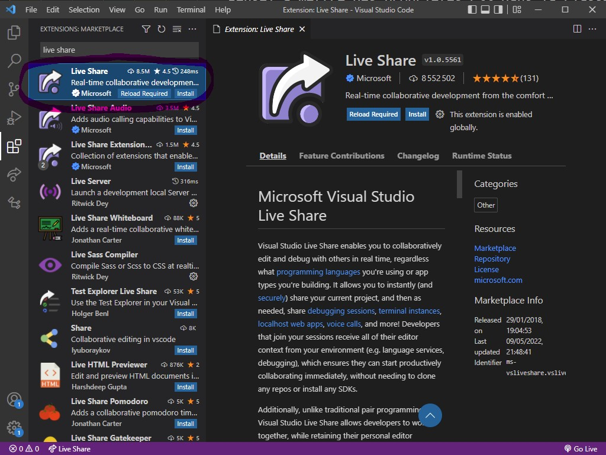
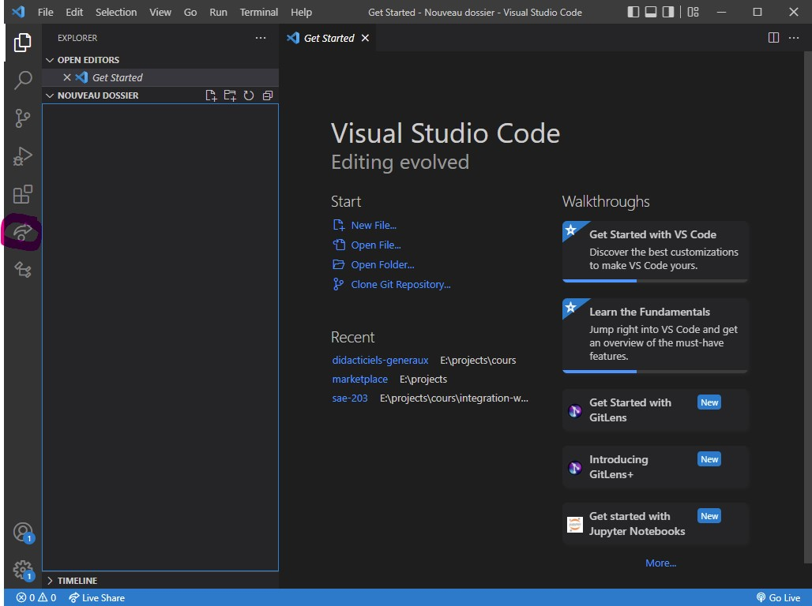
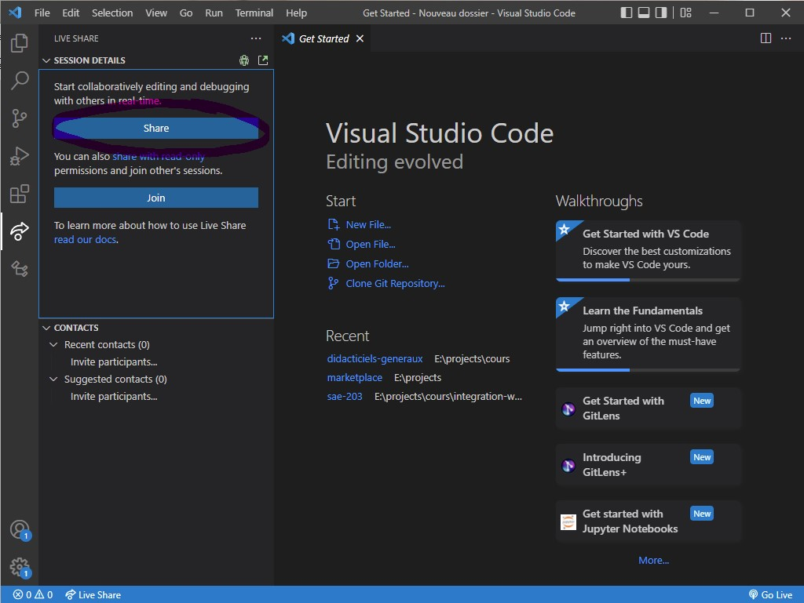
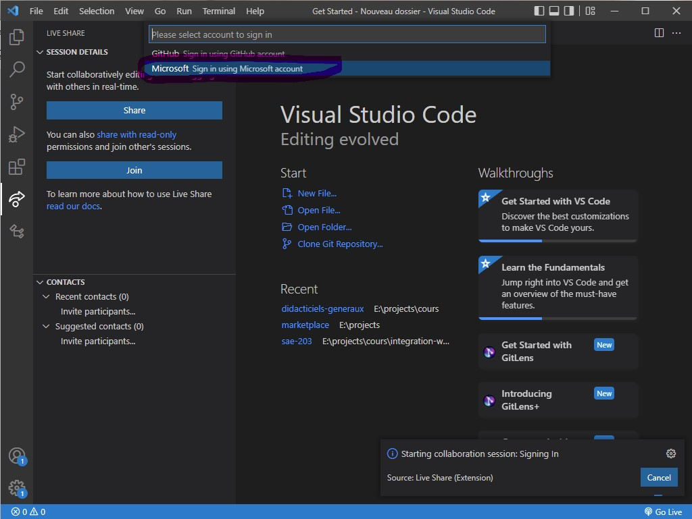
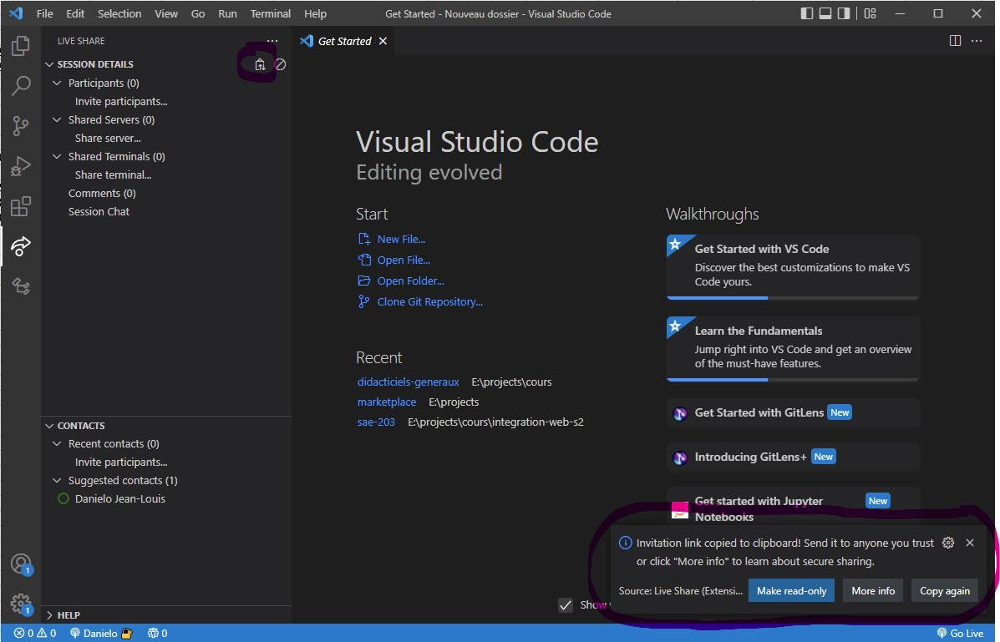
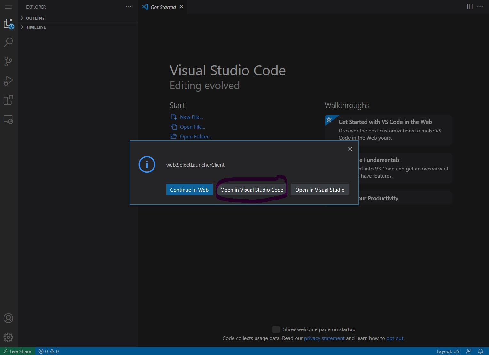

Liveshare est une extension gratuite pour le logiciel VS Code, il permet de partager sa fenêtre de travail avec d'autres personnes pour ainsi travailler à plusieurs sans encombre.

La place de marché des extensions est accessible en cliquant sur les quatre carrés à gauche de la fenêtre du logiciel. 

1. Accédez au marketplace

2. Recherchez "Live share". Sélectionnez l'extension "Live share" et installez-la en cliquant sur le bouton "Install"

Une fois l'installation terminée, une nouvelle icône est apparue à gauche de la fenêtre du logiciel. Cliquez dessus.

> Assurez-vous bien d'être en mode projet (la barre en bas de VS Code doit être bleue pas violette). Vous devez ouvrir un dossier.

## Si vous souhaitez partager votre projet (hôte)

1. Cliquez sur le bouton "Share"

2. Une popup va s'ouvrir en haut de page. Sélectionnez "Microsoft [...]". Ceci va ouvrir votre navigateur par défaut, vous n'avez plus qu'à vous connecter avec votre compte étudiant pour lancer le partage.

3. Une fois connecté. VS Code va mettre dans votre presse-papier l'URL de partage, URL que vous pourrez récupérez dans la popup en bas à droite de la fenêtre ou en haut à gauche après avoir cliqué sur l'icône de "Live Share"

## Si vous participer à un projet

1. Ouvrez le lien envoyé par l'hôte. Ceci va ouvrir un site où l'interface ressemble à VS Code. Une popup va s'ouvrir avec deux/trois propositions. Choissiez "Open in Visual Studio Code".

Ceci va ouvrir VS Code sur votre ordinateur et après chargement vous verrez le même projet que l'hôte. 

Voilà, vous avez mis en place votre projet sous "Live Share". Tout fichier crée ou modifié le sera pour tout le monde. **Les fichiers modifiés ou crées n'existent que chez l'hôte**.

Note : Il est possible que les personnes qui rejoingnent ne puissent pas écrire par défaut. Pour changer les permissions l'hôte doit aller dans l'onglet "Live Share" et faire un clic-droit sur l'hôte pour choisir l'option "read and write".