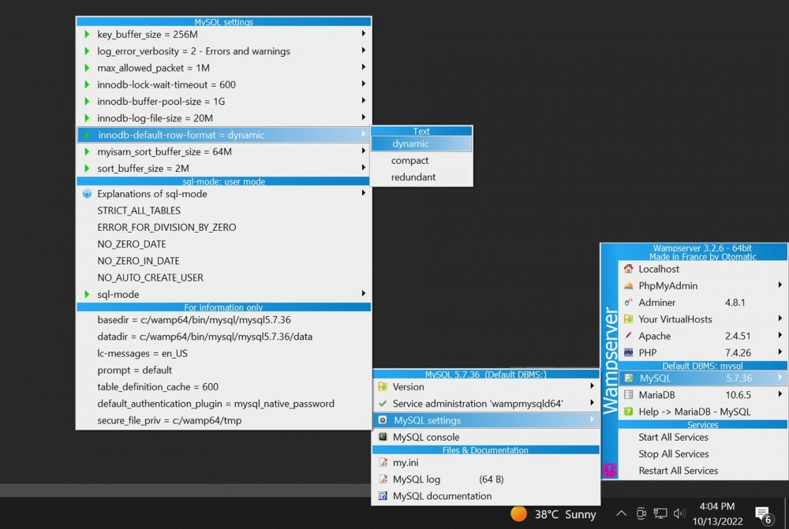

# Installation

Dans cette première partie, vous allez installer Prestashop et vous familiariser avec ce CMS très complet.

Créez votre compte sur le site, téléchargez et installez Prestashop. Vous pouvez mettre en place l'outil sur un serveur local (WAMP / MAMP) ou sur un serveur distan,t, c'est à votre convenance. Toutefois, si vous n'êtes pas sûr(e) de pouvoir créer de nouvelles tables sur votre serveur distance ou n'avez pas de place (Prestashop est lourd), utilisez le serveur local.
- [Télécharger Prestashop](https://www.prestashop.com/fr/telecharger)
    - Choississez freelance

Une fois l'archive récupérée, vous allez la dézipper et mettre son contenu dans votre dossier de travail dans le dossier www/ de WAMP/MAMP ou votre serveur distant. 

> **L'archive récupérée contient une autre archive, vous ne devez pas la dézipper, sinon Prestashop ne pourra pas s'installer.**

Et accéder au chemin depuis votre navigateur. Par exemple, si vous avez mis le contenu de l'archive dans le dossier `www/mon-prestashop`, dans votre navigateur vous mettrez "localhost/mon-prestashop" (ou assimilé).

> En attendant l'installation / téléchargement, vous pouvez tester la version de démo sur le site de Prestashop. [Accéder à la démo.](https://demo.prestashop.com/#/en/front)

> Il se peut que durant l'instation Prestashop lève des erreurs concernant l'absence de certaines extensions. Il faudra les activer depuis le menu de WAMP/MAMP.

Le CMS est très didacticiel durant son installation. Il n'est pas forcément utile d'expliquer toutes les étapes dans ce document. Ayez juste sous la main le nom et le mot de passe de votre base de données, vous en aurez besoin.

___
### Précautions lors de l'installation :
Pour vous éviter des problèmes lors de l'installation. Prenez en compte les points suivants :
- Évitez de lancer l'installation depuis un sous-dossier. **Créez votre dossier de travail à la racine du dossier** `www/` ou `htdocs/` et mettez dans ce dossier le contenu de l'archive que vous avez dézippée 
- Évitez les noms de dossier exotiques : présence d'accents, d'espaces ou de caractères spéciaux (/, ?...)
___

> **Note :**
> Si jamais vous avez l'erreur "SQL error on query Index column size too large. The maximum column size is 767 bytes." durant l'installation. Il vous faudra faire une petite modification dans la configuration du serveur MySQL via le menu de WAMP (MySQL > Configuration MySQL > innodb-default-row-format > dynamic)
> 

Une fois Prestashop installé, parcourez un peu le front-office et le back-office. 
> Par défaut, Prestashop met le front-office en mode maintenance, pour désactiver ce mode pur vous, allez dans le back-office puis le menu "mode maintenance" (en haut à droite). Cliquez sur le bouton "Ajouter mon IP" et "Enregistrer". Le front-office ("Voir ma boutique") vous sera maintenant accessible.

Ensuite essayez de réaliser les tâches suivantes pour prendre la main :
> Pour gagner du temps, utilisez les vrais produits du client, ça sera plus adapté pour la soutenance. Les données sont téléchargeables sur l'ENT (textes et images).
- Ajouter **des** produits
- Ajouter une marque
- Ajouter une catégorie et associez des produits à cette nouvelle catégorie
- Changez le logo et le favicon du site

> Prenez en compte les recommendations de tailles concernant les images. Ajustez avec Photoshop ou autre

- [Accéder au guide d'utilisateur de Prestashop](https://docs.prestashop-project.org/v.8-documentation/guide-utilisateur/premiers-pas)