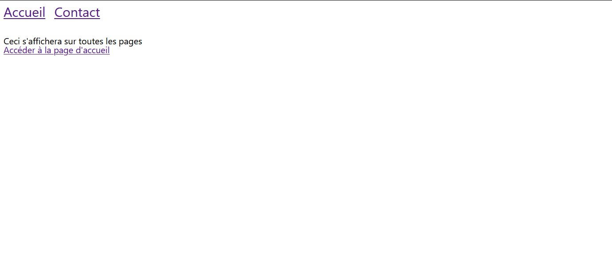

# Introduction à Smarty

Le but de ce TP est de découvrir le moteur de template Smarty. S'il est utilisé par Prestashop, il est tout à fait possible de l'utiliser seul. Nous allons l'utiliser seul pour le moment et ensuite nous ajouterons de la complexité quand nous installerons Prestashop.

Pour ce faire, vous allez avoir besoin d'installer avant Smarty, le moteur n'étant pas natif à PHP.

- [Télécharger Smarty v4.x](https://github.com/smarty-php/smarty/archive/refs/tags/v4.3.0.zip)

Une fois l'archive récupérée, vous allez en récupérer le dossier `libs/` et le mettre à la racine du dossier code. Ainsi, vous devriez avoir la structure suivante (capture d'écran non représentative) :

.<br>
└── code/<br>
&nbsp;&nbsp;&nbsp;&nbsp;├── **libs/** <-- Le dossier que vous devez rajouter<br>
&nbsp;&nbsp;&nbsp;&nbsp;├── templates/<br>
&nbsp;&nbsp;&nbsp;&nbsp;├── ~~templates_c/~~<br>
&nbsp;&nbsp;&nbsp;&nbsp;└── index.php

Ensuite, vous metterez le dossier code/ (que vous pouvez renommer) dans le dossier www/ de WAMP. Accédez à l'index.php depuis le navigateur et vous devriez voir la chose suivante dans votre navigateur.


Le projet que vous avez récupéré est déjà prêt à être utilisé avec Smarty, il y a déjà des templates qui utilisent quelques fonctionnalités de Smarty.

L'un des gros avantages des moteurs de templates, au-delà de nous retrouver avec du code PHP dans du HTML, c'est qu'ils permettent la réutilisation de bout de code, très facilement. Et de séparer nos pages en petits morceaux, ce qui rend le travail à plusieurs encore plus simple. Nous allons en détailler plus bas certaines fonctionnalités que vous allez appliquer dans le TP et plus tard avec Prestashop. Si vous souhaitez en savoir plus, il y a la documentation :

- [Accéder à la documentation de Smarty v4.x - anglais](https://smarty-php.github.io/smarty/4.x/designers/language-basic-syntax/)

## Variables

Comme tout langage de programmation Smarty propose des variables. Avec Smarty les variables peuvent avoir deux origines :

- Le fichier .tpl lui-même, vous définissez votre variable au sein même du fichier de la façon suivante : `{assign var=formation value='mmi'}`. Ici on définit une variable nommée "formation" avec la valeur "mmi".
- Le fichier .php, dans le fichier php qui se charge d'afficher votre fichier .tpl, vous définissez des variables (et leur valeur) qui seront ensuite récupérées et affichées par Smarty. Il y a un exemple dans le fichier "index.php" à la ligne 22.

```php
$smarty->assign('ma_variable', 'Bonjour');
```

Ici nous définissons en PHP une variable nommée "ma_variable" avec la valeur "Bonjour".

En tous les cas que la variable provient du fichier .tpl ou du php, elle s'affiche en Smarty avec la syntaxe suivante : `{$ma_variable}` ("Bonjour" s'affichera dans le navigateur).

Dans le cadre du cours sur Prestashop, nous ne devrions pas avoir besoin de créer des variables (ou des fonctions) Smarty toutefois il reste très important de ne pas oublier comment afficher une variable.

## Conditions (if, elseif, else)

Smarty nous donne également la possibilité de créer des conditions (chose impossible en HTML) pour afficher des éléments en fonctions de paramètre que vous aurez défini. Par exemple :

```twig
{if $formation === 'MMI'}
    <p>Vous devez aimer le multimédia<p>
{elseif $formation === 'TC'}
    <p>Vous devez aimer les relations commerciales<p>
{else}
    <p>Je ne sais pas ce que vous aimez<p>
{/if}
```
Dans le code ci-dessus, nous évaluons la variable "$formation" et en fonction de sa valeur nous n'affichons pas la même chose. Il également possible de vérifier si une valeur est supérieure ou égale à une autre, etc.

- [Voir la liste des conditions possibles avec Smarty - anglais](https://smarty-php.github.io/smarty/4.x/designers/language-builtin-functions/language-function-if/#qualifiers)


## Boucles

## Gabarit
Une des grandes forces des moteurs de template est leur système de gabarit. Il donne la possibilité de réutiliser un élément ou encore de partager une page en plusieurs briques. Smarty ne déroge pas à la règle et nous propose plusieurs fonctions.

### Fonction {extends}

- [Accéder à la documentation de la fonction {extends}](https://smarty-php.github.io/smarty/4.x/designers/language-builtin-functions/language-function-extends/)

### Fonction {block}
Grâce au système d'héritage (une page dans une autre page), il nous est donné la possibilité de définir des trous dans nos templates pour ensuite les remplir avec le contenu de notre choix. Dans le code qui vous a été fourni, il y a deux pages. Ces deux pages héritent d'un même template (_partials/page.tpl) et contiennent le contenu de notre choix. Par exemple :


```twig
{# parent.tpl #}
<!-- [...] -->
<head>
    <title>{block name='nom_page'}{/block}</title>
</head>
<!-- [...] -->
```
Nous définissons un bloc (ou trou) nommé "nom_page" qui pourra être rempli par n'importe quel template qui en héritera.

```twig
{# enfant.tpl #}
{extends file='parent.tpl'}
<!-- [...] -->
{block name='nom_page'}Mon titre de page{/block}
<!-- [...] -->
```
Notre template "child.tpl" peut hériter de parent.tpl grâce à la fonction Smarty "extends", une fois hérité, il est possible de réutiliser le bloc "nom_page" et d'y mettre le contenu souhaité. Ce qui donne le résultat suivant dans le navigateur pour la page "enfant.tpl".

```html
<!-- [...] -->
<head>
    <title>Mon titre de page</title>
</head>
<!-- [...] -->
```
Remarquez bien qu'en héritant du template "parent.tpl", le template "child.tpl" récupére tout le contenu par la même occasion.

A noter également qu'il est possible d'hériter de plusieurs templates à la fois, cette méthode reste à éviter car elle reste de rendre complexe l'organisation de vos pages à la place, il est plus intéressante de faire des héritages en cascade (un template hérite d'un autre et ainsi de suite). Parallèlement, il est possible d'inclure un bloc dans un autre bloc.


- [Accéder à la documentation de la fonction {block}](https://smarty-php.github.io/smarty/4.x/designers/language-builtin-functions/language-function-block/)

### Fonction {include}
Lorsqu'un fragment de code peut être réutilisé ou que notre template devient trop complexe, il peut être intéressant d'utiliser la fonction `{include}`. La syntaxe est très simple, il vous suffit de mettre son contenu dans un fichier .tpl et ensuite d'en affichier le contenu dans n'importe quel fichier .tpl. Vous en avez un exemple dans le code que vous avez récupéré, il y a fichier "contact.tpl" qui inclut le contenu du fichier "includes/formulaire.tpl". Voici quand même un exemple dans ce fichier d'introduction à Smarty.
```twig
{# index.tpl #}
<!-- [...] -->
<p>Bonjour tout le monde, voici le contenu de mon dernier article</p>
{include file="article.tpl"}
<!-- [...] -->
```
```twig
{# article.tpl #}
<!-- [...] -->
<p>La formation MMI est une formation en trois ans visant à former de futurs experts du multimédia...</p>
<!-- [...] -->
```
Dans le code ci-dessus, le template "index.tpl" affiche le contenu du template "article.tpl". Enfin, Smarty donne la possibilité de passer des variables dans un "{include}" ce qui le rend la fonction encore plus réutilisable (voir exemples dans la documentation).

- [Accéder à la documentation de la fonction {include}](https://smarty-php.github.io/smarty/4.x/designers/language-builtin-functions/language-function-include/)

> **Les fonctions "include", "extends" ou encore "bloc" vont être beaucoup utilisées dans Prestashop pour la gestion des thèmes enfant, nous vous conseillons d'être très à l'aise avec elles.**