# Page d'Accueil

| Version mobile  (iPhone 6 - 750px de largeur d'écran) | Version pour PC  (largeur d'écran supérieure à 1113px) |
| :--------------------------------------------------------: | :---------------------------------------------------------: |
|       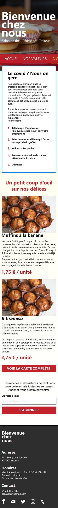       |         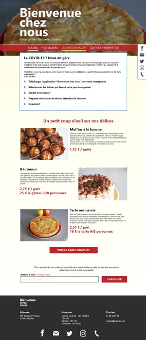          |

## Partie COVID-19

|      Version mobile  (iPhone 6 - 750px de largeur d'écran)      | Version pour PC  (largeur d'largeur d'écran supérieure à 1113px) |
| :------------------------------------------------------------------: | :-------------------------------------------------------------------: |
|         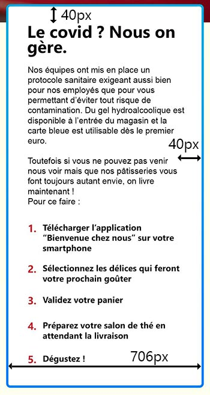         |                       |
| marge intérieure (basse et haute) : 40px / (gauche et droite) : 40px |                        marge intérieure : 40px                        |
|                   marge extérieure (basse) : 80px                    |                    marge extérieure (basse) : 80px                    |
|   couleur de bordure (dégradé haut vers le bas) : #047aff, #00a9de   |   couleur de bordure (dégradé haut vers le bas) : #047aff, #00a9de    |

| 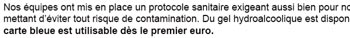 |
| :-------------------------------------------------------: |
|                   taille police : 18px                    |
|                   texte normal et gras                    |
|                     police : Segoe UI                     |
|                 couleur : b9252e / black                  |

| 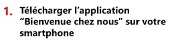 |
| :-------------------------------------------------: |
|                taille police : 22px                 |
|                texte normal et gras                 |
|                   police : Arial                    |
|                   couleur : black                   |

## Partie prix

| 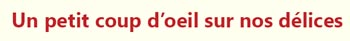 |
| :-------------------------------------------------: |
|                taille police : 40px                 |
|                     texte gras                      |
|                  police : Segoe UI                  |
|                  couleur : b9252e                   |

| Version mobile  (iPhone 6 - 750px de largeur d'écran) | Version mobile  (iPhone 6 - 1334px de largeur d'écran)   | Version pour PC  (largeur d'écran supérieure à 1113px) |
| :--------------------------------------------------------: | :--------------------------------------------------------------: | :---------------------------------------------------------: |
|    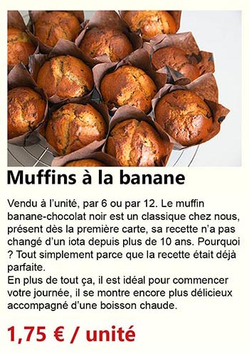     |  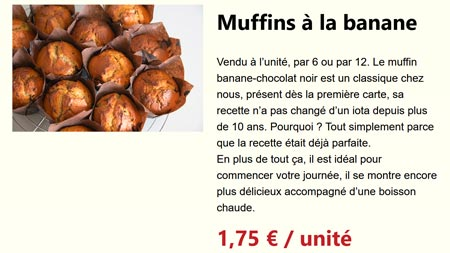   |   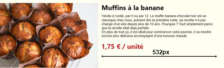   |

| 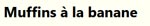 | 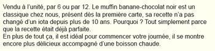 | 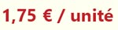 |
| :---------------------------------------------------: | :-------------------------------------------------: | :------------------------------------------: |
|                taille de police : 32px                |               taille de police : 16px               |            taille de police 32px             |
|                      texte gras                       |                    texte normal                     |                  texte gras                  |
|                   police : Segoe UI                   |                   police : Arial                    |              police : Segoe UI               |
|                    couleur : noir                     |                   couleur : noir                    |               couleur : b9252e               |

| 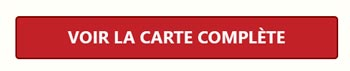   état normal | 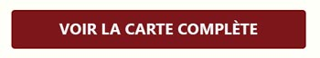   état survol |
| :---------------------------------------------------------------------------: | :---------------------------------------------------------------------------------: |
|                            taille de police : 24px                            |                               taille de police : 24px                               |
|                                  texte gras                                   |                                     texte gras                                      |
|                               police : Segoe UI                               |                                  police : Segoe UI                                  |
|                                couleur : white                                |                                   couleur : white                                   |
|                        couleur d'arrière-plan : b9252e                        |                           couleur d'arrière-plan : 730000                           |
|                          contour : 2px solid 730000                           |                             couleur : 2px solid b9252e                              |
|                            arrondi des coins : 5px                            |                               arrondi des coins : 5px                               |
|                                largeur : 500px                                |                                   largeur : 500px                                   |
|                   marge intérieure (basse et haute) : 20px                    |                      marge intérieure (basse et haute) : 20px                       |

Cet élément doit permettre d'atteindre la page de la carte

| 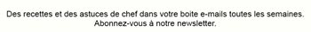 |
| :------------------------------------------------------: |
|                   taille police : 16px                   |
|                       texte normal                       |
|                      police : Arial                      |
|                     couleur : black                      |

---

## Partie newsletter

|  | 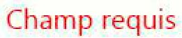 |
| :---------------------------------------------------: | :--------------------------------------------------: |
|                taille de police : 20px                |               taille de police : 20px                |
|                      texte gras                       |                     texte normal                     |
|                   police : Segoe UI                   |                  police : Segoe UI                   |
|                    couleur : black                    |                   couleur : ff0000                   |

| 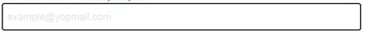 |        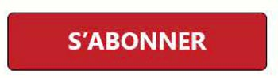         |
| :---------------------------------------------------------: | :------------------------------------------------------------------: |
|                       hauteur : 52px                        |                            hauteur : 52px                            |
|                        texte normal                         |                              texte gras                              |
|                   taille de police : 16px                   |                       taille de police : 24px                        |
|                       police : Arial                        |                          police : Segoe UI                           |
|                       couleur : black                       |                           couleur : white                            |
|                   arrondi des coins : 5px                   |                       arrondi des coins : 5px                        |
|              placeholder : example@yopmail.com              | couleur d'arrière-plan : b9252e (état normal) / 730000 (état survol) |
|          type de données attendue : adresse e-mail          |                                                                      |
|    bordure des éléments de formulaire : 2px solid black     |                                                                      |
