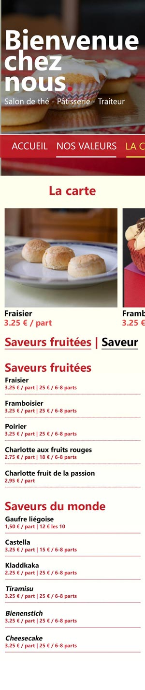
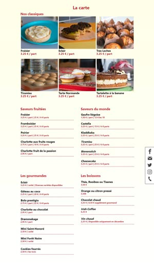
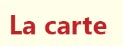
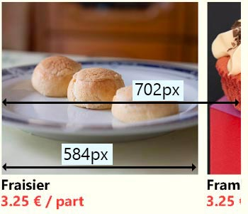
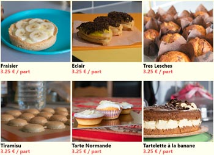
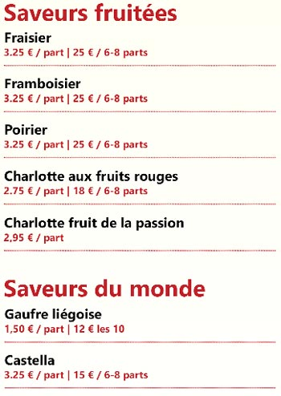
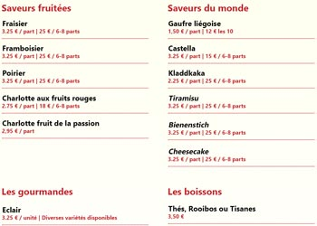

# Page Carte

| Version mobile  (iPhone 6 - 750px de largeur d'écran) | Version pour PC  (largeur d'écran supérieure à 1113px) |
| :--------------------------------------------------------: | :---------------------------------------------------------: |
|                |                     |

|  |
| :----------------------------------------------------: |
|                  taille police : 40px                  |
|                       texte gras                       |
|                   police : Segoe UI                    |
|                    couleur : b9252e                    |

|  |
| :----------------------------------------------------: |
|                  taille police : 30px                  |
|                      texte normal                      |
|                   police : Segoe UI                    |
|                    couleur : b9252e                    |

Notez que ce style s'applique également aux textes "Saveurs du monde", "Les gourmandes", "Saveurs fruitées" et "Les boissons" présents sur la même page.

|   Version mobile  (iPhone 6 - 750px de largeur d'écran)   | Version pour PC  (largeur d'écran supérieure à 1113px) |
| :------------------------------------------------------------: | :---------------------------------------------------------: |
|  |   |

**Notez bien que, sur mobile, le menu devient défilable. De plus, quelque soit la taille de l'écran, on doit toujours voir une partie de l'élément suivant.**

|  |
| :------------------------------------------------------------: |
|                      taille police : 24px                      |
|                           texte bold                           |
|                       police : Segoe UI                        |
|            couleur : b9252e (prix) / black (titre)             |

|  |
| :---------------------------------------------------: |
|                 taille police : 30px                  |
|                      texte gras                       |
|                   police : Segoe UI                   |
|          couleur : b9252e / black (au hover)          |

**Présent uniquement sur mobile**. Au clic sur les éléments du sous-menu, l'utilisateur doit atteindre la partie correspondante dans la page. Le menu est défilable et garde sa place dans la page, il ne suit pas le défilement de la page.

| Version mobile  (iPhone 6 - 750px de largeur d'écran) | Version pour PC  (largeur d'écran supérieure à 1113px) |
| :--------------------------------------------------------: | :---------------------------------------------------------: |
|         |              |

|  |
| :--------------------------------------------------: |
|   taille police : 24px (titre) / 18px (sous-titre)   |
|                      texte gras                      |
|                  police : Segoe UI                   |
|                   couleur : b9252e                   |
|          Bordure : tiret 2px couleur b9252e          |
