# Page Contact

| Version mobile  (iPhone 6 - 750px de largeur d'écran) | Version pour PC  (largeur d'écran supérieure à 1113px) |
| :--------------------------------------------------------: | :---------------------------------------------------------: |
|       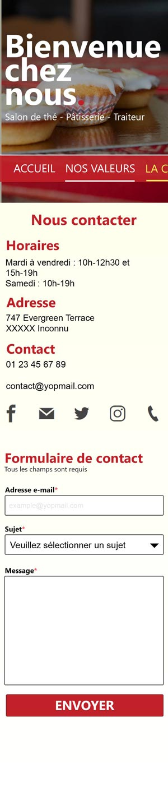       |         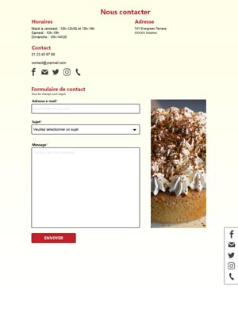          |

|  |
| :----------------------------------------------------: |
|                  taille police : 40px                  |
|                       texte gras                       |
|                   police : Segoe UI                    |
|                    couleur : b9252e                    |

| Version mobile  (iPhone 6 - 750px de largeur d'écran) | Version pour PC  (largeur d'écran supérieure à 1113px) |
| :--------------------------------------------------------: | :---------------------------------------------------------: |
|   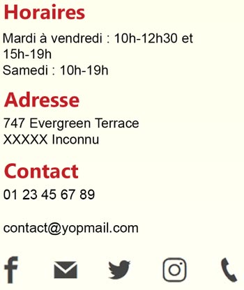   |     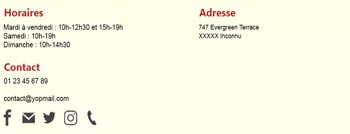      |

**Le comportement des réseaux sociaux est identique à celui décrit dans le fichier `LISEZ-MOI.md` dans la partie "Barre réseau sociaux"**

|  |
| :-----------------------------------------------------: |
|                  taille police : 30px                   |
|                       texte gras                        |
|                    police : Segoe UI                    |
|                    couleur : b9252e                     |

| 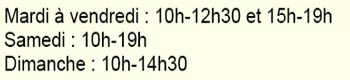 |
| :-----------------------------------------------------: |
|                  taille police : 20px                   |
|                      texte normal                       |
|                     police : Arial                      |
|                     couleur : black                     |

|    Version mobile  (iPhone 6 - 750px de largeur d'écran)     |  Version pour PC  (largeur d'écran supérieure à 1113px)  |
| :---------------------------------------------------------------: | :-----------------------------------------------------------: |
| 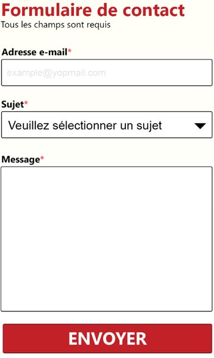 | 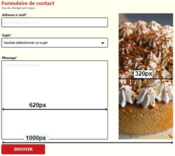 |

**Notez bien que, sur mobile, l'image de droite n'est pas visible.**

|  |
| :---------------------------------------------------: |
|                 taille police : 30px                  |
|                      texte gras                       |
|                   police : Segoe UI                   |
|                   couleur : b9252e                    |

| 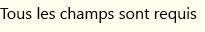 |
| :--------------------------------------------------------: |
|                    taille police : 16px                    |
|                        texte normal                        |
|                       police : Arial                       |
|                      couleur : black                       |

|    **Idem pour tous les labels du formulaire** |
| :-------------------------------------------------------------------------------------------------------: |
|                                           taille police : 16px                                            |
|                                                texte gras                                                 |
|                                             police : Segoe UI                                             |
|                              couleur : black / fb4f5f (pour l'astérisque \*)                              |

| 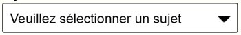 |
| :----------------------------------------------------: |
|                  taille police : 20px                  |
|                      texte normal                      |
|                     police : Arial                     |
|                arrondi des coins : 5px                 |
|       marge intérieure (gauche et droite) : 10px       |

Si vous n'arrivez pas à réaliser le select de cette façon, affichez-le comme vous le pouvez, mais vous n'aurez pas tous les points concernant l'intégration.
Liste de choix du select :

- Commande / Réservation
- Privatisation
- Candidature spontanée
- Autre

| 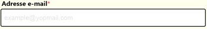 |
| :-------------------------------------------------: |
|                   hauteur : 52px                    |
|                    texte normal                     |
|               taille de police : 16px               |
|                   police : Arial                    |
|                   couleur : black                   |
|               arrondi des coins : 5px               |
|     marge intérieure (gauche et droite) : 10px      |

- placeholder du champ "adresse e-mail" : example@yopmail.com
- placeholder du champ "message" : Contenu de votre message
- bordure des éléments de formulaire : 2px solid black

|     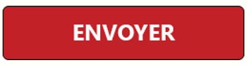      |
| :------------------------------------------------------------------: |
|                              texte bold                              |
|                       taille de police : 24px                        |
|                          police : Segoe UI                           |
|                           couleur : white                            |
|                       arrondi des coins : 5px                        |
|                      bordure : 1px black solid                       |
| couleur d'arrière-plan : b9252e (état normal) / 730000 (état survol) |
