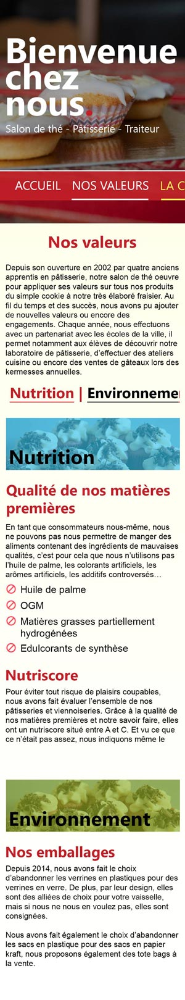
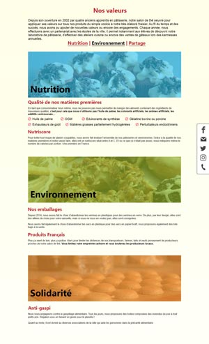
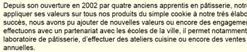
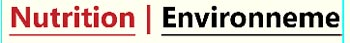
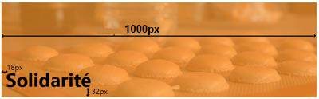
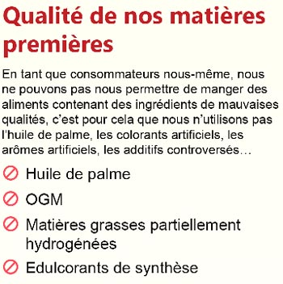
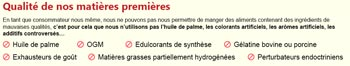
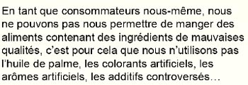
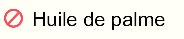

# Page Nos valeurs

| Version mobile  (iPhone 6 - 750px de largeur d'écran) | Version pour PC  (largeur d'écran supérieure à 1113px) |
| :--------------------------------------------------------: | :---------------------------------------------------------: |
|          |               |

|  |
| :-------------------------------------------------------: |
|                   taille police : 40px                    |
|                        texte gras                         |
|                     police : Segoe UI                     |
|                     couleur : b9252e                      |

|  |
| :--------------------------------------------------------: |
|                    taille police : 20px                    |
|                        texte normal                        |
|                       police : Arial                       |
|                      couleur : black                       |

|  |  |
| :---------------------------------------------------------: | :-------------------------------------------------------------: |
|                    taille police : 30px                     |                      taille police : 30px                       |
|                         texte gras                          |                           texte gras                            |
|                      police : Segoe UI                      |                        police : Segoe UI                        |
|             couleur : b9252e / black (au hover)             |               couleur : b9252e / black (au hover)               |

Au clic sur les éléments du sous-menu, l'utilisateur doit atteindre la partie correspondante dans la page.
**Notez bien que, sur mobile, le menu devient défilable.**

| Version mobile  (iPhone 6 - 750px de largeur d'écran) | Version pour PC  (largeur d'écran supérieure à 1113px) |
| :--------------------------------------------------------: | :---------------------------------------------------------: |
|          |  |
|                    taille police : 60px                    |                    taille police : 38px                     |
|                         texte gras                         |                         texte gras                          |
|                     police : Segoe UI                      |                      police : Segoe UI                      |
|                      couleur : black                       |                       couleur : black                       |

Couleur d'arrière plan - opacité 65% :

- Nutrition : rgb(75, 197, 236)
- Environnement : rgb(142, 173, 38)
- Solidarité : rgb(252, 161, 64)

**Couleurs identiques sur tous les terminaux.**

| Version mobile  (iPhone 6 - 750px de largeur d'écran) | Version pour PC  (largeur d'écran supérieure à 1113px) |
| :--------------------------------------------------------: | :---------------------------------------------------------: |
|    |         |

|  |
| :--------------------------------------------------------: |
|                    taille police : 30px                    |
|                         texte gras                         |
|                     police : Segoe UI                      |
|                      couleur : b9252e                      |

|  |
| :---------------------------------------------------------: |
|                    taille police : 16px                     |
|                        texte normal                         |
|                       police : Arial                        |
|                       couleur : black                       |

|  |
| :-------------------------------------------------------: |
|                   taille police : 20px                    |
|                       texte normal                        |
|                      police : Arial                       |
|           couleur : black / FB4F5F pour l'icone           |
