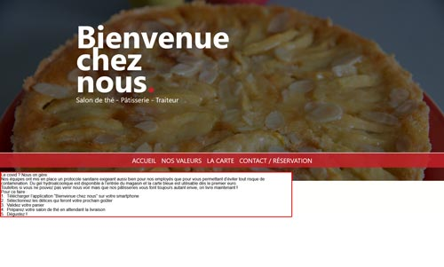
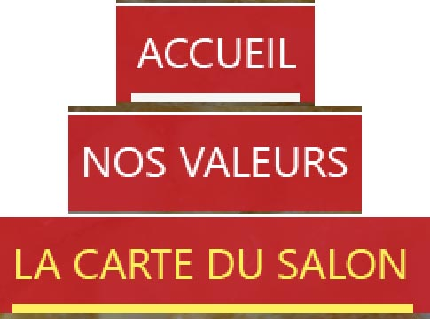
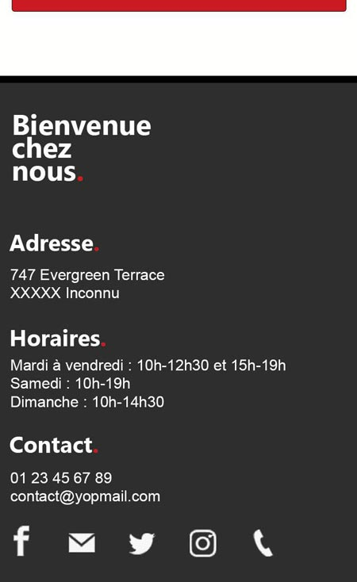
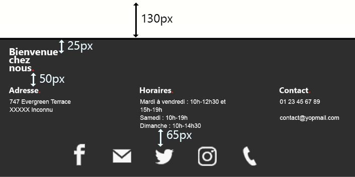
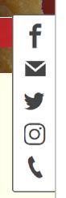

# Examen Intégration Web - Devoir maison

Cet examen vise à tester les compétences que vous avez acquises lors des différents TP et TD que nous avons eu. Si le projet paraît conséquent par rapport à ce que nous avons fait jusqu'à présent, il s'approche de ce qui peut être demandé dans le milieu professionel.

Il vous faudra intégrer un site web responsive à partir d'un code donné qu'il faudra compléter. A noter **qu'il pourrait très fortement avoir des erreurs et manquements dans le code fourni,** à vous de les corriger.
Avant de commencer à développer : **ouvrez le fichier `index.html`** et assurez-vous bien de voir la chose suivante dans votre navigateur :

Si vous n'avez pas ceci qui s'affiche. Assurez-vous d'avoir la structure de dossiers suivante :

- [assets/](.\examen-final\assets)
  - [css/](.\examen-final\assets\css)
  - [fonts/](.\examen-final\assets\fonts)
  - [images/](.\examen-final\assets\images)
- [\_sources/](.\examen-final_sources)
  - [images/](.\examen-final_sources\images)
  - [integration-depart.png](.\examen-final_sources\integration-depart.png)
  - [texte-accueil.txt](.\examen-final_sources\texte-accueil.txt)
  - [texte-carte.txt](.\examen-final_sources\texte-carte.txt)
  - [texte-contact.txt](.\examen-final_sources\texte-contact.txt)
  - [texte-valeurs.txt](.\examen-final_sources\texte-valeurs.txt)
- [grille-notation-examen-final.ods](.\examen-final\grille-notation-examen-final.ods)
- [index.html](.\examen-final\index.html)
- [LISEZ-MOI.md](.\examen-final\LISEZ-MOI.md)

Les sources fournies proviennent de PhotoShop, **le logiciel n'a pas le même rendu notamment au niveau des polices**. Ne vous inquiétez pas si ça ne ressemble pas aux sources fournies, vous pouvez trouver le rendu attendu dans le dossier `_sources/images` à la racine. La version mobile du site a été faite sur un iPhone 6 (750px de largeur d'écran).
Le fichier PhotoShop est le fichier `_sources/design.psd`, pour celles et ceux qui n'ont pas PhotoShop, vous pouvez l'ouvrir en ligne sur le site [photopea.com](https://www.photopea.com/) ou encore Gimp. Si vous n'êtes pas à l'aise avec le logiciel, voici des liens vers la documentation de chaque page, elle explique les tailles, les couleurs ou encore distances entre certains éléments :

- Page d'accueil : Voir fichier LISEZ-MOI-Accueil.md
- Page valeurs : Voir fichier LISEZ-MOI-Valeurs.md
- Page carte : Voir fichier LISEZ-MOI-Carte.md
- Page contact : Voir fichier LISEZ-MOI-Contact.md
- Tout ce qui est commun aux pages est présent plus bas sur cette page

Si certaines mesures sont absentes, cela signifie que c'est à vous de décider (notamment les marges verticales) ou que des propriétés CSS que vous utiliserez en découlera les espaces.

# Présentation du site

Bienvenue chez nous. est un salon de thé (fictif) présent dans une ville inconnue. Fort de sa renommnée régionale, le salon de thé a décidé de réaliser un site web pour être plus proche de ses clients, mais sur tout se lancer dans la livraison et le _click 'n' collect_, s'ils ont trouvé une personne pour le design, ils ont décidé de faire appel à vous pour l'intégration du site. Par vous, Bienvenue chez nous. désigne votre petite agence, en effet, pour vous rapprocher le plus possible du milieu professionnel, **il vous est autorisé de former un groupe jusqu'à trois membres au maximum**

| Version mobile  (iPhone 6 - 750px de largeur d'écran) | Version pour PC  (largeur d'écran supérieure à 1113px) |
| :--------------------------------------------------------: | :---------------------------------------------------------: |
|              |                   |

_Aperçus des pages d'accueil du site sur mobile et PC_

Le site est composé de quatre pages pages : accueil (index.html), valeurs, carte et contact. Moderne jusqu'au bout, le site est responsive et devra s'afficher sans heurts aussi bien sur PC, tablette (portrait et mobile) et smartphone (portrait et mobile). Si le designer a réalisé le design pour la version PC et mobile (portrait principalement et un peu de la version paysage), il n'a pas eu le temps de réaliser la version tablette, ça sera donc à vous de vous arranger pour que l'expérience ne soit pas dégradée sur tablette (et sur les autres appareils bien évidemment).
Le designer n'a pas pris soin également de mettre tout le contenu sur mobile, **il a donc préféré concentrer son travail sur la version PC principalement, cette version fera donc foi vis-à-vis des textes et de son formattage.** Par ailleurs, pour éviter de vous donner des fichiers trop lourds, il n'a pas mis l'en-tête de page et le pied de page sur toutes les images, doivent bien évidemment être présents sur les quatres pages.

Toutes les images de design du site sont présentes dans le dossier `_sources/images`, vous trouverez également les fichiers .psd (`bcn-desktop.psd` et `bcn-mobile.psd`) sur ENT, si vous n'avez pas Photoshop vous pouvez l'ouvrir en ligne sur le site [photopea.com](https://www.photopea.com/) ou encore Gimp. Les sources fournies proviennent de PhotoShop, **le logiciel n'a pas le même rendu notamment au niveau des polices**. Ne vous inquiétez pas si votre intégration ne ressemble pas parfaitement aux sources fournies.

# Critères évaluation

Votre site sera testé sur Firefox et Chrome, il en sera de même pour la partie responsive, la mode "vue responsive" sera utilisée pour simuler un terminal mobile. Assurez-vous que votre projet fonctionne correctement sur **les deux navigateurs**.
Voir le fichier `grille-notation-examen-final.ods` pour plus d'informations.
Merci de mettre les noms et prénoms de tous les membres du groupe dans la cellule en haut à gauche du fichier. Pour rappel vous n'avez pas le droit d'être plus de trois membres au sein d'un groupe.

# Rendu du devoir

### La date limite de rendu est fixée au 27 décembre 2020 à 23h59. Passé ce délai, un demi-point vous sera retiré par jour de retard.

Dans la partie "Examen final", il y a un devoir nommé "Rendu devoir site "Bienvenue chez nous"", vous devez rendre les documents suivants :

- Le fichier `./index.html`
- Le fichier `./grille-notation-examen-final.ods` (rempli avec les noms et prénoms des membres du groupe)
- Le dossier `./assets/` (et ses sous-dossiers)
- Tout fichier que vous avez ajouté pour la réalisation du site

## **En aucun cas vous ne devez rendre le dossier `_sources`.**

Si jamais l'envoi de votre devoir sur ENT ne fonctionne pas. Faites une archive des documents demandés ayant le format suivant NOM-PRENOM (d'un membre du groupe, vu que vous êtes censé avoir mis le nom de tous les membres du groupe dans le fichier `./grille-notation-examen-final.ods`) et envoyez-les moi à l'adresse e-mail suivante : **danielo.jean-louis@cyu.fr**
Par email, la date de réception de l'email fera foi, alors n'envoyez pas l'email à 23h59.

Etant donné que le travail peut être fait en groupe, **un seul membre du groupe doit faire le dépôt sur ENT ou l'envoyer l'email.**

# Mise en page

Le conteneur principal du site possède une largeur de 1000px, il est déjà présent sous les traits de la classe "contenu". Vous n'avez pas à être [Pixel Perfect](https://cours.u-cergy.fr/mod/lesson/view.php?id=134687&pageid=1127), d'autant plus que les mobiles n'ont pas la même taille d'écran, rappelez-vous de ce qui a été dit dans le TP4, il y a également la leçon concernant le CSS, il y a deux parties concernant le responsive web design sur ENT. Concernant les espaces entre les éléments, ils n'ont pas à être exactement comme le design mais ils doivent s'en approcher quand même.

Dans les fichiers ci-dessous vous trouvez plus de détails concernant les tailles, les couleurs ou encore les polices à utiliser :

- Page d'accueil : Voir fichier LISEZ-MOI-Accueil.md
- Page valeurs : Voir fichier LISEZ-MOI-Valeurs.md
- Page carte : Voir fichier LISEZ-MOI-Carte.md
- Page contact : Voir fichier LISEZ-MOI-Contact.md

## Header / Haut de page

Vous n'avez rien à faire tout est déjà géré aussi bien niveau PC que terminaux mobiles.

## Navigation

Element de navigation active :

- couleur : white
- bordure : 3px solid white

Lien au survol :

- couleur : faf062
- bordure : 3px solid faf062

Lien visité / Etat normal :

- couleur : white
- bordure : pas de bordure

## Footer / Pied de page

| Version mobile  (iPhone 6 - 750px de largeur d'écran) | Version pour PC  (largeur d'écran supérieure à 1113px) |
| :--------------------------------------------------------: | :---------------------------------------------------------: |
|       |       |

_Même marges entre la version PC et mobile_
Liens des réseaux sociaux :

- facebook : https://www.facebook.com/CYCergyParisUniversite/
- twitter : https://twitter.com/UniversiteCergy
- instagram : https://www.instagram.com/cy_univ/
- Téléphone : https://www.u-cergy.fr/fr/index.html
- mail : hello.world@yopmail.com

Pour intégrer les icônes deux choix s'offrent à vous :

- Utilisation des images dans le dossier `assets/images/icones/`
- Utilisation de la police d'icônes gérée dans le dossier `assets/fonts` **(point bonus)**.  
  Si vous arrivez à gérer les webfonts, la couleur des icônes est `f7f7f7`. Ajoutez également une couleur au survol.
  Pour savoir comment rajouter les webfonts dans votre projet, regardez le contenu du fichier `assets/fonts/demo.html`, avec tout ce que nous avons appris, notamment l'utilisation de la console du navigateur, vous devriez être capable d'utiliser les webfonts. Observez les fichiers liés au fichier `assets/fonts/demo.html`.

## Barre réseaux sociaux

|       Version mobile  (iPhone 6 - 750px de largeur d'écran)        |  Version pour PC  (largeur d'écran supérieure à 1113px)  |
| :---------------------------------------------------------------------: | :-----------------------------------------------------------: |
| **Absente. Cette partie ne doit pas apparaître sur mobile et tablette** |  |
|                                                                         |                    Dimension : 80 x 330px                     |
|                                                                         |                Couleur d'arrière-plan : white                 |
|                                                                         |                  Bordure : 2px solid 5d5d5d                   |
|                                                                         |   Arrondi des coins : 5px (côtés haut gauche et bac gauche)   |

Le composant doit être tout le temps visible même quand on défile dans la page.

Liens des réseaux sociaux :

- facebook : https://www.facebook.com/CYCergyParisUniversite/
- twitter : https://twitter.com/UniversiteCergy
- instagram : https://www.instagram.com/cy_univ/
- Téléphone : https://www.u-cergy.fr/fr/index.html
- mail : hello.world@yopmail.com

Pour intégrer les icônes deux choix s'offrent à vous :

- Utilisation des images dans le dossier `assets/images/icones/`
- Utilisation de la police d'icônes gérée dans le dossier `assets/fonts` **(point bonus)**. 
  Si vous arrivez à gérer les webfonts, la couleur des icônes est `444444`. Ajoutez également une couleur au survol.
  Pour savoir comment rajouter les webfonts dans votre projet, regardez le contenu du fichier `assets/fonts/demo.html`, avec tout ce que nous avons appris, notamment l'utilisation de la console du navigateur, vous devriez être capable d'utiliser les webfonts. Observez les fichiers liés au fichier `assets/fonts/demo.html`.

## Textes

Pour éviter de vous faire perdre du temps, vous n'aurez pas besoin de recopier les textes, ils sont tous présents dans le dossier `./sources`, il y a un fichier texte pour chaque page.

Le projet utilise deux polices :

- Arial pour le corps de texte
- Segoe UI pour les titres. Police présente dans le fichier `./assets/css/variables.css` sous la forme d'une variable css

**Notez bien qu'il y a des parties de texte qui sont en gras, regardez les fichiers de la version PC pour savoir quelles parties sont concernées.**

## Images

Toutes les images sont dans le dossier `assets/images`, elles sont toutes séparées par pages / rôles, et proposées (sauf les icônes) dans différentes résolutions. Si vous ne savez pas comment gérer les différentes résolutions mettez qu'une seule image, vous n'aurez pas tous les points mais ça fonctionnera. Allez à l'essentiel.
Conscient que vous ne pourrez pas tester votre projet sur des écrans de résolution différentes, chaque image (sauf celles du dossier icones) ont leur résolution écrite en bas à droite. Ainsi en jouant sur le mode responsive des navigateurs, vous verrez si la bonne image est chargée.

## Formulaires

Le site contient deux formulaires : un sur la page d'accueil et l'autre sur la page "contact". Dans les deux cas, la validation du formulaire doit être gérée par le navigateur. **Dans les deux formulaires tous les champs sont requis.**

- formulaire de newsletter : les données doivent passer dans l'url
- formulaire de contact : les données doivent passer dans le corps de la requête (autrement dit on ne doit pas voir les données dans l'url)

# Conseils

- Pour éviter de rendre le dossier `_sources/` copiez-collez les fichiers suivants dans un autre dossier :
  - le dossier `assets/`
  - le fichier `grille-notation-examen-final.ods` (ouvrable avec excel ou LibreOffice)
  - le fichier `index.html`
- Si vous travaillez à plusieurs, je vous conseille de faire des points régulièrement (quotidiennement si possible), et de vous poser les questions suivantes :
  - J'ai fait quoi hier ?
  - Je compte faire quoi aujourd'hui ?
  - Quels problèmes ai-je présentement ?
- Regardez les TP, devoirs et autres, ils peuvent contenir des indices concernant la façon dont il faut intégrer certaines choses.
