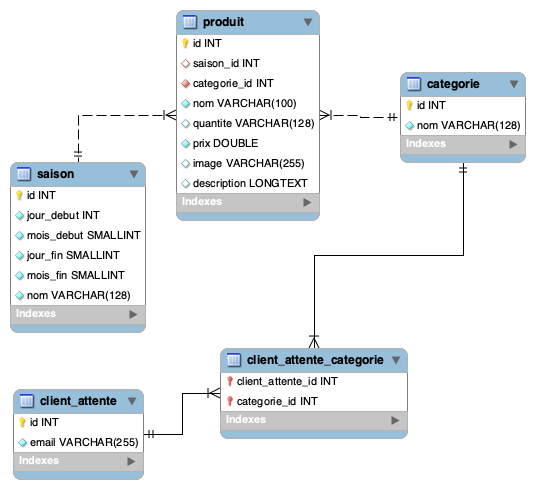
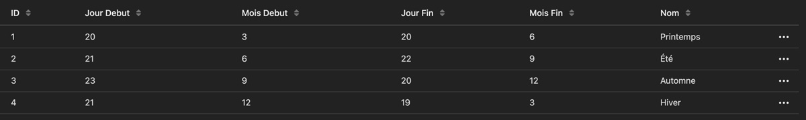

# En route vers la SAÉ 203 - Site web et Base de données (BDD)
_Les consignes pourront être modifiées_

Dans le but de mieux vous préparer à la SAÉ 203 - Site web et Base de données (BDD), vous allez devoir travailler de façon **individuelle** sur un devoir **noté** fleuve. A partir du code donné, vous allez devoir compléter le site de façon à ce qu'il ressemble au projet Adobe XD (voir lien plus bas) mais surtout l'agrémenter des fonctionnalités vues tout au long du semestre en cours aussi bien en Intégration Web (HTML/CSS/JS) que Développement Web (PHP/MySQL). 

> Si le projet est individuel, vous avez tout à fait le droit de communiquer entre vous, de vous entre-aider

Vu que vous partez d'un code fourni, **pensez bien à le regarder (console du navigateur notamment),** faire des tests avant de vous lancer à corps perdu dans le développement. Par ailleurs, **vous ne devez en aucun cas modifier les fichier CSS fournis,** (c'est pour ça qu'ils sont dans un dossier "ne-pas-modifier") c'est à vous de rajouter de nouveaux fichiers CSS pour compléter l'intégration. Vous pouvez en revanche copier un sélecteur CSS présent dans le code de base pour le surcharger si besoin est **dans vos propres fichiers.**


## Description générale et contexte

L'IUT de Sarcelles (CY Cergy Paris Université) veut ouvrir un salon de thé en ligne et vous confie sa réalisation.

Le site en question permettra la vente en ligne de plusieurs produits divisés en catégories.
Dans le site, le salon de thé prévoit une page pour chaque catégorie ou l'utilisateur pourra visualiser la liste des produits concernés. Toutes les pages seront accessible par un menu de navigation fixe.
Pour chacun des produits dans une page l'utilisateur a d'abord la possibilité d'afficher une description supplémentaire (qui apparaît dans une pop-up dans la même page) et d'ajouter le produit au panier. 

Le but principal du salon est celle de privilégier la saisonnalité des produits. Pour cette raison certains produits ne pourront pas être disponibles et ils devront donc s'afficher avec un libellé spécial qui mentionne la rupture saisonnière, **les saisons devront être gérées en fonction de la date du jour.** De la même manière, les produits épuisés seront aussi libellés.

Si le produit est épuisé, l'utilisateur devrait avoir la possibilité de renseigner son adresse mail pour recevoir une notification lors du retour en stock du produit choisi.

**Pour comprendre mieux les besoins fonctionnels du site et le design vous trouvez une maquette interactive ici :** 

- [Accéder à la maquette Adobe XD](https://xd.adobe.com/view/1e0c8482-b0f1-4dd2-b161-4ceb9128896b-4b5f/)

## Notez bien

Vous ne serez pas forcément apte dès le début du semestre à faire le site, toutefois au fur et à mesure des cours vous verrez de nouvelles fonctionnalités qui vous permettront d'avancer sur le site. 


Vous verrez donc durant ce semestre :

## Notions

### Integration Web

- Positionnement
- CSS Transform
- CSS Transition
- Iconfonts
- Langage de programmation javascript

### Développement Web

- PHP
- MySQL / Base de données

Bien évidemment les notions vues durant le semestre précédent vous seront plus qu'utiles pour réaliser ce devoir. N'attendez pas le dernier moment pour le faire, **essayez d'ajouter les fonctionnalités au fur et à mesure des cours,** ça devrait être plus simple les notions étant encore fraîches dans votre tête.

Notez également que certaines données (descriptions, contenu du menu...) seront gérées via la base de données MySQL, inutile donc d'écrire tous les textes à la main, il faudra donc les charger depuis la base de données.

## CSS Transform & CSS Transition

Les CSS transitions dans la maquette Adobe XD sont là à titre d'exemple, libre à vous de reproduire les mêmes ou en inventer de nouvelles. Mais votre projet doit contenir des CSS transitions et des CSS transform.
N'oubliez pas de créer une cohérence dans vos animations : n'allez pas faire une animation qui dure 5 secondes à un endroit et à un autre une animation qui en dure 1, surtout sur les deux éléments se ressemblent.

# Icônes

Les icônes sont des svg, ils ne doivent pas être au format .jpg dans votre projet. Il faudra utiliser une webfont comme vu en TP. Pour rappel, votre police d'écriture est générée grâce au site [icomoon.io](https://icomoon.io/).

# Base de données


<p style="text-align: center">Schéma de la base de données</p>

La catégorie "cakes" est volontairement vide, il faudra utiliser pour la page associée à cette catégorie le template de la page vide, celle qui propose à l'internaute d'être notifié quand il y aura des produits.

La base de données doit être utilisée pour les parties suivantes :
- Les catégories du menu (dans l'en-tête)
  - Le menu avec les images peut rester comme il est
- Le contenu des popups
- Le détail d'un produit
  - Attention : la colonne "description" de la table produit retourne du HTML. **Ne mettez pas son contenu dans une balise &lt;p> et encore moins dans une balise &lt;span>**
- Enregistrer les adresses e-mail des utilisateurs qui veulent être notifiés quand un produit est disponible
  - Faites bien attention à sécuriser les entrées avant de les insérer dans la base

#### Saisonnalité des produits
Certains produits possède une valeur concernant la saison. Il faudra donc indiquer (via un pictogramme vectoriel) la saison du produit et le rendre impossible à la vente lorsque nous ne sommes pas dans la saison. 

<p style="text-align: center">Schéma de la table saisons</p>
Il faudra donc, à partir des colonnes jour_debut, mois_debut, jour_fin et mois_fin, reconstruire les dates des saisons pour ensuite rendre disponible ou non le produit. En php, ça donne quelque chose comme ceci :

```php
// Les valeurs des variables jour_debut, mois_debut, jour_fin et mois_fin doivent venir de la base de données.

$mois_debut_ete = "6";
$jour_debut_ete = "21";
$mois_fin_ete = "9";
$jour_fin_ete = "22";

// On récupère l'année courante
$annee = date("Y");

// On crée des objets de type "date" pour le début et la fin de la saison été
$debut_ete = date_create("$jour_debut_ete/$mois_debut_ete/$annee");
$fin_ete = date_create("$jour_fin_ete/$mois_fin_ete/$annee");

// On décide d'afficher notre date au format jour/mois/année (facultatif, c'est pour notre test)
echo date_format($fin_ete, "d/m/Y");
echo date_format($debut_ete, "d/m/Y");

// Et pour récupérer la date courante 
$aujourdhui = date_create();

// A partir de là, vous devez rajouter la condition permettant de s'assurer que la date du jour est comprise dans la saison cible.
```


[Script SQL pour créer la base de données Mysql (cliquez sur le bouton "raw" puis faites clic droit > Enregistrer sous)](salon_the_IUT.sql).
Ce fichier devra être importé dans le menu "import" de phpmyadmin.


# Page boissons
Tout en respectant la direction artistique du site, **ça sera à vous de proposer un design** pour cette page, elle devra donc lister les informations en provenance de la base de données. N'hésitez pas à vous inspirer de ce que vous avez vu et aimé sur le web, c'est votre page.

Notez bien que nous ne vous proposons aucune image pour cette catégorie.

# Images

Les images sont distantes, dans le rendu final, il faudra impérativement reconstruire leur URL à partir du domaine et de la base de données. **Vous ne devez pas les télécharger.** 
La racine URL des images est https://danyellow.net/route-sae-203/, le nom de chaque image est dans la base de données. Il y a deux dossiers pour les images :
- minatures : utilisé dans la liste des produits
  - URL : https://danyellow.net/route-sae-203/miniatures/
- full : utilisé dans la popup des produits
  - URL : https://danyellow.net/route-sae-203/full/

Ainsi si vous voulez afficher une image, il faudra écrire, par exemple (ici le cas d'une miniature) :

```php
$baseURLMiniatures = "https://danyellow.net/route-sae-203/images/miniatures";

// L'image correcte s'affichera sur le site


// L'attribut "loading" avec la valeur "lazy" permet de charger une image à la demande, c'est un bon moyen simple de l'optimiser
```

# Formulaire
Lorsqu'une catégorie de produits est vide, un formulaire doit être affiché, de ce fait, l'utilisation de WAMP/MAMP est indispensable. **La validation du formulaire côté serveur est tout aussi indispensable.** Quant au message de réussite ou échec, à vous de voir pour le design, vous avez tout à fait le droit de reprendre celui de la SAÉ 105.

# Astuces

- A la racine du projet, il y a un fichier nommé "squelette.php". A chaque nouvelle page que vous aller créer, **copiez et renommez le fichier.** Ce fichier possède une base saine pour créer une nouvelle page
- Pour éviter de vous perdre dans vos fichiers, pensez bien à glisser votre dossier de travail dans VS Code
- Évitez de nommer vos fichiers index2, index3..., nommer ses fichiers, c'est comme les classes, ça doit être explicite
- Vous ne pouvez pas être pixel perfect. N'essayez pas d'être iso avec la maquette, le moteur de rendu de votre navigateur et d'Adobe XD sont différents, des différences **mineures** appraîtront, c'est normal et pas grave
- Nous vous avons fourni une base de données à remplir et remplie  
  - Premier réflexe : l'importer dans phpMyAdmin
- Votre code HTML se répète à travers les pages (ou même la même page) ? Pensez à la fonction php include
- Inutile d'aller modifier le code CSS fourni, créer vos propres fichiers CSS pour limiter les effets de bords et altérer le code CSS fourni
- Evitez de copier tout le code CSS fourni par Adobe XD, ça peut être tentant, mais il est malheureusement de très mauvaise qualité et va vous poser plus de problèmes qu'autres choses. Vous pouvez récupérer les propriétés CSS suivantes :
  - font-size
  - width (dans une moindre mesure)
  - height (dans une moindre mesure)
  - les couleurs
  - font-weight
- Pensez bien à lire les notes présentes sur la maquette Adobe, elles peuvent apporter des éclaircissements. Par ailleurs, assurez-vous bien que le commentaire est bien associé à la page en question

# Rendus attendus

- Une archive nommée nom-prénom contenant l'ensemble des fichiers permettant le bon fonctionnement de votre site :
  - Base de données (fichier .sql)
  - HTML/PHP/CSS/javascript...
- URL du site en ligne **(facultatif).** Attention, la mise en ligne du site nécessite également la mise en ligne de la base de données. Il faut donc l'exporter depuis phpymyadmin

**Votre rendu devra être mis sur Moodle avant la date butoir, cette date sera donnée ultérieurement.** Plusieurs rappels de cette date seront faits par e-mail, ainsi, nous nous réservons le droit de vous mettre un 0 si vous rendez le devoir en retard. Faites donc le devoir au fur et à mesure des TP de Développement Web et Intégration Web.


# Notation
Les critères suivants seront évalués 
### Intégration Web (HTML/CSS/javascript)

- Qualité du code
  - Pas de classes au nom étrange
  - Limitation du nombre de classes CSS
  - Réutilisation des classes CSS
    - N'oubliez pas qu'une balise peut avoir plusieurs classes CSS. Chaque classe devant être séparée par un espace
  - Organisation du code
    - Utiliser la structure déjà présente peut vous aider
  - Sémantique HTML :
    - Toute utilisation inappropriée de la balise &lt;br> sera sanctionnée
    - Un formulaire non accessible sera sanctionné
    - Absence d'attribut alt sur la balise &lt;img> sera sanctionné
      - **L'attribut alt doit toujours être présent même vide**
    
- Accessibilité
  - &lt;img> avec attribut "alt" même vide
  - Valeur de la balise &lt;title> qui change pour chaque page avec la valeur appropriée
  - Fichier(s) javascript sont chargés **avant** la fermeture de la balise &lt;body>
  - [Voir plus de normes d'accessibilité](https://www.accede-web.com/notices/html-et-css/)
  - Unité des police d'écriture en rem
    - Toute utilisation de l'unité px pour la propriété font-size sera sanctionnée, **il faut utiliser l'unité rem**
      - Il faut diviser la valeur par 16 pour obtenir la font-size en rem
- Présence des fonctionnalités / qualité de l'intégration (voir Adobe XD - lien plus haut -)

### Développement Web (PHP/MySQL)

- Qualité du code
  - Utilisation de la fonction include()
    - Une partie du code fourni nécessite d'être optimisée avec la fonction include()
  - Utilisation de fonctions (quand c'est nécessaire)
  - Lecture et écriture de la base de données
  - Utilisation des paramètres d'url
    - Pour changer le contenu de la page "details.php", Vous ne devez en aucun cas créer une page php pour chaque catégorie 


# Votre liste à faire
- [x] Lire les consignes
- [ ] Importer et connecter la base de données
- [ ] S'approprier le code, bien le regarder (HTML et CSS), faire des tests
- [ ] Continuer l'intégration, la rendre le plus fidèle possible à la maquette
  - [ ] Mettre un état actif pour la page courante
  - [ ] Générer ma webfont pour les icônes 
- [ ] Respecter les normes d'accessibilité web (liste non exhaustive)
  - [ ] Mes images possèdent un attribut "alt"
  - [ ] L'unité de la propriété "font-size" est rem
  - [ ] Je n'utilise pas de balises &lt;br> de façon inappropriée
  - [ ] Toutes les pages ont un &lt;titre> unique
- [ ] Rajouter un favicon (image au choix)
- [ ] Toutes mes pages sont accessibles, je n'ai pas d'erreur 404 (page non trouvée) quand je clique sur un lien
- [ ] Rendre le projet
  - [ ] **Exporter la base de données**
  - [ ] Créer une archive avec votre nom-prénom qui contient :
    - [ ] Le code
    - [ ] Les ressources (fichiers images et autres)
    - [ ] La base de données
  - [ ] Nommer l'archive avec mon nom-prénom

# Pour aller plus loin

Pour aller plus loin sur le projet, voici une liste (non-exhaustive) de fonctionnalités que vous pouvez rajouter, vous n'aurez pas plus de points pour autant :

- Indiquer les éléments déjà dans le panier dans la page détails
  - Vous pouvez utiliser une icône pour l'indiquer par exemple
  - Vous pouvez stocker les éléments dans le panier dans le localStorage
- Afficher une notification à chaque fois qu'on rajoute un élément au panier
  - Indiquer également si on dépasse 100 -> bloquer l'ajout
- Gérer une page 404, autrement dit afficher une page spécifique si l'utilisateur essaye d'accéder à une page qui n'existe pas
  - Il vous faudra un fichier .htaccess
- Écrire votre **CSS** en SCSS ou SASS
  - Cette partie de ce tutoriel concernant les langages SCSS et SASS sera amplement suffisante
    - [Tutoriel SASS/SCSS](https://openclassrooms.com/fr/courses/6106181-simplifiez-vous-le-css-avec-sass/6596483-decouvrez-sass-et-sa-syntaxe)
  - [La documentation en anglais](https://sass-lang.com/guide)
  - Il vous faudra un outil pour compiler le SCSS/SASS en CSS
    - [En ligne (je déconseille)](https://jsonformatter.org/scss-to-css)
    - [Avec un plugin VS Code (préférable)](https://marketplace.visualstudio.com/items?itemName=ritwickdey.live-sass)
- Ajouter des plugins **pertinents** en javascript
- Utilisation d'expressions régulières (appelée aussi Regex) pour valider l'adresse e-mail côté serveur
  - Vous pouvez aussi utiliser la fonction `filter_var` de PHP [voir documentation de la fonction `filter_var`](https://www.php.net/manual/en/function.filter-var.php) pour valider l'adresse e-mail côté serveur
- Indiquer à l'utilisateur que son e-mail est déjà sur liste d'attente lorsqu'il essaye de se réinscrire dans la même catégorie
  - Il faut donc vérifier en base l'adresse e-mail ET la catégorie
- Une page listant tous les e-mails des clients sur liste d'attente
- Ajouter un mode sombre
  - [Voir didacticiel sur le mode sombre](https://www.jannaud.fr/guide-pour-passer-facilement-son-site-web-en-mode-sombre-dark-mode-css)
  - C'est à vous de faire le design
