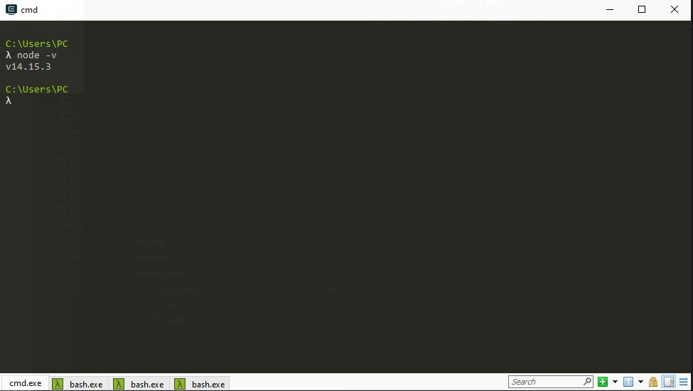
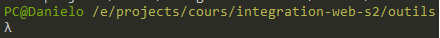
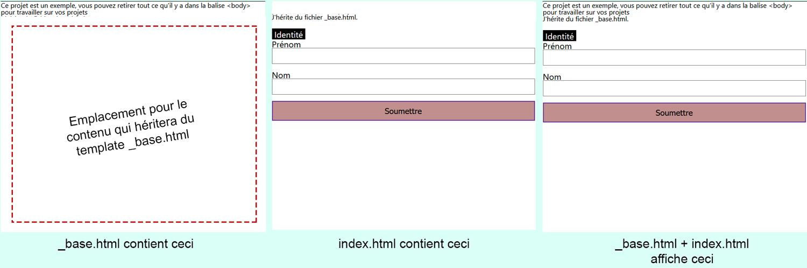

# Architecture front-end

De nos jours, rares sont les projets web où les développeurs écrivent directement du HTML/CSS. Malgré leur universalité ces langages souffrent de beaucoup de problèmes, notamment la répétivité du code HTML. Alors, les développeurs web passent par des langages intermédiaires, il en existe de multitudes, chacun ayant leurs avantages et inconvénients. Dans le cadre de cette architecture, nous allons utiliser [nunjunks](https://mozilla.github.io/nunjucks/) pour le HTML et [sc|ass](https://sass-lang.com/) pour le CSS. Quelque soit le langage intermédiaire utilisé, ils ne peuvent pas être lus directement par le navigateur, ils doivent être compilés que l'intermédiaire d'un serveur javascript, un serveur nodejs pour être précis. D'où ce projet, cette architecture front-end.

**Notez que dans le milieu professionnel, on attend pas forcément de vous que vous soyez un architecte front-end mais au moins que vous soyez familier avec l'environnement nodejs et le terminal.**

## Prérequis

### Logiciels
- Téléchargez et installer Nodejs sur le site officiel de nodejs. [Accéder au site officiel de nodejs](https://nodejs.org/en/)
  Sélectionnez la version LTS (il est possible que le numéro de version diffère par rapport à la capture). Laissez les options par défaut lors de l'inscription

- Téléchargez et installez [cmder](https://cmder.net/) (Windows), télécharger la version "complète (full)" - Facultatif, mais cmder est bien meilleur que l'invite de commande de Windows (et Powershell)
- Validez l'installation de nodejs
  - Ouvrez cmder (ou l'invite de commande / Terminal sur MacOS)
  - Entrez "node -v"
  - Vous devriez voir la chose suivante
  
  - Ceci valide l'installation de nodejs sur votre ordinateur

### Fichiers
- [Téléchargez le dossier du projet](https://downgit.github.io/#/home?url=https://github.com/DanYellow/cours/tree/main/integration-web-s2/outils/archi-fe)
- Décompressez l'archive (et placez le dossier où vous voulez travailler)
- Avec cmder, écrivez `cd ` (l'espace est très important)
- Glissez le dossier fraîchement récupéré dans cmder
- Appuyer sur Entrée

**Note : Si vous êtes sous Windows, que votre dossier de travail est dans un dossier différent du disque C et que vous utilisez "cmd" (appelé aussi "invite de commande"), vous devez impérativement changer de disque avec la commande suivante : `-nom-de-votre-disque:` par exemple `e:` (pas besoin de mettre la lettre en majuscule)**

Si tout s'est bien passé la console devrait afficher quelque chose comme ceci :

Ceci indique que nous sommes dans le dossier "outils"

## Installation
1. Installation des dépendances. Ecrire la commande suivante dans la racine de votre dossier de travail
  ```sh
   npm install
  ```
Note : sauf problèmes, vous devez entrer cette commande qu'une seule fois par projet.

## Lancement du projet
1. Entrer la commande suivante à la racine de votre dossier de travail
  ```sh
    npm start
  ```
  Note : sans `npm install` la commande précédente ne fonctionnera pas
2. Attendre le lancement du projet. Votre navigateur web défini par défaut va s'ouvrir

Note : Vous devez faire ceci (se mettre dans le bon dossier avec les lignes de commande + `npm start`)
Note 2 : Vous pouvez arrêter le serveur appuyant sur les touches `ctrl + c`

## Structure des dossiers (simplifiée)
* [_scripts/](.\archi-fe\dist) (Dossier contenant un ensemble de scripts liés à l'architecture. Théoriquement, vous n'avez pas besoin d'y toucher pour travailler. Voir plus bas pour plus d'informations)
* [dist/](.\archi-fe\dist) (Dossier crée après le premier `npm start`. **Ne jamais éditer ce dossier manuellement**, les modifications seront écrasées par les modifications faites dans le dossier `src/`)
* * [build/](.\archi-fe\build) (Dossier crée après `npm run build`. **Ne jamais éditer ce dossier manuellement**, les modifications seront écrasées par les modifications faites dans le dossier `src/`) Version de production du site, version que vous mettrez en ligne.
* [node_modules/](.\archi-fe\node_modules) (Contient les dépendances, ne **jamais** copier ce dossier, `npm install` sert à ça)
* [src/](.\archi-fe\src) (Dossier dans lequel vous travaillerez)
  * [assets/](.\archi-fe\src\assets) (Ouvrir pour regarder plus en détails)
  * [views/](.\archi-fe\src\views) (Ouvrir pour regarder plus en détails, c'est ici que vous devez définir vos fichiers HTML)
  * [favicons/] : A rajouter si vous souhaitez gérer les favicons dans votre projet
* [tests/](.\archi-fe\tests) (Ensemble de tests unitaires faits avec l'outil puppeteer, partie non finie)
* [package-lock.json](.\archi-fe\package-lock.json) (Fichier définissant la version exacte des dépendances)
* [package.json](.\archi-fe\package.json) (Fichier définissant les dépendances du projet et la liste des commandes `npm run ...`)

## Outils utilisés
Le but de cette partie est de définir très brièvement leur fonctionnement. Je vous invite donc à regarder la documentation officielle de chacun de outils (et autres didacticiels) pour en savoir plus.

### Nunjucks
L'un des gros problèmes du HTML est le fait qu'on doive répéter le code à plusieurs reprises, ainsi s'il y a une partie commune à plusieurs pages, il faut la reporter sur chacune des pages. Ça peut créer des erreurs, et surtout rend le travail très redondant. Il existe une multitude de moteur de templates HTML. Dans le cadre du projet, c'est nunjucks qui est utilisé. Sa syntaxe est très proche du HTML et surtout de Jinja et de Twig, moteurs de templating HTML utilisés pour Django (Python) et Symfony (PHP) respectivement.
* [Voir documentation de Nunjucks](https://mozilla.github.io/nunjucks/)
  
L'une des grandes forces de ces moteurs de templates HTML c'est la notion d'héritage, dans le projet nous avons un fichier layouts/\_base.html et un fichier index.html. Vous remarquez que ce dernier est quelque peu léger en terme de code et pourtant, il est totalement valide du point de vue HTML ! Tout ceci grâce au système d'héritage de template.

L'image ci-dessus explique cette notion d'imbrication / héritage entre fichiers. Il est bien possible de faire un héritage d'héritage ou encore d'inclure des fragments d'autres fichiers.

Note : Dans le cadre de cette architecture, il est préférable de préfixer d'un underscore (\_) tous les fichiers de mise en page ou fichier qui ne doivent pas être de vraies pages au final. Ceci va éviter la création de pages .html inutiles.


### SASS/SCSS
Permet de contrevenir à certaines limites du CSS en ajoutant des fonctionnalités non-négligeables les fonctions, des mixins, l'import, un héritage comme dans les langages de programmation comme le C++ ou le Javascript. A noter que le SASS/SCSS proposent également des variables, toutefois, contrairement aux variables CSS, les variables SCSS/SASS sont compilées.
Notez également que l'architecture du projet permet de gérer le SASS et le SCSS, toutefois, il est préférable de choisir un des deux langages.
* [Voir documentation officielle de SASS/SCSS (anglais)](https://sass-lang.com/)
* [Présentation de SASS/SCSS](https://la-cascade.io/se-lancer-dans-sass/)

### Gulpjs
Gulpjs est un outil permettant de définir des tâches qui se réaliseront sous des conditions définies. Ces tâches s'articulent autour de plugins qui sont installées via npm, le gestionnaire de dépendances du langage javascript. Dans le fichier ./gulpfile.js, vous trouverez  sont définies dans le fichier gulpfile.js présent à la racine du projet. Vous n'avez pas besoin d'éditer le fichier, mais pourquoi pas essayer de rajouter une nouvelle tâche :
* [gulp-zip](https://github.com/sindresorhus/gulp-zip) : zipper le dossier build

Dans le projet, il y a deux tâches majeures :
* gulp build : permet de générer un dossier pour la production (`npm run build`)
* gulp serve : permet de démarrer l'environnement de travail (`npm run start`)

### BrowserSync
Outil permettant de synchroniser vos navigateurs. Grâce à l'utilisation d'un serveur node pour faire tourner le site local, il est maintenant possible d'accéder au site depuis n'importe quel appareil sur le réseau local, idéal pour tester sur smartphone. Si vous voulez tester avec votre smartphone, il vous suffit d'accéder sur son navigateur, à votre adresse ip suivi du port de votre serveur. Vous pouvez obtenir ces informations en accédant à l'url : http://localhost:3002

## Tâches
Le projet s'articule autour de tâches, elles sont listées dans le fichier package.json dans la clef "scripts". Toute les tâches, pour être appelées, doivent être précédée de "npm run _nom-de-la-tache_". Exemple : "npm run build"
* (npm run) build : Produit une version de production du projet. Le CSS est minifié pour gagner en poids de fichier
* (npm run) start : Lance le serveur de développement, voir plus haut pour plus d'information
* (npm run) screenshots : Génère une capture d'écran de toutes les pages html présentes dans le dossier dist pour différents écrans. Ces écrans sont définis dans le fichier _scripts/screenshots.config.js. Notez les choses suivantes à propos de ce script :
  * Le script crée un dossier __screenshots et une archive ./screenshots.tar
  * Le script ne fonctionnera pas si le dossier ./dist n'existe pas
  * Il faut impérativement que vous ayez installé imagemagick sur votre ordinateur (Télécharger imagemagick)[https://imagemagick.org/script/download.php]
  * Le script peut prendre un peu de temps dépendamment du nombre de pages et de la puissance de votre ordinateur