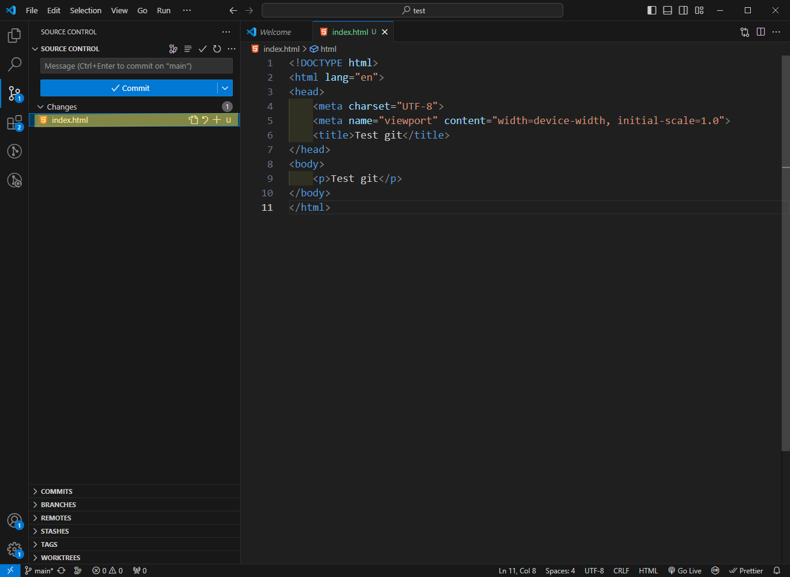

# Mémo GIT

> **Important : Si vous souhaitez utiliser git pour la SAE, il faut impérativement éditer les fichier .env.local.dev et .env.local.prod et non .env.dev et .env.prod. Ne pas le faire vous expose à des failles de sécurité critiques.**
>
> **Si ça arrive, changez immédiatement le mot de passe de votre base de données chez votre hébergeur.**

Git est un outil qui est un standard dans le milieu du développement. C'est un outil libre et gratuit. Dans les grandes lignes, c'est un logiciel permettant de gérer des version d'un logiciel, fichier ou encore site web. 

Si vous êtes sur macOS, git est installé par défaut, si vous êtes sous Windows, il faudra l'installer via le logiciel gratuit gitbash. [Télécharger gitbash](https://gitforwindows.org/).

## git ou github ?
Cette confusion a souvent lieu. Pour faire simple, git est la technologie, github est un site web, et certainement le plus populaire pour utiliser git. De ce fait, il est possible d'utiliser git sans passer par github, l'interface sera différente mais l'utilisation de git, elle, ne changera pas. Ne l'oubliez pas. Pensez aussi à créer votre compte sur [github](https://github.com/signup?ref_cta=Sign+up&ref_loc=header+logged+out&ref_page=%2F&source=header-home), si ce n'est pas déjà fait.

> Ce document a été pensé autour de git et github, mais comme dit juste en haut, mis à part l'interface, tout outil basé sur git fonctionne plus ou moins de la même façon notamment au niveau des lignes de commande.

## Commandes
> git possède de nombreuses commandes, ce document ne listera que les commandes principales, celles dont vous aurez le plus besoin. Les autres, vous aurez l'occasion de les découvrir durant vos périgrignations avec git.


### Initialisation du projet
Première étape d'un projet git : l'initialisation. **Cette étape n'est à faire qu'une seule fois par projet.** Pour simplifier les choses, il est préférable de faire cette étape depuis github plutôt que la ligne de commande.
||
|:--:|
|*Allez sur le site github, connecté. Cliquez sur le "+" et sélectionnez "New repository" (dépôt en français)*|

||
|:--:|
|*Définissez un nom unique (par rapport à la liste de vos dépôts existants). Puis cliquez sur "Create repository"*|

||
|:--:|
|*Voilà, votre repository est prêt. La page est ainsi car il n'y a pas encore de fichiers ajoutés*|

> Vous avez maintenant initialisé votre projet, toutefois, il n'est pas sur votre ordinateur encore, c'est ce que nous allons voir dans la partie suivante.

# Cloner le dépôt (repository)
Dans le vocabulaire de git, l'action de "cloner" consiste à télécharger sur son ordinateur le contenu d'un dépôt. Pour se faire, il faudra utiliser la ligne de commande et la commande suivante :
```bash
git clone URL-du-depot.git
```
> Note : VS Code intègre un terminal, il est accessible via le menu `Terminal > New Terminal`. L'avantage de cette méthode c'est que VS Code ouvre la console directement dans votre projet, c'est plus pratique. Malheureusement quand vous clonez un dépôt, il n'existe pas encore sur votre ordinateur, mais on peut _tricher_ en procédant de la façon suivante créant un dossier vide. : 
> - Créez un dossier vide sur votre ordinateur
> - Glisser ce dossier dans VS Code
> - Ouvrez la console et cloner le dépôt avec la commande `git clone URL-du-depot.git .` (le point est important)
> 
> Et voilà, vous avez cloné votre dépôt.

Appuyez ensuite sur la touche "entrée". Félicitations, vous avez cloné votre projet sur votre ordinateur. 

> Le clonage ne s'effectue, si et seulement si, le projet n'est pas sur votre ordinateur.

# Ajouter des fichiers à l'historique 
Une fois le projet cloné glissez-déposez tout le contenu du dossier "code" de la SAE dans le dossier récemment téléchargé via la commande `git clone`.

Git permet de garder un historique des fichiers au sens d'un dépôt (ajout, suppression, modification). Toutefois, git crée un registre uniquement des fichiers qu'il connait. Après avoir déplacé tous les fichiers de la SAE 203 dans le dossier, vous avez du remarquer sur la gauche de VS Code une pastille avec un nombre, ce nombre représente le nombre de fichiers ajoutés/modifiés dans votre dépôt. Cliquez dessus.

||
|:--:|
|*La pastille à gauche nous indique le status de notre projet git*|

La partie "Source control" garde une trace actuelle de votre dernière modification. Dans la liste des fichiers, vous remarquerez qu'il y a la lettre "U" d'affichée. Ce "U" signifie "Unstagged", cet état signifie que ce fichier n'est pas lié à git, il n'est pas dans l'historique.

||
|:--:|
|*Ici notre fichier `index.html` bien que dans le dossier de notre dépôt, il est marqué comme **U**nstagged. Il faut y remédier.*|

Pour ajouter nos fichiers à l'historique, il faut utiliser la commande suivante dans le terminal :
```bash
git add .
```

||
|:--:|
|*Après avoir exécuté la commande `git add .`, notre U de Unstagged s'est transformé en A pour Added*|

Notre fichier `index.html` est ajouté dans l'historique toutefois nous n'avons encore rien enregistré, c'est ce que nous allons voir dans la partie suivante.

# Enregistrer les modifications

L'engistrement d'une modification est appelée `commit`, voyez cette action comme étant l'insertion d'une action dans un registre. Cette action s'effectue via la commande :
```bash
git commit -am "Contenu du message"
```
> Les guillemets peuvent être simples ou doubles.

Il est préférable d'avoir un contenu de message clair, ceci vous permettra de comprendre très facilement ce qui a été effectué pour cette ligne du registre, et ce, sans regarder votre code.

> Pour un message de commit clair, nous vous conseillons d'écrire un message qui répond à la phrase suivante "This commit will..." ou en français "Ce commit (fera)...". Dans le cas de nos exemples, l'ajout de notre fichier "index.html", le message du commit peut être "Ajout de la page d'accueil".

Une fois le commit définit, n'oubliez pas d'appuyer sur la touche "entrée" pour le valider.
Pour terminer cette partie, rappelez-vous qu'un commit est gratuit, n'hésitez pas à commiter plusieurs fois par heure. Notamment quand vous accomplissez une grande avancée sur votre projet : ajout de fichiers, fonctionnalités... 

## Mettre à jour le dépôt distant
Jusqu'à présent, nous avons ajouté et enregistré nos fichiers dans l'historique de git, néanmoins, ces modifications sont locales, il faut donc mettre à jour l'historique distant. On parlera de "push" dans le vocabulaire de git. Pour ce faire, il faut utiliser la commande `git push origin`. Cette dernière va envoyer sur le serveur distant tous les commits effectués qui n'ont pas encore été envoyés. 

> Important : git refusera un push si votre historique local n'est pas à jour, il faudra impérativement effectuer un tirage de branch (`git pull`) avant.

Lors de votre premier push, il n'est pas improbable que github vous demande des autorisations, elles permettent de vous autoriser automatiquement, autorisez-les.


## Récupérer l'historique distant
Si vous changez d'ordinateur ou travaillez d'avec d'autres, votre historique local ne sera certainement pas à jour s'il y a eu des modifications entre-temps. Pour les récupérer, rien de plus simple :
```bash
git pull origin
```

La commande `git pull origin` met fin à ce document de présentation brève de git, vous avez l'essentiel pour commencer à l'utilisation. Avec le temps, vous découvrirez d'autres commandes tout aussi utiles.

### Gérer les merges (fusion d'historiques)
Lorsque que vous effectuez un pull, git effectue une fusion des historiques. Il peut arriver que git vous demande comment gérer cette action (voir image ci-dessous). Généralement, il n'est pas utile de mentionner les raisons du merge. Ainsi pour remettre la console dans son état inital, il vous suffit d'écrire `:q` (et appuyer sur `Entrée`) dans la console.
||
|:--:|
|*Quand git fait ça, c'est qu'il est en train d'effectuer un merge. Faites `:q`. Et ça sera réglé.*|

## Extras

### Autoriser d'autres collaborateurs
Si n'importe qui peut cloner (`git clone`) votre projet, tout le monde n'est pas autorisé à pousser sur votre dépôt, pas défaut. Pour permettre aux autres membres de votre groupe de pousser sur votre historique distant, il faudra changer les permissions de votre dépôt sur le site github. Suivez la démarche suivante :

||
|:--:|
|*Allez dans le menu "Settings" de notre dépôt*|

||
|:--:|
|*Puis le menu "Collaborators"*|

||
|:--:|
|*Cliquez sur "Add People" et ajoutez les noms de compte de vos collaborateurs.*|

Notes :
- Vos collaborateurs devront valider leur participation au projet (un e-mail de validation sera envoyé)
- Les projets dans lesquels vous collaborés sont dans le menu `Paramètres > Repositories`. [Également accessible via cette URL](https://github.com/settings/repositories).

### Gérer les conflits
Aussi performant soit-il, git peut parfois se brouiller quand il fusionne des historiques, ça s'appelle un conflit. Ils interviennent la plupart du temps quand plusieurs développeurs ont édité les mêmes lignes de code.

Ainsi, on se retrouve avec un code non interprétable correctement par un compilateur ou le navigateur, ce qui provoque des comportements inattendus.

La résolution des conflits doit se faire manuellement. Pour signaler un conflit git ajoute de multiples chevrons dans le code (`<<<<<<<<<<`). Il faut donc les rechercher dans le code et sélectionner les parties de code qui nous intéresse.

Heureusement, VS Code possède une fonctionnalité de recherche globale.
||
|:--:|
|*Après avoir sélectionné l'outil de recherche, on recherche `<<<<<<` pour trouver nos conflits*|

VS Code liste les fichiers avec des conflits, il vous suffira sélectionner chacun des fichiers en conflit et les résoudre.

### Liens utiles
- [Documentation officielle en français](https://git-scm.com/book/fr/v2)