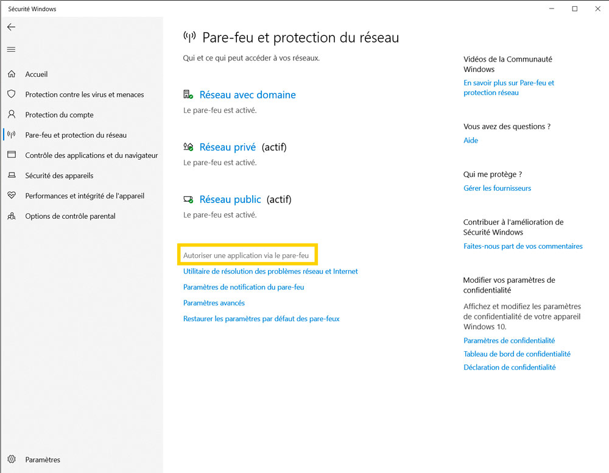
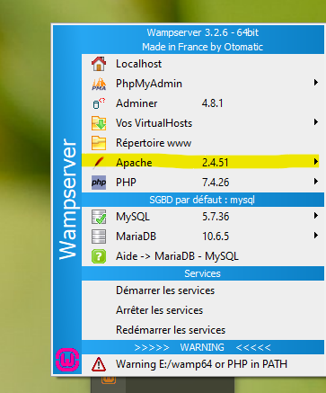

# Travailler avec Liveshare et partager votre serveur

L'utilisation de l'extenson liveshare de VS Code est très pratique pour travailler en groupe sur le même projet. Néanmoins, vous avez dû remarquer que si vous pouvez bien modifier les fichiers chez l'hôte, il vous est impossible de voir les modifications sur votre ordinateur local.

> Note : Les instructions suivantes ne fonctionneront que si et seulement si les conditions suivantes sont toutes réunies :
> - Les ordinateurs, qui veulent voir les modifications en local, sont sur le même réseau. Par exemple à l'IUT.
> - Le projet tourne sur un serveur (MAMP/WAMP/XAMPP...)

Si les conditions précédentes sont remplies, l'ordinateur hôte (celui qui lance le serveur liveshare) doit récupérer son adresse ip locale et la partager avec les membres de son groupe. Ainsi, vous pourrez tous éditer les fichiers du même projet et consulter les modifications sur votre ordinateur.

### Obtenir son adresse IP locale

#### Windows

1. Ouvrez l'application "invite de commande"
2. Ecrivez la commande  `ipconfig` et appuyez sur la touche `Entrée`

3. Récupérez l'adresse ip locale et transmettez-la aux membres de votre groupe

##### Note pour les hôtes sous Windows - Windows 10

Le système d'exploitation peut potentiellement bloquer les requêtes venant de l'extérieur en direction de votre serveur. Dans le cas où l'hôte est sous Windows, il vous faudra rajouter le serveur au pare-feu Windows. Pour ce faire, suivez les étapes suivantes :

1. Ouvrez le logiciel "Sécurité Windows". Vous pouvez utiliser le raccourci `Windows + S` pour afficher le menu de recherche.

2. Sélectionnez "Pare-feu et protection du réseau"

3. Sélectionnez "Autoriser une application via le pare-feu"

4. Sélectionnez "Modifier les paramètres" puis "Autoriser une autre application"
   - Cliquer sur "Modifier les paramètres" va activer "Autoriser une autre application"

5. Cliquez sur le bouton "Parcourir" puis sélectionnez le fichier `httpd.exe` dans le dossier `wamp64\bin\apache\apache2.4.51\bin` et validez l'opération

Il vous faudra également éditer le fichier `httpd-vhosts.conf`. Pour y accéder et l'éditer suivez les étapes suivantes :

1. Cliquez sur le logo de WAMP dans la barre de status de Windows. Puis Survolez "Apache ..."

2. Cliquez sur `httpd-vhosts.conf`
   - Ceci va ouvrir un logiciel avec le fichier `httpd-vhosts.conf`

3. Remplacez dans le fichier "Require local" en "Require all granted" puis sauvegardez le fichier
4. Redémarrez le WAMP

Maintenant l'accès depuis l'extérieur au serveur hôte fonctionnera.

#### MacOS
1. Ouvrez l'application "Préférences système"
2. Choississez le menu "Réseau"

3. Sélectionnez la méthode connexion utilisée et récupérez l'adresse ip locale et transmettez-la aux membres de votre groupe

Les membres de votre groupe n'auront qu'à accéder à l'adresse ip depuis le navigateur de leur ordinateur.
   - N'oubliez pas de rajouter le reste de l'URL par exemple 192.168.X.X/sae203

Maintenant, vous pouvez tous travailler sur le même projet tout en voyant les modifications en local.

> Note : Des manipulations supplémentaires peuvent être à effectuer **si l'ordinateur hôte utilise XAMPP**. Vous trouverez des informations sur ce site : [Accéder au didacticiel (anglais)](
https://www.mrtekno.net/2019/08/how-to-access-localhost-xampp-vm.html)

L'accès à votre travail local peut également fonctionner à distance, mais ceci nécessite des outils externes comme localtunnel (gratuit) - [accéder au site de localtunnel](https://localtunnel.github.io/www/).