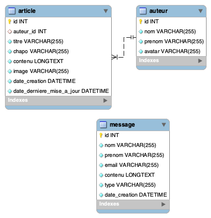

# SAÉ 203 - Site web et Base de données (BDD)
_Les consignes pourront être modifiées_

CY Cergy Paris Université nous confie la réalisation d'un site web dédié au BUT Métiers du Multimédia et de l'Internet (MMI). Et pas n'importe lequel puisqu'il s'agit du site sur lequel vous avez travaillé durant la SAÉ 105. Vous partirez de la correction du projet (disponible sur ENT).

Notez qu'il y a un dossier "ressources/css/ne-pas-modifier", merci de ne pas y toucher, il contient le strict nécessaire pour avoir le squelette d'une page, toutefois vous pouvez en revanche copier un sélecteur CSS présent dans le code de base pour le surcharger si besoin est.

- [Accéder à la maquette Adobe XD](https://xd.adobe.com/view/9db2b308-f3b3-40d2-9372-2b43c83a277f-c8e1/screen/b2376c6c-7c7d-4071-a7f0-e32f20ac85aa/)

Nous vous remettons le lien vers la maquette Adobe XD, toutefois vous n'en aurez pas trop besoin, en effet, les ajouts que vous allez devoir faire seront de nouvelles pages, deux pour être exacts :
- Article : lorsqu'on clique sur un article sur la page d'accueil, on doit accéder à son contenu
- La liste des auteurs du site (rajoutez une page dans la navigation)

Pour ces trois pages, c'est à vous de réaliser le design.

Et en plus, vous allez devoir réaliser le back-office du site, vous trouverez plus d'information concernant cette partie dans la partie dédiée dans ce document.
# Base de données

Comme le nom de la SAE l'indique, elle sera l'occasion de voir les bases de données. Cette du projet ressemble à ceci :


<p style="text-align: center">Schéma de la base de données</p>

Cette base de données est composée de trois tables dont une relation One-to-Many. Ainsi un auteur peut avoir rédigé plusieurs articles, mais un article ne peut avoir qu'un **seul et unique auteur.** De ce fait, on retrouve dans la table "article", la clé étrangère "auteur_id", cette clef peut être null, un article peut donc avoir aucun auteur.

Concernant la table article, la colonne "date_creation" n'est mise à jour **que** lors de la création d'un article (`INSERT INTO`) tandis que la clef date_derniere_mise_a_jour est mise à jour à chaque mise à jour d'un article (`UPDATE`).

[Script SQL pour créer la base de données Mysql (cliquez sur le bouton "raw" puis faites clic droit > Enregistrer sous)](base-de-donnees.sql).

# Administration

Grosse partie de cette SAE, elle sera l'occasion de mettre en application les connaissances vues sur bootstrap. Dans le dossier `/administration`, vous trouverez un gabarit sous bootstrap, il faudra compléter le tout de façon à avoir les pages et les fonctionnalités suivantes :
- Articles
  - Création d'article
    - On doit pouvoir associer un auteur à un article
  - Edition d'article
  - Liste d'articles
- Auteur
  - Création d'auteur
  - Edition d'auteur
  - Liste d'auteurs
- Message
  - Liste des messages reçus

Vu que vous êtes encore débutant en php/mysql, la plupart des requêtes sont déjà présentes, il faudra toutefois les éditer en fonction de vos besoins. **Nous vous invitons à regarder les commentaires ainsi que le fichiers REQUETES-SQL.md pour mieux comprendre les requêtes.**

La partie "Auteur" est presque complète, et vous servira d'exemple, il faudra remplacer quelques valeurs dans les requêtes pour que tout fonctionne comme prévu.


### Redirection après soumission

Lors de vos tests, vous remarquerez qu'il ne se passe rien lorsque vous soumettrez vos formulaires. C'est normal, il manque le comportement du navigateur après la soumission. Deux choix s'offrent à vous : 
- Rester sur la page avec les données mises à jour
- Rediriger l'utilisateur vers une autre page

Voici le code pour les deux cas. Ce code est à mettre **après** les données ont été enregistrées dans la base.

```php
// L'utilisateur reste sur la même page
$pageRedirection = $_SERVER['HTTP_REFERER'];
header("Location: $pageRedirection"); 
```

```php
// L'utilisateur va ailleurs
$pageRedirection = "remplacer-par-url";
header("Location: $pageRedirection"); 
```

~~Vous donnerez également la possibilité à l'utilisateur de pouvoir supprimer un article.~~


# Astuces

- Vous travaillez en groupe, ayez la même structure de fichiers, ça sera plus simple après pour tout fusionner
- Lorsque vous devez ajouter une nouvelle page sur la partie visible. Dupliquez le fichier "squelette.php" à la racine du dossier puis reconommez-le
- Lorsque vous devez ajouter une nouvelle partie à l'admnistration. Dupliquez le **dossier** "squelette" contenu dans le dossier `administration`
- 

# Rendus attendus

- Une archive nommée nom-prénom contenant l'ensemble des fichiers permettant le bon fonctionnement de votre site :
  - Base de données (fichier .sql)
  - HTML/PHP/CSS/javascript...
- URL du site en ligne **(facultatif).** Attention, la mise en ligne du site nécessite également la mise en ligne de la base de données

Votre rendu devra être mis sur Moodle avant la date butoir, cette date sera donnée ultérieurement. Un seul rendu est nécessaire par groupe, celui du chef d'équipe.

# Notation
Les critères suivants seront évalués. Une ou les deux parties peuvent être amenée à être évaluée lors d'un oral.
### Intégration Web (HTML/CSS/javascript)

- Qualité du code
  - Pas de classes CSS au nom étrange
  - Réutilisation des classes CSS
    - N'oubliez pas qu'une balise peut avoir plusieurs classes CSS
  - Organisation du code
    - Utiliser la structure déjà présente peut vous aider
  - Sémantique HTML :
    - Toute utilisation inappropriée de la balise &lt;br> sera sanctionnée
    
- Accessibilité
  - &lt;img> avec attribut "alt" même vide
  - Valeur de la balise &lt;title> qui change pour chaque page avec la valeur appropriée
  - Fichier(s) javascript sont chargés avant la fermeture de la balise &lt;body>
  - Unité des police d'écriture en rem
    - Toute utilisation de l'unité px pour la propriété font-size sera sanctionnée, il faut utiliser l'unité rem.
      - Il faut diviser la valeur par 16 pour obtenir la font-size en rem
  - [Voir plus de normes d'accessibilité](https://www.accede-web.com/notices/html-et-css/)
- Présence des fonctionnalités / qualité de l'intégration (voir Adobe XD - lien plus haut -)

### Développement Web (PHP/MySQL)

- Qualité du code
  - Utilisation de la fonction include()
    - Une partie du code fourni nécessite d'être optimisée avec la fonction include()
  - Utilisation de fonctions (quand c'est nécessaire)
  - Lecture et écriture de la base de données
  - Utilisation des paramètres d'url

# Votre liste à faire
- [x] Lire les consignes
- [ ] Importer et connecter la base de données
- [ ] S'approprier le code, bien le regarder (HTML et CSS), faire des tests
- [ ] J'ai réalisé toutes fonctionnalités :
  - [ ] Les champs en erreur sont **clairement** indiqués après soumission du formulaire
    - Note : Les attributs "required" doivent être supprimés
    - A vous de gérer le design, n'hésitez pas à prendre de l'inspiration sur le web
    - La bannière originale doit rester
  - Développement de la cinquième page principale
    - Sa mise en page utilise bootstrap
    - Son accès est disponible depuis la page de menu
  - [ ] Développement de la page "article"
    - [ ] Chaque article doit charger un article différent
  - [ ] Développement de la page "auteur"
  - [ ] Rajouter une table pour enregistrer les messages envoyés depuis la page contact
  - [ ] Enregistrement dans la base de données les messages envoyés
- [ ] Respecter les normes d'accessibilité web (liste non exhaustive)
  - [ ] Mes images possèdent un attribut "alt"
  - [ ] L'unité de la propriété "font-size" est rem
  - [ ] Je n'utilise pas de balises &lt;br> de façon inappropriée
- [ ] Rajouter un favicon (image au choix)
- [ ] Toutes mes pages sont accessibles, je n'ai pas d'erreur 404 (page non trouvée)
- [ ] Rendre le projet
  - [ ] **Exporter la base de données**
  - [ ] Créer une archive avec votre nom-prénom qui contient :
    - [ ] Le code
    - [ ] La base de données
  - [ ] Nommer l'archive avec mon nom-prénom

# Pour aller plus loin

Pour aller plus loin sur le projet, voici une liste (non-exhaustive) de fonctionnalités que vous pouvez rajouter pour aller plus loin, vous n'aurez pas plus de points pour autant, mais vous acquirerez plus de nouvelles connaissances :

- Ajouter un mode sombre
  - [Voir didacticiel sur le mode sombre](https://www.jannaud.fr/guide-pour-passer-facilement-son-site-web-en-mode-sombre-dark-mode-css)
  - C'est à vous de faire le design
- Gérer une page 404, autrement dit afficher une page spécifique si l'utilisateur essaye d'accéder à une page qui n'existe pas
  - Il vous faudra un fichier .htaccess, vous trouverez comment faire sur le web
- Écrire votre **CSS** en SCSS ou SASS
  - Cette partie de ce tutoriel sera amplement suffisant 
    - [Tutoriel SASS/SCSS](https://openclassrooms.com/fr/courses/6106181-simplifiez-vous-le-css-avec-sass/6596483-decouvrez-sass-et-sa-syntaxe)
  - [La documentation en anglais](https://sass-lang.com/guide)
  - Il vous faudra un outil pour compiler le SCSS/SASS en CSS
    - [En ligne (je déconseille)](https://jsonformatter.org/scss-to-css)
    - [Avec un plugin VS Code (préférable)](https://marketplace.visualstudio.com/items?itemName=ritwickdey.live-sass)
- Ajouter des plugins **pertinents** en javascript
- Ajouter une interaction sur la bannière erreur lors de la soumission du message, pour permettre, au clic sur la bannière, d'atteindre le premier champ en erreur 
- Utiliser une Regex (côté PHP) pour s'assurer que l'adresse e-mail est valide respectant bien le format `nom@domaine.ext`
- Ajouter la fonctionnalité suivante : A partir d'un article, on doit être capable d'accéder à la page de l'auteur de l'article
  - Cette page auteur contiendra également la liste de tous les articles écrits par l'auteur
