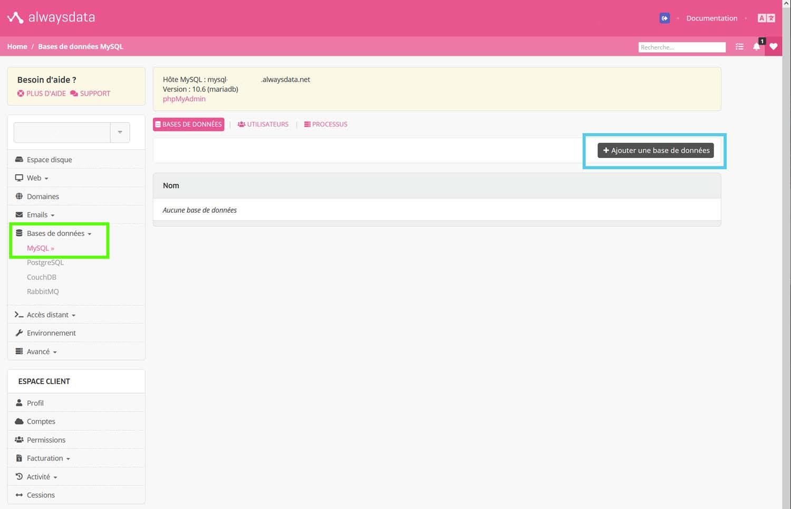
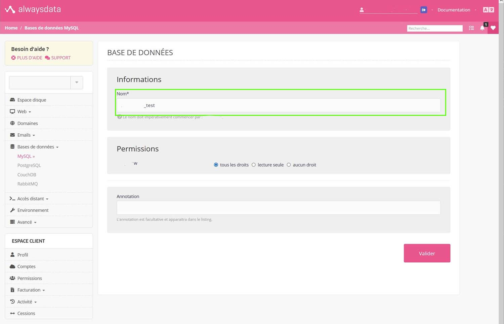
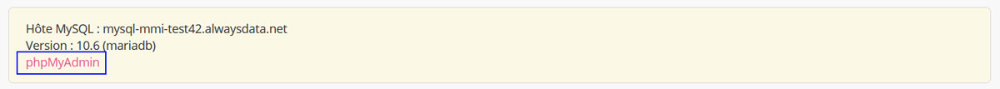
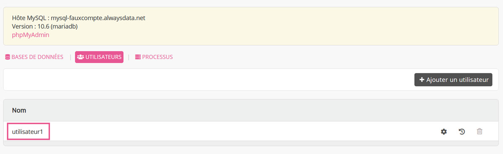
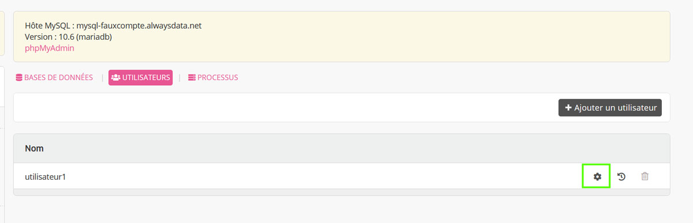
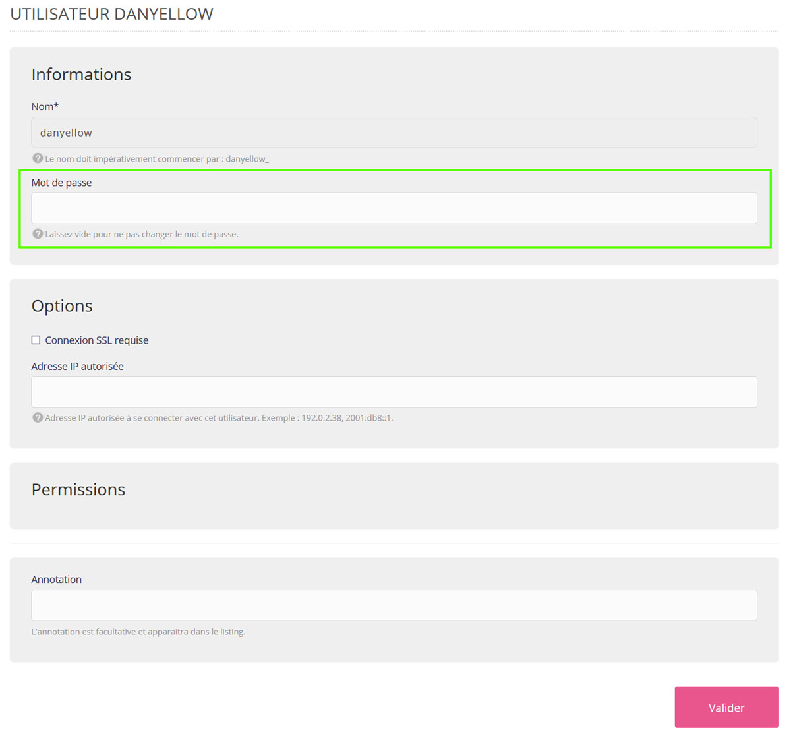

# Didacticiel - Comment créer une base de données SQL dans alwaysdata

Voici un didacticiel traitant de la création d'une base de données sur l'hébergeur alwaysdata. Pour rappel, alwaysdata propose une offre gratuite, certes limitée, mais amplement suffisante pour héberger vos petits projets dont cette SAE.

Dans cette dernière, nous aurons besoin d'héberger votre SAE, voici les étapes à suivre pour créer une base de données distante et donc rendre votre projet accessible à tous.

> On partira bien évidemment que vous avez crée un compte sur le site alwaysdata. Si ce n'est pas déjà fait, faites-le ça prend moins de 5 minutes. [Accéder au site d'alwaysdata](https://www.alwaysdata.com/fr/)

## 1. Accès au formulaire de création de base MySQL

1. Cliquez sur "Bases de données" (à gauche)
2. Cliquez sur "MySQL"
3. Cliquez sur "Ajouter une base de données"

## 2. Création de base de données MySQL

1. Choississez un nom. Comme l'indique l'interface, le nom doit commencer par "votre_compte_" + nom arbitraire
2. Laissez les permissions par défaut
3. Validez

> En réalisant cette étape, vous venez de créer un nom de base de données, c'est cette base que vous pourrez utiliser plus tard pour y créer des tables et leurs contenus. Si vous avez oublié le nom, pas de panique, il se trouve dans la liste du menu Bases de données > MySQL, onglet "Bases de données"

> Par ailleurs, pour accéder à l'interface de phpmyadmin, il vous suffit juste de cliquer sur le lien "phpmyadmin" situé dans l'encart juste au-dessus dans la partie Bases de données > MySQL.

Et pour importer une base de données, [regardez le didacticiel sur l'import de bases](LISEZ-MOI-IMPORT-SQL.md)

Si vous avez réalisé ces deux étapes, tout est prêt. Vous avez les informations suivantes :
- url de serveur (hostname) : Il se trouve dans l'encart de la capture d'écran ci-dessus. Il faudra l'adapter à votre projet.
- nom de base de données (database) : C'est le nom que vous avez défini précédemment, celui qui respecte la nomenclature suivante : "votre_compte_" + nom arbitraire
- nom d'utilisateur (username) : par défaut, c'est le nom de votre compte, si vous ne le connaissez pas. Allez dans l'onglet "Utilisateurs" 

- mot de passe (password) : Par défaut, le mot de passe est identique à celui de votre compte. Toutefois, il est possible d'avoir un mot de passe décorréler entre votre compte et vos différentes bases de données. Suivez la partie plus bas pour en savoir plus.

Si, on prend du code php, ceci nous donnerait quelque chose comme :
```php
    $mysqli = mysqli_connect(
        {url de serveur}, 
        {nom d'utilisateur}, 
        {mot de passe}, 
        {nom de base de données}
    );
```

## Modification de mot de passe de base de données MySQL

> Cette partie est facultative, elle s'adresse aux personnes souhaitant augmenter la sécurité de leur compte en différenciant le mot de passe de leur compte alwaysdata (celui utilisé pour se connecter à l'interface) avec celui de leur base de données

1. Allez dans le menu Bases de données > MySQL
2. Sélectionnez l'onglet "Utilisateurs"
3. Cliquez sur la roue dentée du compte dont vous souhaitez modifier le mot de passe
    
4. Définissez un nouveau mot de passe et validez
    
    - Si vous souhaitez réutiliser le mot de passe de votre compte pour la base de données, il vous suffit de vider le champ et enregistrer

> N'oubliez pas de modifier le mot de passe de votre base de données dans vos fichiers php si vous faites la modification. 