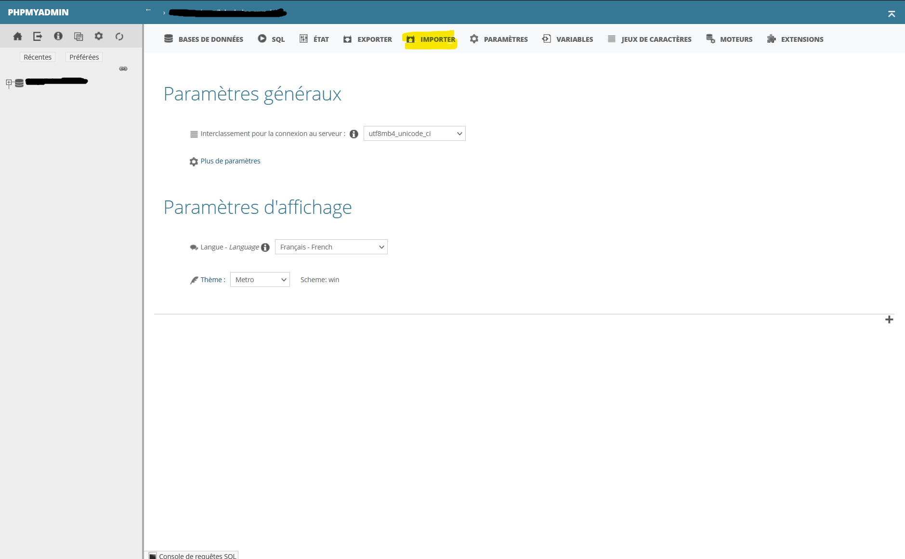
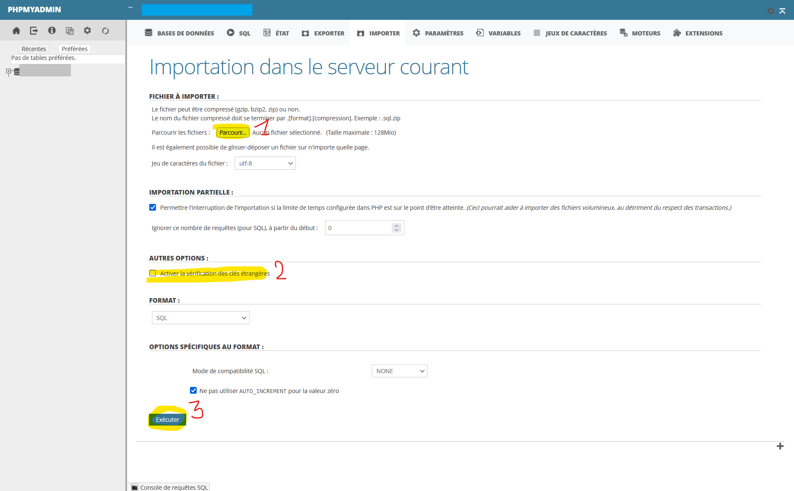

# Didacticiel - Comment importer une base de données SQL dans phpmyadmin

Parfois, comme dans le cadre de cette SAÉ, il vous arrivera de travailler avec des bases de données (bdd) existantes. De ce fait, vous serez dans l'obligation d'importer cette base pour pouvoir travailler. Le but de cet didacticiel est de vous montrer comment importer un fichier .sql dans phypmyadmin.

> Les captures d'écran ont été faites sous une version personnalisée de phpmyadmin, toutefois le principe reste le même, et ce, quelque soit votre version. Certains textes peuvent être différents en fonction de la version mais le sens restera toujours le même. **Si jamais vous vous sentez trop perdu(e), cherchez un didacticiel sur Youtube. Il y en a plein et ils sont très courts.**

## 1. Accès à l'onglet "Import"

1. Cliquez sur "Importer"

## 2. Import de la base

1. Cliquez sur "Parcourir"
   - Ouverture d'une popup
   - Sélectionnez votre fichier SQL (extension .sql)
   - Importez le fichier
     - Note : Dépendamment de la taille du fichier, l'import peut prendre du temps
2. (Optionnel) Décochez l'option "Activer la vérification des clés étrangères"
   - Décocher l'option permet d'éviter certains conflits lors de l'exécution de la requête
3. Cliquez sur "Exécuter"
   - Le bouton peut ne pas être visible de prime à bord si la fenêtre est trop petite. Défilez la page pour le trouver (souvent en bas de page) 

> Si jamais phpmyadmin vous indique que la table "sae_203_db" n'existe pas. Ceci signifie que vous avez exécuté votre requête dans une base de données avec un nom différent. Deux solutions :
> - Supprimer la ligne `USE 'sae_203_db';` dans le fichier base-de-donnees.sql
> - Renommer la base de donnée en "sae_203_db"

Normalement, vous devriez avoir importé votre base de données. Les tables et la bdd nouvellement ajoutées seront visibles à gauche de l'interface.

> Note : Si phpmyadmin vous indique qu'il n'a pas le droit de créer une base de données. Vous devrez retirer les deux premières lignes du fichier `base-de-donnees.sql`. Celles commençant par "CREATE DATABASE" et "USE".
Ce problème risque plus d'arriver sur un hébergeur distant, très rarement sur votre ordinateur.