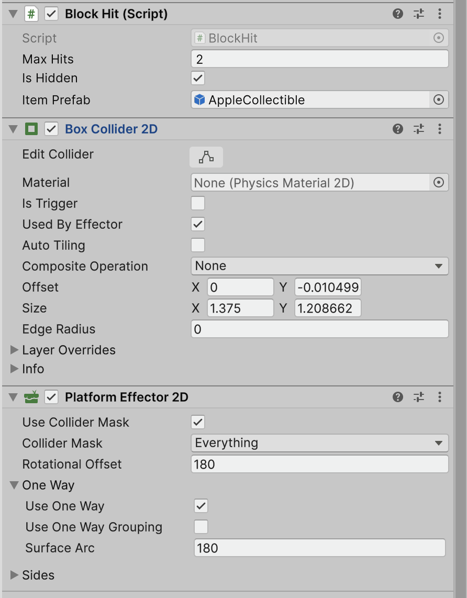
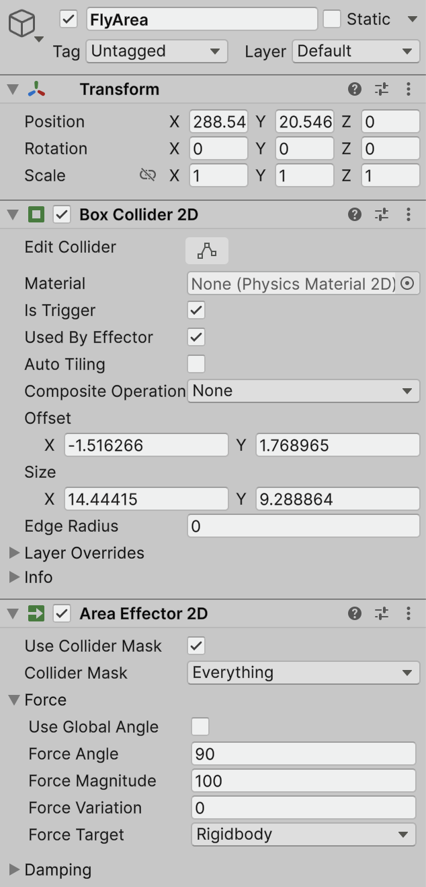
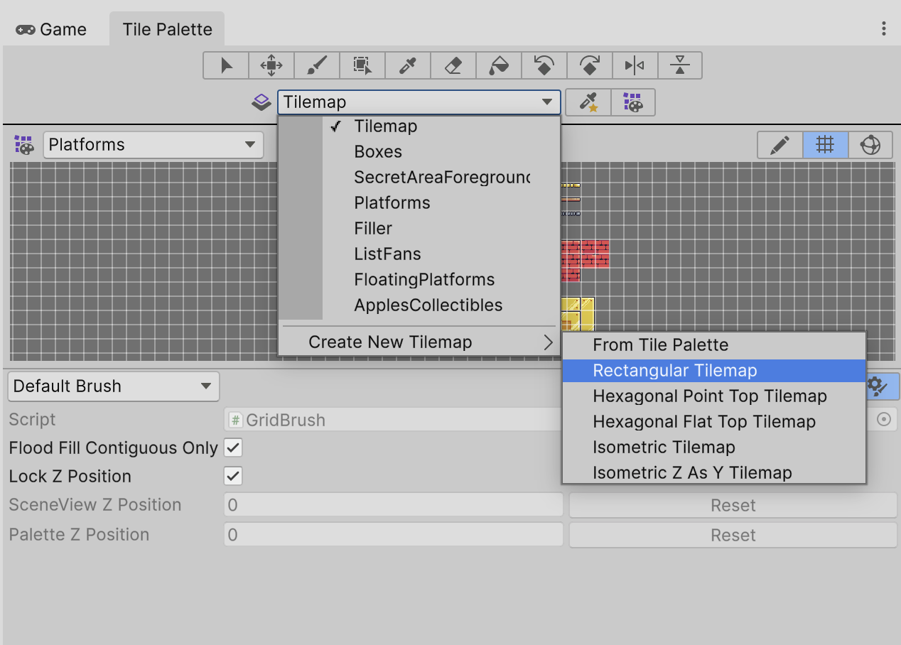
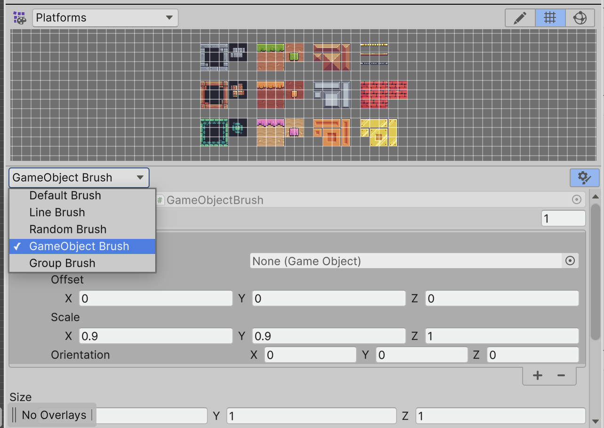
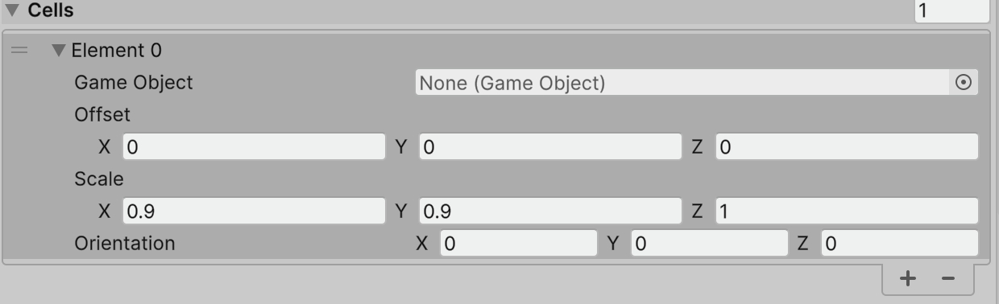

# Mémo notions cours

Ce document contient, de façon exhaustive, les composants / notions abordées dans le contexte de la SAE 402. Ainsi, si vous avez manqué / oublié des choses vous avez ce document pour vous aider.

## Blocs

La fonctionnalité "Blocs" nous permet, à la manière de la série de jeux _Super Mario_ de faire apparaître un objet lorsqu'on saute en dessous.

### Composants utilisés + configuration :
- Rigidbody2D
- BoxCollider2D
- PlatformEffector2D



> N'oubliez pas de cocher "Used By Effector" pour le composant "BoxCollider2D", sinon le composant "PlatformEffector2D" ne sera jamais appliqué.
>

<details>
<summary>Script BlockHit.cs</summary>

```cs
using System.Collections;
using UnityEngine;

public class BlockHit : MonoBehaviour
{
    private SpriteRenderer sr;
    private Animator animator;

    [SerializeField]
    private int maxHits = 2;

    [SerializeField]
    private bool isHidden = false;

    private PlatformEffector2D pe2d;

    private int currentHits = 0;

    private bool isAnimating = false;

    [SerializeField]
    private GameObject itemPrefab;

    void Awake()
    {
        animator = GetComponent<Animator>();
        sr = GetComponent<SpriteRenderer>();
        pe2d = GetComponent<PlatformEffector2D>();

        if (isHidden)
        {
            pe2d.enabled = true;
            sr.color = Color.clear;
        } else
        {
            pe2d.enabled = false;
            sr.color = Color.white;
        }
    }

    void OnCollisionEnter2D(Collision2D collision)
    {
        if (!collision.gameObject.CompareTag("Player"))
        {
            return;
        }

        ContactPoint2D contact = collision.GetContact(0);

        if (contact.normal.y > 0.5f && currentHits < maxHits && !isAnimating)
        {
            currentHits = currentHits + 1;
            animator.SetTrigger("Hit");
            pe2d.enabled = false;
            sr.color = Color.white;

            if (itemPrefab != null)
            {
                StartCoroutine(Hit());
            }

            if (currentHits == maxHits)
            {
                sr.color = new Color(1f, 1f, 1f, 0.5f);
            }
        }
    }

    IEnumerator Hit()
    {
        isAnimating = true;
        GameObject item = Instantiate(
            itemPrefab,
            transform.position,
            Quaternion.identity
        );
        Collectible collectible = item.GetComponent<Collectible>();
        yield return item.transform.MoveBackAndForth(
            item.transform.localPosition + Vector3.up * 1.5f
        );
        collectible.Picked();
        isAnimating = false;
    }
}
```
</details>
Le script ci-dessous gère l'apparition de l'élément caché dans le bloc. L'élément peut être ce que vous souhaitez à partir du moment où c'est un prefab.

## Ventilateurs

A la fin du niveau fourni avec la SAE 402, une zone de ventilateurs va permettre au joueur de s'envoler et attendre la fin du niveau.

### Composants utilisés :
- AreaEffector2D
- BoxCollider2D



> N'oubliez pas de cocher "Used By Effector" pour le composant "BoxCollider2D", sinon le composant "AreaEffector2D" ne sera jamais appliqué.

## Placer les éléments sur une grille

Comme les tuiles, il est possible de placer n'importe quel Prefab sur une grille. En les plaçant sur la grille, on gagne du temps à les placer et c'est plus agréable visuellement.

**Etape 1**



- Allez dans la fenêtre "Tile Palette". Si vous ne l'avez pas, il vous suffit d'aller dans le menu Window > 2D > TilePalette
- Cliquez sur la liste déroulante listant toutes les grilles de la scéne et créez une grille rectangulaire (comme sur l'image ci-dessus)

**Etape 2**



- **En prenant bien soin de sélectionner la grille dédiée**, sélectionnez l'option "GameObject Brush"

**Etape 3**



- Dans le champ "Game Object" sélectionnez ou glissez-déposez le prefab que vous souhaitez mettre sur votre grille

Comme pour une tuile classique, il faudra utiliser les mêmes outils pour placer vos éléments sur la scène.
