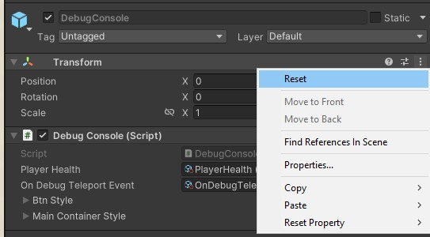
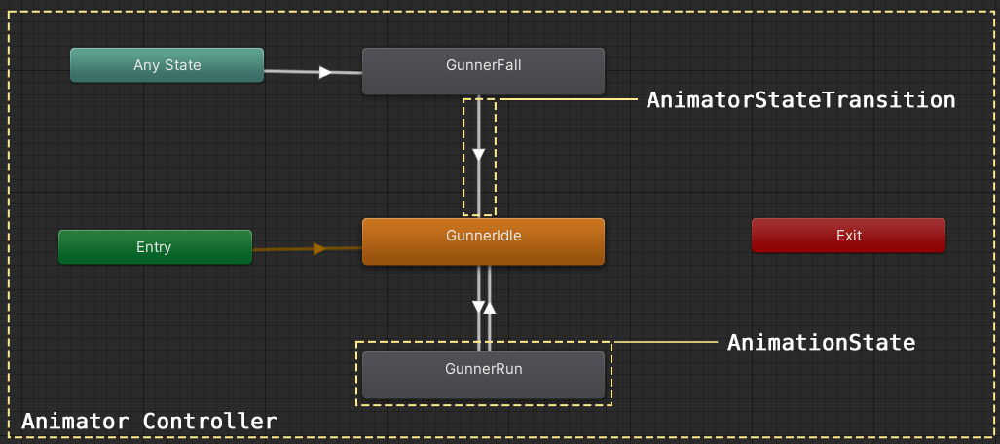
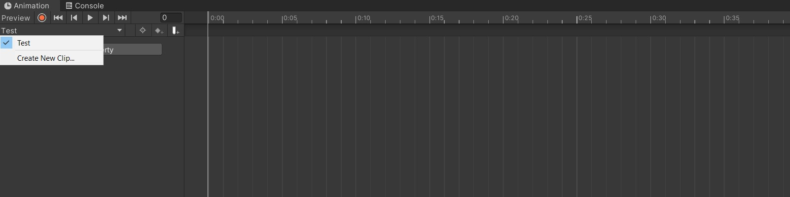
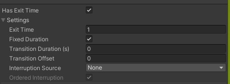
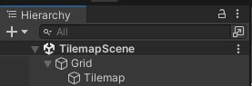
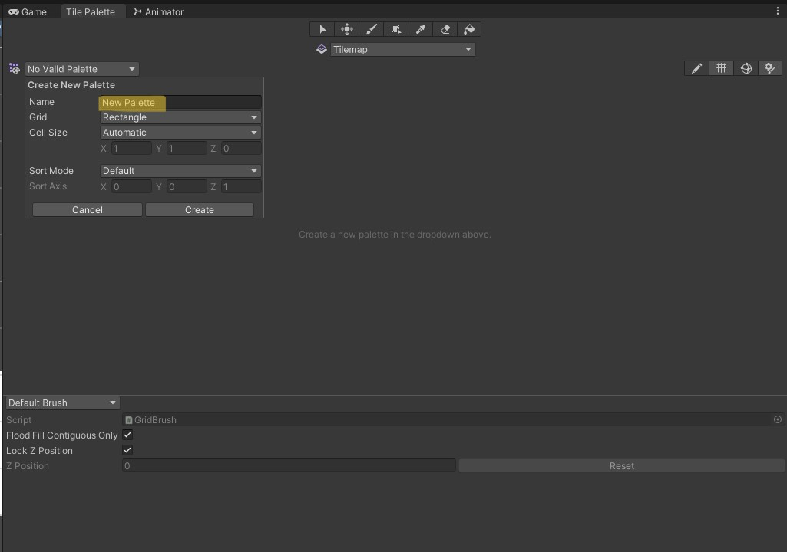
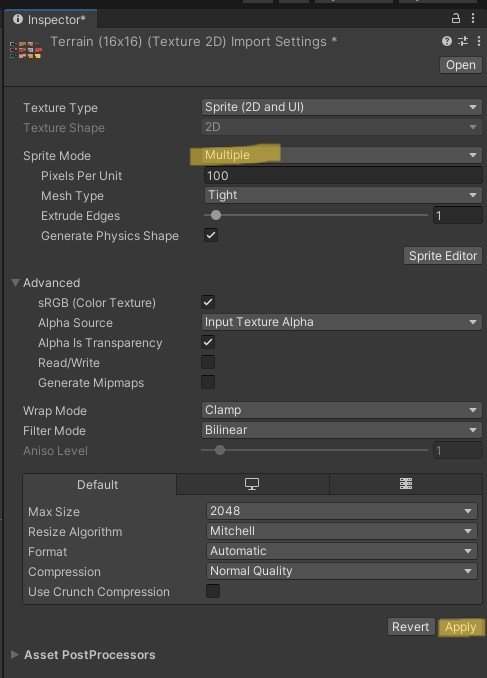
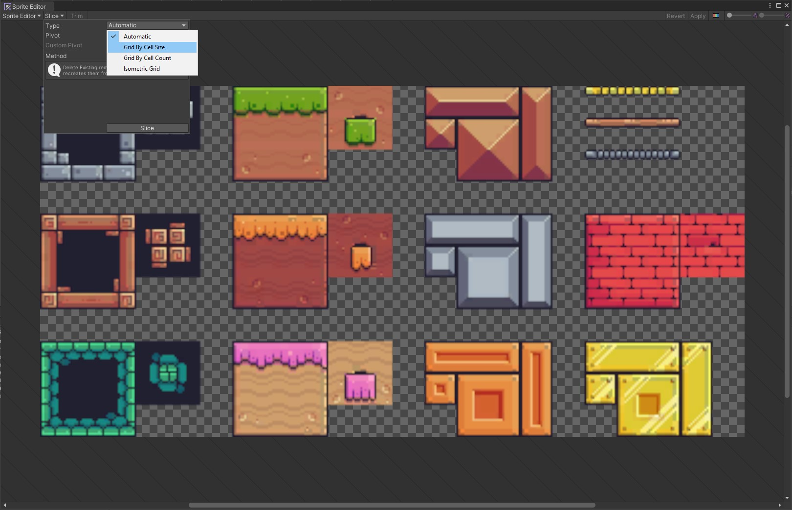
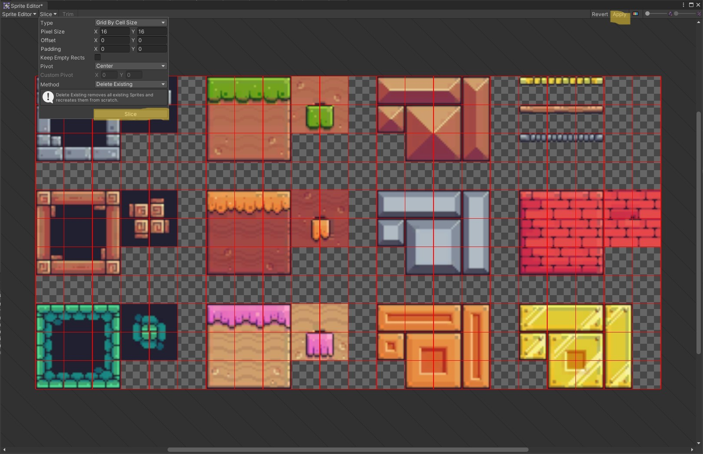

# Mémo composants/classes

Dans le but de vous aider à mieux retenir le rôle des différents composants que nous avons vu jusqu'à présent, voici un document qui résume leur rôle. A noter tout de même que ce document n'est pas exhaustif et vise à mettre en lumière les points clés de ces composants. Nous vous invitons toujours à vous aider de la documentation si vous avez besoin de plus d'informations et d'exemples.

### Table de matières

- [Mémo composants/classes](#mémo-composantsclasses)
    - [Table de matières](#table-de-matières)
- [GameObject](#gameobject)
  - [Tag](#tag)
  - [Layer](#layer)
- [Transform](#transform)
- [Rigidbody2D](#rigidbody2d)
- [Collider2D](#collider2d)
- [C# Script](#c-script)
- [Animator](#animator)
  - [Animator - Composant](#animator---composant)
  - [Animator Controller](#animator-controller)
    - [Points à retenir](#points-à-retenir)
  - [AnimatorState](#animatorstate)
  - [AnimatorStateTransition](#animatorstatetransition)
    - [Trigger ou booléen ?](#trigger-ou-booléen-)
- [Tilemap](#tilemap)
  - [Ajouter une Tile Palette](#ajouter-une-tile-palette)
  - [Créer des Tiles](#créer-des-tiles)
  - [Ajouter des collisions](#ajouter-des-collisions)
- [Canvas](#canvas)
- [Scène](#scène)
- [Prefab](#prefab)
- [Texte - TextMeshPro](#texte---textmeshpro)

# <a name="gameobject"></a>GameObject

Objet de base de tous les éléments dans une scène Unity, le GameObject est la classe que vous utiliserez le plus. De conteneur des sprites de votre joueur à l'affichage des points de vie. Le GameObject est indispensable.
Un GameObject est toujours embarqué avec le composant `Transform`, ce dernier gère la Position, la Rotation et l'Échelle d'un objet, pour éviter tout comportement inattendu, pensez toujours à réinitialiser (Reset) un Gameobject après avoir ajouté à votre scène, ça vous assure qu'il part de l'origine de votre scène ou de son parent.

En effet, il est possible d'imbriquer un GameObject dans un autre, un peu comme vous le feriez dans Photoshop avec le système de groupes (et sous-groupes). Ce système possède plusieurs rôles :

- Permettre à des GameObjects de se déplacer ensemble. Par exemple, un objet lié au joueur
- Servir de "dossiers" pour grouper plusieurs GameObjects et donc organiser votre scène. En effet, un GameObject peut contenir que le composant Transform

En plus de pouvoir changer son nom, il est possible de changer le tag ainsi que le calque (layer) d'un GameObject. Le changement de nom peut se faire depuis la fenêtre Inspector ou en double-cliquant sur le GameObject dans la fenêtre "Hierarchy".

## <a name="tag"></a>Tag

Un tag permet de récupérer un GameObject depuis n'importe quel Script. Par défaut, un GameObject n'a pas de tag, vous devez le définir via la fenêtre `Inspector`. Généralement on associera le tag "Player" aux joueurs et "Enemy" aux ennemis. Bien évidemment, vous pouvez en ajouter de nouveaux.

A noter qu'il est préférable de chercher un GameObject par tag que par son nom pour des questions de performances. De plus, toujours pour des questions de performances, il est préférable de cacher le résultat de cette opération.

Exemple :

```cs
// [...]
// Bonne pratique : Le résultat de FindWithTag() est caché dans une variable
public class ExampleClass : MonoBehaviour
{
    public GameObject target;
    public Vector3 destination;

    void Start()
    {
        target = GameObject.FindWithTag("MyTag");
        // [...]
    }

    void Update()
    {
        target.position = Vector3.Lerp(target.transform.position, destination, 0.5f * Time.deltaTime);
    }
}
// ---------------
// [...]
// Mauvaise pratique : Le résultat de FindWithTag() calculé régulièrement
public class ExampleClass : MonoBehaviour
{
    public GameObject target;
    public Vector3 destination;

    void Update()
    {
        target = GameObject.FindWithTag("MyTag");
        target.position = Vector3.Lerp(target.transform.position, destination, 0.5f * Time.deltaTime);
    }
}
```

Par ailleurs, vous comparerez souvent le tag d'un GameObject avec un tag attendu, là encore, pour des questions de performances, il faudra penser à utiliser la méthode `CompareTag()` plutôt qu'une égalité stricte `==`.

Exemple :

```cs
// Bonne pratique : on utilise la méthode CompareTag()
private void OnCollisionEnter2D(Collision2D other)
{
    if (other.gameObject.CompareTag("Player"))
    {
        // Code
    }
}

// Mauvaise pratique : on utilise l'égalité stricte
private void OnCollisionEnter2D(Collision2D other)
{
    if (other.gameObject.tag == "Player")
    {
        // Code
    }
}
```

> Notez bien que la méthode `CompareTag()` est sensible à la case, conséquemment "Player" et "player" sont deux termes différents pour la méthode. Faites attention.

Il existe également la méthode `Find()`, elle prend en paramètre une chaîne de caractères représentant le nom d'un GameObject dans la hierachie à partir de la racine. Si vous souhaitez récupérer un sous-élément, il faudra mettre le chemin complet, comme nous le ferions en HTML avec le chargement de ressources.

Comme la méthode `FindWithTag()`, `Find()` est très coûteuse en ressource, pensez à cacher les résultats pour les réutiliser plus tard.


## <a name="layer"></a>Layer

Les layers définissent les interactions entre les GameObjects de votre scène. Tout comme les tags, un GameObject ne peut avoir qu'un seul et un unique layer et est interchangeable aussi bien via le code ou le panneau `Inspector`. Et vous pouvez en ajouter de nouveaux dans la limite de 32 au maximum (2^32).

Les interactions peuvent être de plusieurs ordres. Par exemple, durant nos cours, nous avons défini ce qui est ou non grâce aux layers.

De plus, ils permettent de finir des "groupes" physique de GameObjects. Par exemple, si vous ne souhaitez pas que des ennemis ne puissent pas se gêner en se déplacement, il faudra les mettre dans le même layer puis indiquer à Unity qu'au sein de ce layer les éléments peuvent se traverser. Ceci se fait grâce à la matrice de collision qui se trouve dans le menu `Edit > Project Settings` puis onglet `Physics 2D` et onglet `Layer collision matrix`.


> Attention à ne pas confondre les onglets `Physics 2D` et `Physics`. Si les deux possèdent une matrice de collision, ils n'ont effet qu'en 2D et 3D respectivement (au niveau de leur Rigidbody).

Dans l'exemple ci-dessus, on peut voir que la case est décochée à l'intersection du layer "Enemies". Par conséquent, Unity ignorera les collisions entre tous les GameObjects de ce layer.

Ce mécanisme est très utile si vous souhaitez rendre invincible votre joueur durant quelques instants pour lui permettre de traverser certains layers.

Enfin sachez que les layers sont utilisés notamment avec les Raycasts pour définir avec quoi vous pouvez interagir.

# Transform

Composant par défaut de tout GameObject, **le composant `Transform` ne peut pas être retiré d'un GameObject**. Il représente les composantes : Position (position), Rotation (rotation) et Échelle (scale) d'un objet

> Pour éviter d'avoir de mauvaises surprises, pensez toujours à réinitialiser (Reset) un Gameobject après avoir ajouté à votre scène. Pour rappel, on fait ceci en cliquant sur les trois petits points situés à droite du nom d'un composant.
> 

La position d'un GameObject existe dans deux espaces un dit "global" (appelé "world" par Unity) et un autre "local". Les deux sont égaux lorsqu'un GameObject est à la racine de la hiérarchie d'une scène, ceci a son importance lorsqu'un GameObject est imbriqué. En effet, lorsque c'est le cas, Unity ne calcule plus la position du GameObject par rapport à l'origine de la scène mais par rapport à l'origine de son parent direct. Ainsi, c'est la position locale qui est affichée dans l'inspecteur.

De ce fait, il existe les propriétés `localPosition` et `position`, la première représant la position local et l'autre globale. Ce raisonnement reste le même pour la rotation et l'échelle d'un GameObject.

> Astuce : les composantes du composant acceptent des expressions numériques comme des opérateurs arithmétiques mais aussi d'aller beaucoup plus loin. Par exemple, si vous avez quatre `GameObject`, et que vous voulez les répartir sur l'axe X entre les valeurs -10 et 10, on peut utiliser une fonction d'interpolation linéaire, représentée par la fonction `L(min, max)`. Après avoir sélectionné vos `GameObject`, passez en paramètre la plage de valeurs `L(-10, 10)` et _voilà_.
>
> Il est également possible d'utiliser des fonctions plus complexes comme `cosinus` ou `sinus` et même placer de façon aléatoire les éléments grâce à la fonction `R(min, max)`
> [Accéder à la documentation de l'onglet Inspector - voir partie "Numeric field expressions"](https://docs.unity3d.com/Manual/EditingValueProperties.html)

# <a name="rigidbody-2D"></a>Rigidbody2D

Utilisable uniquement dans un environnement 2D, le composant Rigidbody2D soumet un GameObject au moteur physique d'Unity. Ainsi tout GameObject avec un Rigidbody2D sera donc attiré par la gravité. Ainsi, en absence de `Collider2D` un GameObject avec un Rigidbody2D fera une chute infinie. Avoir des notions de physique de base aide à mieux comprendre le comportement d'un Rigidbody2D.

Ce composant fonctionne souvent de pair avec un `Collider2D`, donc si vous mettez un `Rigidbody2D` n'oubliez pas le `Collider2D` sur le même composant. Sinon, ça ne sert plus ou moins à rien.

Unity propose trois types de comportements pour la physique d'un élément sous la propriété `bodyType` :

- Dynamic : Valeur par défaut. L'élément est soumis à la gravité et est affecté par les mouvements des autres. Ainsi deux GameObjects avec un Rigidbody2D Dynamic peuvent se pousser mutuellement si leur masse leur permet. Un Rigidbody2D Dynamic peut se déplacer
- Kinematic : N'est pas soumis à la gravité ni aux forces externes (impossibilité d'être poussé). On ne peut pas modifier les propriétés `velocity` ou `angularVelocity`, elles ne s'appliqueront pas. On utilise souvent un Rigidbody Kinematic pour réaliser des plateformes mouvantes ou tout simplement un ascenseur. Notez bien qu'un Rigidbody2D Kinematic ne peut pas interagir avec un Rigidbody2D Static ou Rigidbody2D Kinematic. Autrement dit, il les traversera en cas de contact
- Static : Dernière valeur possible : Static. Comme son nom l'indique, un Rigidbody2D Static a pour but de rester statique. Il n'a pas été pensé pour être déplacé. Si c'est le cas, il est préférable de changer son bodyType avant de revenir à la valeur Static

Dans certains cas, il se peut que votre `Rigidbody2D` Dynamic (avec un Collider2D) ait des saccades lors de déplacements. Ceci est lié à la valeur de la propriété "collisionDetectionMode" ("Collison Detection" dans l'inspecteur), par défaut, la valeur est "Discrete" pour des questions de performances. Mais il est préférable de changer la valeur en "Continuous" pour votre joueur.

> Rappel : toute opération concernant la physique doit être placée dans la méthode `FixedUpdate()` et seulement elle. `FixedUpdate()` est synchonisée avec la fréquence du moteur physique qui est **fixe** et toujours appelée au même moment (environ 50 fois par seconde). Faire ceci vous assure de ne pas avoir des comportements étranges concernant la collision. Notez tout de même que si la force appliquée n'est pas continue (par exemple un saut), il est possible d'utiliser la méthode `Update()`.

En bref, on appliquera un `Rigidbody2D` à un GameObject lorsqu'on souhaite qu'un objet soit soumis à la physique.

Pour terminer, abordons les propriétés `gravityScale` et `mass` de la classe `Rigidbody2D`. La propriété `mass` représente la masse d'un GameObject, n'a aucune incidence sur son attraction par la gravité. La seule incidence qu'il porte est sur sa capacité à être déplacé par une force.

La propriété `gravityScale` définit à quel point un objet sera attiré par la gravité. **Plus cette valeur est élevée, plus le GameObject atterrira rapidement.** Par exemple, si vous souhaitez faire un jeu de tir avec la caméra au-dessus (top-down shooter), il faudra mettre la valeur 0 pour la propriété `gravityScale`, ainsi votre GameObject ne tombera jamais.

> N'utilisez pas la méthode `.Transform()` pour déplacer vos GameObjects, si cela peut être tentant, ceci vous expose à la mauvaise détection des collisions entre éléments. Et par conséquent, entraîner des comportements étranges. Par exemple, traverser les murs. Vous avez la méthode `MovePosition()` de la classe Rigidbody2D qui vous permet de faire la même chose mais de façon appropriée.

# <a name="collider-2D"></a>Collider2D

Composant souvent lié à un Rigidbody2D, Unity propose plusieurs types de `Collider2D`, la différence se trouve au niveau de leur forme. Ainsi un `Collider2D` peut être un carré, un cercle ou même un polygone. Cependant leur fonctionnement reste le même : permettre à un objet 2D d'exister auprès d'autres GameObject.

Un `Collider2D` peut être un solide ou non, le cas échéant, on dira que c'est un "trigger". De fait, un autre GameObject peut rentrer dedans.

> Point important : un `Collider2D` ne peut pas interagir avec un autre GameObject qui ne possède pas de Rigidbody2D. Par exemple, si vous souhaitez que votre joueur puisse ramasser des pièces. Il faut mettre un `Collider2D` sur votre pièce, et un `Collider2D` **et** un Rigidbody2D.

Trigger ou non, un `Collider2D` possède trois états :

- Enter : Un GameObject vient de rentrer ou on lui entre dedans
- Exit : Un GameObject sort ou quelque chose en est sorti
- Stay : Un GameObject reste en contact avec un autre ou est dans quelque chose

Dépendamment de votre choix (trigger ou non), ce ne sont pas les mêmes évènements qui seront appelés. Si c'est un trigger, ce sont les méthodes de la famille `OnTriggerEnter2D`, `OnTriggerExit2D` et `OnTriggerStay2D` qu'il faudra utiliser. Si ce n'est pas un trigger, il faudra utiliser les méthodes `OnCollisionEnter2D`, `OnCollisionExit2D` et `OnCollisionStay2D`.

# <a name="c-sharp"></a>C# Script

Composant écrit par vos soins, un `C# Script` est un composant vierge, par défaut. Pour des questions d'organisation, il est préférable de mettre vos scripts dans un dossier "Scripts/" lui-même dans le dossier "Assets/".

> Le même composant peut être utilisé sur plusieurs GameObject, on évitera donc d'avoir des propriétés en dur dans un composant.

Le même `C# Script` peut être appliqué sur n'importe quel GameObject. En interne, Unity crée une instance de ce `C# Script` comme nous le ferions avec un autre langage de programmation.

Par défaut, un `C# Script` hérite de la classe `MonoBehaviour`, c'est ce qui nous permet notamment de faire appel aux méthodes `Start()`, `Update()` ou encore `OnCollisionExit2D()`.

> Seul un `C# Script` héritant de `MonoBehaviour` peut être ajouté à un GameObject. Mais il est possible qu'un `C# Script - MonoBehaviour` fasse appel à des classes non `MonoBehaviour`.

Pour plus d'informations sur le `C#`, veuillez vous référer au document d'introduction sur Unity.

- [Accéder au document](./README.md)

#  <a name="animator"></a>Animator

Chef d'orchestre de vos `AnimationStates`, le composant `Animator` permet de définir les relations entre les différentes `AnimationStates` grâce à des transitions appelées `AnimatorStateTransition`.



> La fenêtre `Animator` s'ouvre via le menu `Window > Animation > Animator`

La gestion des animations peut être définies en quatre grandes parties :

- Animator : Asset qui contient `(Animator)Controller`, `AnimatorState` et `AnimatorStateTransition`
- AnimatorState : Contient un état, c'est là qu'on définira le clip d'animation à jouer ou encore sa vitesse.
  - Note : Par défaut, une animation se joue en boucle. Pour supprimer ce comportement, il faut désactiver l'option "Loop Time" après avoir sélectionné l'`AnimationClip` **depuis l'onglet "Project"**
- AnimatorStateTransition : Définit les conditions de passage d'une transition à une autre

> Évitez de mettre des animations gérées par le composant `Animator` dans un Canvas, ceci est très mauvais au niveau des performances. Les alternatives sont les suivantes :
>
> - Ne pas en mettre
> - Faire des animations en C# ou utiliser un package comme [LeanTween (gratuit)](https://assetstore.unity.com/packages/tools/animation/leantween-3595) qui permet de faire des animations en C# via des méthodes clé en main
> - **Mettre des animations dans des Canvas distincts.** Si dans votre UI, vous avez un texte qui ne change pas **et** une image qui bouge, faites un Canvas avec le texte et un autre avec l'image le tout contenu dans un autre Canvas

**Si l'élément est animé en permanence, vous pouvez utiliser le composant `Animator` dans un Canvas, c'est le seul cas.**

## Animator - Composant

Composant lié à un GameObject, il lui assigne un ensemble d'animations. Pour fonctionner, il doit impérativement avoir un `Controller`, vous pouvez en créer un depuis l'onglet `Project` : `Clic droit > Create > Animator Controller` ou bien, après avoir sélectionné un GameObject, cliquez sur le bouton Create de l'onglet `Animation` (`Window > Animation > Animation`). L'avantage de cette dernière méthode, c'est quelle va automatiquement assigner le `Controller` au GameObject sélectionné.

Toujours pour des questions d'organisation, il est préférable de créer un dossier "Animations/" où vous rangerez vos animations, il est même conseillé de créer des sous-dossiers pour mieux se repérer.

Dans l'onglet Inspector, le composant possède les propriétés suivantes :

- Controller
- Avatar : inutile avec les sprites
- Apply Root Motion : Si activé, la position et la rotation du GameObject sont gérés depuis les `AnimationStates` et non le code. Autrement dit, le GameObject ne peut plus être déplacé ou pivoté depuis le code
- Update Mode :
  - Normal : les animations sont gérées par l'échelle du temps. Si le jeu est mis en pause (`Time.timeScale = 0;`) alors les animations s'arrêtent également
  - Animate Physics : L'animation n'est plus synchronisée avec la méthode `Update()` mais la méthode `FixedUpdate()`
  - Unscaled Time : les animations ne sont pas gérées par l'échelle du temps. La mise en pause du jeu n'arrête pas les animations
- Culling Mode :
  - Always Animate : L'animation se joue tout le temps, et ce, même quand le GameObject n'est pas visible
  - Cull Update Transforms : L'animation se met en pause lorsque le GameObject n'est plus visible mais reprend où elle s'est arrêtée lorsqu'il redevient visible
  - Cull Completely : L'animation s'arrête quand le GameObject n'est pas visible et recommence au début lorsqu'il redevient visible

Changer la valeur de la propriété Culling Mode permet de gagner en performance, essayez d'y penser si vous avez des ralentissements dans votre jeu. L'équivalent dans un script C# du culling serait les méthodes `MonoBehaviour.OnBecameVisible()` et `MonoBehaviour.OnBecameInvisible()`.

**Notez bien que la caméra de l'onglet "Scene" compte également pour le cull(ing).**

Le composant `Animator` est contrôlable depuis un script C#. Par exemple, grâce à une Coroutine, vous pouvez bloquer le code jusqu'à la fin de l'animation courante avec le code suivant :

```cs
IEnumerator MyCoroutine()
{
    // [...]
    yield return null; // Important : S'assure qu'on va récupérer l'animation actuelle et non la précédente
    yield return new WaitForSeconds(animator.GetCurrentAnimatorStateInfo(0).length);
    // [...]
}
```

## <a name="animation-controller"></a>Animator Controller
L'`Animator Controller` contrôle l'enchaînement des animations. Par défaut, il possède quatre blocs :
- Entry : Point d'entrée de votre `Animator Controller`, elle va lancer la première animation
- Default AnimatorState (en orange) : C'est l'animation qui va être jouée juste après que votre GameObject est instancié
    - Il est obligatoire
- Any State : AnimatorState permettant de transitionner à tout moment vers un autre `AnimatorState`. Any state est à réserver pour les animations ayant une priorité maximale : Mort, dégâts, étourdissement ou encore recul
- Exit : AnimatorState réinitialisant votre `Animator Controller` permet de revenir au point d'entrée

### Points à retenir
- Vous pouvez pas créer d'`AnimatorStateTransition` vers "Entry" et "Any State"
- Si vous souhaitez changer d'`AnimatorState` par défaut, faites un `clic droit (sur le AnimatorState voulu) > Set As Layer Default State`
- Lorsque vous faites un `AnimatorStateTransition` depuis "Any State" assurez-vous que "Has exit time" est coché, sinon vous aurez un comportement étrange

## AnimatorState
Bloc représentant un état de l'`Animator Controller`, une animation à jouer lorsque les conditions sont remplies. Quand vous sélectionnez un `AnimatorState`, vous pouvez définir l'`AnimationClip` ou `BlendTree` qui va être joué. En plus de ça, il vous pouvez en définir la vitesse. La propriété `speed` est notamment utile pour jouer une animation à l'envers, la propriété est une valeur normalisée, la valeur 1.0 est la valeur de base. Et plus elle s'approche de 0, plus l'animation sera jouée lentement. Si la valeur est négative l'animation sera jouée à l'envers.

Pour créer une animation, il faut sélectionner un GameObject et dans l'onglet `Animation`, cliquer sur l'animation puis "Create New Clip..."


> Conseil : pensez toujours à préfixer le nom d'une animation par le nom du GameObject, par exemple, "WarriorIdle". Ceci vous permettra de retrouver plus facilement une animation.

Par défaut, un `AnimationClip` se joue en boucle, pour ne plus avoir ce comportement, il faut la sélectionner depuis l'onglet "Project" et décocher la case "Loop Time".

Une animation peut affecter quasiment toutes les propriétés des composants d'un GameObject ainsi que celles de ses GameObjects imbriqués. Cependant toutes les propriétés ne peuvent pas être interpolées. **Par ailleurs, une fois qu'une propriété est contrôlée par un `AnimationClip`, elle ne peut plus être modifiée dans le code.**

## AnimatorStateTransition

Une transition définit les conditions pour lesquelles l'Animator va jouer une animation ou une autre. Ces conditions peuvent être de plusieurs types :

- Entier
- Float
- Booléen
- Trigger

### Trigger ou booléen ?

> Pour savoir si votre transition doit être de type "trigger" ou "booléen", il faut vous poser la question suivante : Est-ce que mon action peut être arrêtée par la volonté du joueur ? Si la réponse est oui alors utilisez un booléen.
>
> A noter également qu'une animation type trigger doit **toujours** être déclenchée par un évènement et non par la méthode `Update()`.

Après avoir crée votre transition : clic droit depuis un `AnimationState` vers un autre. Cliquez sur `AnimationStateTransition` (représenté par une flèche) pour la voir en détails.

> N'oubliez pas qu'une transition n'est pas bi-directionnelle pas défaut, il faut l'établir dans le sens inverse pour qu'elle le soit.

Dans l'onglet "Inspector" qui s'est ouvert, vous pouvez afficher le comportement de votre transition (liste non-exhautive) :

- Has Exit Time : Indique si oui ou non, une animation doit atteindre un certain niveau de complétion avant de passer à la transition suivante
  - Ne pas cocher la case permet de passer d'un `AnimationState` à l'autre à tout moment
- Exit Time (**utilisable que si et seulement si "Has Exit Time" est coché**) : Valeur normalisée représentant l'instant à partir duquel la transition peut avoir lieu. Si vous mettez la valeur 0.25, par exemple, à partir de la première image située à 25% de l'animation, l'animator peut effectuer la transition si la condition est réunie
- Fixed Duration : Si cochée, la valeur de "Transition Duration" sera mesurée en secondes et non une valeur normalisée
- Transition duration : Représente la durée de transition entre l'`AnimationState` actuel et le suivant
    - Par exemple, si vous mettez la valeur 0.2. Ceci signifie que l'`Animator` va jouer 80% de l'animation courante et les 20% restants vont jouer les deux animations permettant ainsi une transition fluide.
    > Attention : Dans le cas de sprites, la transition duration ne donne pas forcément les meilleurs résultats. C'est à vous de tester.
- Conditions : Endroit où vous allez définir les conditions pour passer d'un `AnimationState` à l'autre. Les conditions sont cumulatives, ceci équivaut à un "&&" en programmation. Dépendamment du type de paramètre pour votre condition, Unity n'affichera pas les mêmes champs. Si la transition entre deux `AnimationStates` peut être multiple, il faut créer un autre `AnimationStateTransition`. Notez les points suivants :
  - En absence conditions, Unity se basera sur le paramètre "Exit Time" pour passer à la condition suivante. Exit Time devant être activé, sinon Unity lèvera une alerte
  - Les conditions doivent être remplies **avant** que la transition soit possible
  - Les paramètres de conditions sont sensibles à la casse, ainsi écrire "jump" n'a pas la même signification que "Jump"
- Can Transition To Self (uniquement avec Any State) : Indique à Unity si l'animation ne doit être jouée qu'une seule fois. Si la case n'est pas décochée, il est possible que votre animation se bloque lorsque les conditions sont remplies
---
- [Accéder à la documetation `AnimationStateTransition`](https://docs.unity3d.com/Manual/class-Transition.html)

# <a name="tilemap"></a>Tilemap
- [Voir documentation des Tilemaps](https://learn.unity.com/tutorial/introduction-to-tilemaps)

Le principe d'un tilemap est très simple mais extrêmement puissant, il consiste à générer une grille et y placer des composants dessus en tout genre : tuiles (animées ou non), composants, plateformes et bien d'autres.

Si vous avez crée un projet 2D le package "2D Tilemap Editor" devrait être déjà installé. Si ce n'est pas le cas, vous pouvez aller dans le menu `Window > Package Manager` et chercher "2D Tilemap Editor".

Une fois installé, pour créer votre Tilemap, rien de plus simple : `Clic droit dans la fenêtre "Hierarchy" > 2D Object > Tilemap > Rectangular`. Si tout s'est bien passé, Unity a dû créer deux GameObject : "Grid" et "Tilemap"


> Si vous souhaitez ajouter un nouveau Tilemap, il vous suffit de faire un clic droit sur le GameObject "Grid" et d'ajouter un nouveau Tilemap avec les mêmes étapes que listées plus haut. L'ordre des Tilemap a son importance quand vous les peindrez. Pensez également à nommer vos Tilemaps avec un nom explicite, plus simple pour vous y retrouver.

Sauf cas spéciaux, les valeurs par défaut des composants Grid, Tilemap et Tilemap Renderer sont amplement suffisantes pour nos besoins

## Ajouter une Tile Palette
Une Tile Palette fonctionne comme la palette d'un peindre, la fenêtre est accessible depuis `Window > 2D > Tile Palette`

||
|:--:|
| Notre palette est vide, remplissons-la. Pensez bien à la nommer de façon explicite |

Après avoir cliqué sur "Create New Palette", sélectionnez le dossier qui va recevoir votre palette. Pour des questions d'organisations, il est préférable de créer un dossier "TilePalettes" à la racine du dossier "Assets".

## Créer des Tiles
Une tile (ou tuile en français) est le fragment d'une sprite. Généralement un sprite va contenir plusieurs images de forme carrée qui vont être découpées en tuile et chacune de ces tuiles pourra être placée comme bon vous semble sur votre composant Tilemap pour ainsi donner vie à votre jeu. Pour des questions de simplicité, il est préférable de connaître la taille de vos tuiles en avance pour réaliser le découpage.

Une fois l'image importée, il faut prévenir Unity que cette image est découpée grâce à son outil de slice. Pour ce faire :
- Sélectionnez l'image dans la fenêtre "Project"
- Dans la fenêtre "Inspector" changez Single -> Multiple pour l'option "Sprite Mode"
- Validez votre choix en cliquant sur "Apply"

  

- Cliquez sur le bouton "Sprite Editor". Ceci va ouvrir une nouvelle fenêtre
- Cliquez sur "Slice" :
  - Si vous connaissez la taille des tuiles : Choississez "Grid by Cell Size"
  - Si vous connaissez le nombre de tuiles par colonne et ligne : Choississez "Grid by Cell Count"

  
  > Quelque soit l'option choisie, Unity affiche des repères pour voir où vous découpez. Si les repères ne tombent pas correctement, il faut que vous revoyez les valeurs.
- Une fois les paramètres entrés, cliquez sur le bouton "Slice" puis le bouton "Apply" (à droite). Et fermez la fenêtre.
  

Dans la fenêtre "Project", le nom de l'image est maintenant précédé d'un triangle qui indique un groupement, vous pouvez cliquer dessus pour voir le contenu qui n'est autre que ces images découpées.

Pour remplir notre TilePalette crée, il suffit juste de glisser-déposer le conteneur de nos tuiles (l'image précédée d'un triangle) dans la fenêtre de votre palette. Ceci va ouvrir une nouvelle fenêtre qui vous demande où vous souhaitez créer vos tuiles. Encore une fois pour mieux vous organiser, créez un dossier (nommé Tiles, par exemple) pour contenir vos Tiles.

Une fois validé, vos images s'afficheront dans la palette et vous pourrez l'appliquer sur vos Tilemap grâce aux différents outils de la fenêtre "Tile Palette".

- [Détails des outils de la fenêtre Tile Palette - anglais](https://learn.unity.com/tutorial/introduction-to-tilemaps#5f35935dedbc2a0894536d00)
  - Les touches `)` et `^` permettent de faire pivoter une tuile. En combinant avec la touche `Maj`, vous pourrez refléter sur l'axe horizontal et vertical

> Note : Assurez-vous de sélectionner le bon Tilemap avant de peindre dessus.

## Ajouter des collisions

La gestion des collisions pour un tilemap nécessite les trois composants suivants avec les paramètres associés :
- Tilemap Collider 2D
  - Cocher "Used By Composite"
- Composite Collider 2D
- Rigidbody 2D (crée automatiquement après avoir ajouté le composant `Composite Collider 2D`)
  - bodyType : Static

L'utilisation des composants vous assure d'avoir un grand Collider qui regroupera toutes vos tiles, évitant ainsi aux Colliders qui se déplaceront sur vos Tiles de se bloquer entre deux Tiles. On n'oubliera pas d'appliquer un Layer à notre Tilemap.

> Il est également possible d'appliquer le composant `Platform Effector 2D` sur un Tilemap. Permettant ainsi de traverser les Tiles en fonction de votre position.


# <a name="canvas"></a>Canvas

Le Canvas est un type spécial de GameObject, il permet de contenir des interfaces de jeux (menus, ATH, etc.).

> Par son fonctionnement, Unity créera automatiquement un Canvas si vous créez un élément graphique tel qu'un texte ou un bouton.

Un Canvas peut s'afficher plusieurs façons, propriété "Render Mode" :
- Screen Space - Overlay : Affichage par défaut. Les éléments d'UI s'affichent en permanence. Ex : barre de vie ou menu
  > Ce mode permet l'activation ou non de l'option "Pixel perfect". Activée, elle rend les éléments d'UI moins flous et plus nets. Cependant, on évitera de l'activer si votre Canvas contient une liste déroulante (composant `Scroll Rect`) pour éviter de trop nuire aux performances. Idem si votre Canvas contient des éléments qui sont animés.
- Screen Space - Camera : Influencé par la position de la caméra. Si l'élément n'est plus dans le champ de la caméra, il n'est plus visible. Ex : barre de vie au-dessus d'un ennemi
- World Space : Le Canvas fait partie du jeu. Dans ce mode l'UI peut d'afficher devant ou derrière d'autres GameObject dans l'espace 3D. Le mode est également appelé "diegétique interface"

> Attention : Le composant Canvas est très gourmand en ressources, il est préférable de ne pas utiliser le composant Animator dans un Canvas. Si vous souhaitez animer un élément dans un Canvas préférez l'utilisation de code. Il existe le plugin freemium [DoTween](https://assetstore.unity.com/packages/tools/animation/dotween-hotween-v2-27676) qui permet les animations plus aisées en code.

Pour des questions de performances du GPU, on appliquera les optimisations suivantes :
- Ayez un Canvas par rôle, car même si vous cachez les éléments dont vous n'avez pas besoin, ils sont quand même calculés par Unity. Le mieux est de désactiver le Canvas
  > Il est possible d'avoir un Canvas dans un autre Canvas
- Désactivez la propriété "Raycast Target" si votre image n'est pas interactive
- Ajouter le composant `Rect Mask 2D` sur le Canvas pour appliquer un UI Culling dessus, autrement dit, cacher tout élément d'UI qui n'est pas dans le champ de vision de la caméra
- Si un élément est animé, il est préférable qu'il soit dans un Canvas dans un dédié aux GameObject animés


# <a name="scene"></a>Scène
- [Voir documentation des scènes](https://docs.unity3d.com/Manual/CreatingScenes.html)

Composant indispensable une scène représente un écran de jeu. Un écran de jeu peut être un niveau ou encore votre menu principal. L'idée des scènes est de découper votre jeu pour le charger progressivement. Si votre scène a trop de contenus, donc trop lourde, elle risque de prendre du temps à être chargée ou pire faire crasher votre jeu si vous essayez de mettre trop de choses dans la mémoire vidéo (GPU RAM). Il est possible de faire un jeu avec une seule scène et charger / décharger les GameObject à la demande, ça fonctionne mais c'est assez fastidieux et nécessite une certaine organisation.

> Tout projet Unity possède une scène par défaut nommée "SampleScene". Un projet Unity ne pouvant pas fonctionner sans scène. Il est préférable de nommer ses scènes avec un nom explicite dans un dossier "Scenes".

Le plus simple est de séparer de façon logique votre jeu en scènes. Exemple :
- Menu principal -> Scène
- Niveau 1 -> Autre scène
- Niveau ... -> Autre scène
- Crédits -> Scène

> N'oubliez pas que grâce aux ScriptableObject, il est possible de faire passer des informations d'une scène à l'autre. [En savoir plus](./SCRIPTABLE-OBJECTS.md).

Il n'y a pas vraiment de limite définie de GameObject dans une scène. Il faut expérimenter. A noter qu'une scène n'est pas ajoutée à votre jeu automatiquement, car elle peut servir pour expérimenter, il faut l'ajouter manuellement. [Vous en saurez plus dans le document sur les BUILD](./BUILD.md).

# <a name="prefab"></a>Prefab
- [Voir documentation des Prefabs](https://docs.unity3d.com/Manual/Prefabs.html)

Une Prefab est un type spécial de composant, c'est un GameObject qui a été sauvegardé dans le but d'être réutilisé à l'envie. Un exemple très simple ça serait un ennemi, une fois défini (Scripts, Sprites...), on aimerait en avoir plusieurs dans nos scènes. Au lieu de copier cet ennemi et s'exposer à de multiples modifications si on doit changer certaines parties de notre ennemi, on en fait une Prefab.

Avec une Prefab, le GameObject est "centralisé" et toute modification sur le GameObject original est répercutée sur ses copies. Il est tout de même possible de surcharger les propriétés d'un GameObject (sauf supprimer un composant).

> Pour transformer un GameObject en Prefab, il suffit juste de glisser-déposer un GameObject depuis l'onglet "Hierarchy" vers l'onglet "Project". Encore une fois, on préfèrera mettre les Prefabs dans un dossier dédié.

Il est possible d'imbriquer des Prefabs dans d'autres Prefabs. Pour modifier le Prefab original, il suffit d'effectuer un double clic dessus aussi bien dans l'onglet "Hierarchy" que "Project". D'ailleurs, il est toujours préférable de réinitialiser la position d'une Prefab en 0, 0, 0.

# <a name="texte"></a>Texte - TextMeshPro

Composant associé au Canvas (le composant Texte ne peut pas exister hors d'un Canvas), il permet d'afficher du texte. Toutefois, on évitera à tout prix d'utiliser le composant Text proposé par Unity, d'ailleurs, il est catégorisé en "Legacy" (héritage). A la place on utilisera TextMeshPro (ou TMP), il propose un meilleur contrôle de l'apparence du texte comparé au composant Text. Il est notamment possible d'utiliser une syntaxe proche du HTML pour personnaliser le texte.
- [Voir liste non exhaustive des balises TextMeshPro](https://docs.unity3d.com/Packages/com.unity.textmeshpro@4.0/manual/RichText.html)
- [Bases de TMP - anglais - env 15 min](https://www.youtube.com/watch?v=gVialGm65Yw)
  - Vous avez également [ce mémo réalisé par la même chaîne](./TMP-Cheat-Sheet-V2-Christina-Creates-Games.pdf)
