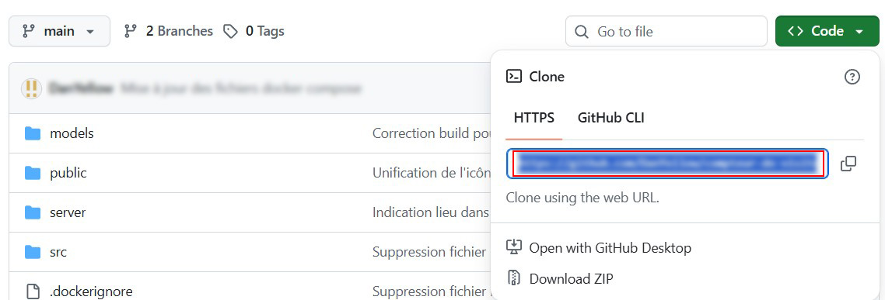

# Mémo Git

Comme indiqué au début du cours, vous serez noté(e) sur votre utilisation de Git. Ainsi vous devez commiter régulièrement votre avancée durant le cours. Si dans un cours de deux heures, vous n'avez commité qu'une seule fois, ce n'est pas très bon. Pour rappel, un commit permet d'archiver du code à un instant T. De ce fait, s'il y a un problème avec le code, vous pouvez facilement revenir en arrière vous évitant donc des ctrl + z hasardeux.

Dans le cadre du cours, vous serez amené à changer d'ordinateur, conséquemment à récupérer votre projet à chaque début de cours. **Il ne faut absolument pas télécharger le zip de votre dépôt,** s'il contient bien la dernière version de votre code, vous n'aurez pas l'historique de git. Et vous ne pourrez pas commiter sans faire des commandes supplémentaires qui nuire à l'historique actuel du projet.

Vous devez **cloner** le projet à la place, comme expliqué ci-dessous :

1. Récupérer l'url du dépôt sur GitHub :


2. Entrer la commande suivante dans la terminal :
```sh
git clone _url-recupérée-à-l-etape-1_
```
> **Note :** Le projet sera cloné à l'endroit où vous entrerez la commande dans un dossier. Si vous souhaitez ne cloner **que** le contenu du dépôt (sans créer de dossier racine), il faudra utiliser un point à la fin de la commande comme suit : `git clone _url-recupérée-à-l-etape-1_ .`

_Et voilà_, le projet est maintenant sur votre ordinateur et possède son historique git.

**Pensez bien à commiter régulièrement.**

Pour le reste des commandes : `git commit`, `git push`..., vous avez un mémo pour ça :
- [Accéder au mémo sur les commandes de base de git](https://github.com/DanYellow/cours/blob/main/s2-integration-web/sae-203/LISEZ-MOI-GIT.md)
