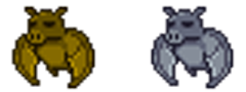

# ScriptableObjects (abréviation SO)

Un ScriptableObject est un conteneur de données suivant un gabarit que vous aurez défini. Ces gabarits peuvent contenir un ou plusieurs propriétés de plusieurs types :
- Primitives : entier (int), chaînes de caractères (string)...
- Complexes : GameObject, Transform, Vector2, tableau (array/list...), Sprite...

Ils sont souvent utilisés lorsque vous avez plusieurs Gameobject qui utilisent la même structure de données. Par exemple, les éléments d'un inventaire dans un jeu vidéo se prêtent bien pour être des ScriptableObjects.

L'un des grands avantages des ScriptableObjects est leur limitation en terme d'empreinte dans la mémoire. En effet, ils limitent la copie de valeurs là où un objet MonoBehaviour aurait copié toutes les données autant de fois qu'il aurait été utilisé.

Par exemple, admettons que nous souhaitons faire un jeu vidéo avec des ennemis ayant les propriétés suivantes :


| **name**        | Chauve-souris basique | Chauve-souris prime |
|-----------------|---------:|------------|
| **health**        | 6500     | 7800       |
| **damage**      | 80       | 120        |
| **description** | [...]      | [...]        |
| **color** | yellow      | white        |
| **speed** | 21      | 42        |
| **...** | ...      | ...        |

Si nos deux ennemis possèdent les mêmes comportements, animations ou encore sprites et n'ont que pour différence leurs statistiques, il n'est pas utile de créer plusieurs prefabs pour chacun d'eux. Un seule suffit et nous chargerons les bonnes données pour le bon ennemi.

Plus haut, il a été abordé le fait que les Scriptable Objects nous permettent de réduire la consommation de mémoire (RAM). Par exemple, si les champs listés sont stockés sur chaque GameObject et que nous avons 1 000 ennemis dans notre scène, ceci nous donne au total 5 000 éléments stockés en mémoire (1 000 ennemis x 5 propriétés de classe). Alors qu'avec l'utilisation d'un ScriptableObject, on diminue drasiquement le nombre d'objet stockés en mémoire car nos 1 000 ennemis vont chercher les mêmes informations qui n'existent qu'une seule fois. Ainsi, on passe de 5 000 à 1 005 (1 000 + 5).

Au-delà de la diminution de l'usage de la mémoire, les ScriptableObjects possèdent les avantages suivants :
- **Ils existent dans les Assets.** Pas de réinitialisation de valeur si on les modifie (dans le jeu ou l'éditeur) et qu'on arrête le mode "Play". Ainsi, il est possible de passer des informations d'une scène à l'autre
    - **Néanmoins les ScriptableObjects ne sont pas un moyen de sauvegarder les données du joueur dans un vrai build**
- **Limitent le couplage entre les GameObjects.** On veut le plus possible limiter le couplage dans le code (pas que dans Unity), ça nous permet d'utiliser un GameObject seul sans en importer d'autres dont on n'en aurait pas besoin dans une autre scène
    - Un exemple souvent utilisé est celui des points de vie du joueur. En utilisant un ScriptableObject pour gérer les points de vie du joueur, des GameObjects peuvent lire la valeur pour s'adapter en fonction : ennemis plus aggressifs, mouvement du joueur plus lents / plus rapides... sans pour autant interconnecter tous ces GameObjects
    > En somme, les ScriptableObjects permettent d'appliquer le Modèle Vue Controller (MVC) dans Unity. Le Modèle étant le ScriptableObject, la Vue vos scènes et le Contrôleur le script C# MonoBehaviour
    - [En savoir plus sur le couplage](https://fr.wikipedia.org/wiki/Couplage_(informatique))
- **Utilisables par des non-développeurs.** Dans certains studios de jeu vidéo, ce sont les game designers qui s'occupent de les créer. Les développeurs les utilisant ensuite dans leur code et bien évidemment ils développent la structure des données
- **Existent au-delà de la scène.** Un ScriptableObject est très utile pour faire passer les informations d'une scène à l'autre de façon propre. Par exemple, les points de vie du joueur
- **Centralisent les données.** Vu que plusieurs GameObject lisent le même ScriptableObject, il suffit de l'éditer pour appliquer les modifications partout dans votre projet

> **Pourquoi pas un Singleton ?**
>
> Petit apparté avant de continuer sur les ScriptableObjects, à la lecture de leur description, on pourrait penser qu'un ScriptableObject n'est qu'un Singleton stylisé, non ? Les deux permettent de partager des données entre divers classes, oui. Les deux sont uniques au sein d'un projet, oui. Mais les comparaisons s'arrêtent ici. Avec Unity, un Singleton doit impérativement hériter de `Monobehavior` ce qui pose un problème de couplage entre nos GameObjects. Et c'est avant-tout ce problème que nous essayons de résoudre.
>
> Pour rappel (dans les grandes lignes), un Singleton est une classe qui ne peut être instanciée qu'une seule fois par projet et dans le cas d'Unity qu'une seule fois par Scène.

Voici un exemple de ScriptableObject

```cs
using UnityEngine;

public class EnemyDataSO : ScriptableObject
{

}
```
Dans le code ci-dessus, la grande différence avec les classes que nous avons faites jusqu'à présent c'est qu'elle hérite de `ScriptableObject`. Pour le reste, ça fonctionne plus ou moins comme avant, on définit des propriétés publiques ou privées ainsi que des méthodes, elles aussi à niveau de visibilité variable (private / public). Notez tout de même que les méthodes `Update()` ou `Awake()` ne sont pas utilisables avec un ScriptableObject néanmoins vous pouvez utiliser la méthode `Start()` ou encore référencer un ScriptableObject dans un autre ScriptableObject.

Sinon, si on reprend le cas de nos bateaux en ScriptableObject, nous voulons avoir les informations suivantes pour chaque bateau :
- damage (int) - dégâts
- cost (int) - prix
- name (string) - nom
- description (string) - description
- sprite (Sprite) - Image

```cs
using UnityEngine;

public class EnemyDataSO : ScriptableObject
{
    public int health;

    // L'attribut [Range(Min, Max)] permet d'avoir, à la place d'un champ, un slider permettant de faire varier une valeur entre les deux bornes précisées incluses. Ceci équivaut en HTML à "<input type="range" min="0" max="1500" />"
    // A noter que cet attribut fonctionne également avec les float
    [Range(0, 500)]
    public int damage;
    public Color color;

    // L'attribut [Multiline] permet d'afficher une zone de texte multiligne dans l'inspecteur Unity, un peu comme <textarea> en HTML
    [Multiline]
    public string description;
    public int speed;
}
```

> Pourquoi "SO" ?
>
> Par convention, on ajoute comme suffixe à nos ScriptableObjects "SO" pour indiquer clairement que le script en est un.

Une fois notre ScriptableObject définit, vous pouvez créer autant de données d'ennemis que vous le souhaitez. Attention tout de même, le code ci-dessous ne vous permettra pas de créer un ScriptableObject pour le moment car il nous manque l'attribut `CreateAssetMenu()` avant la définition de notre classe. Ce qui nous donne, au final, le code suivant :
```cs
[CreateAssetMenu(fileName = "New EnemyData", menuName = "ScriptableObjects/EnemyData")]
using UnityEngine;

public class EnemyDataSO : ScriptableObject
{
    public int health;
    [Range(0, 300)]
    public int damage;
    public Color color;
    [Multiline]
    public string description;
    public int speed;
}
```
Rapide explication sur la ligne de code que nous venons d'ajouter :
- CreateAssetMenu() : Méthode propre à Unity permettant d'ajouter des nouveaux éléments au menu `Assets > Create > Scriptable Objects`. Ici notre ScritableObject
- fileName : Nom par défaut lors de la création du ScriptableObject. Le nom peut être changé
- menuName : Endroit où va se trouver la création de notre ScriptableObject dans le menu `Assets > Create > Scriptable Objects`
    - Notez que ce chemin doit être unique, plusieurs ScriptableObjects ne peuvent pas avoir le même chemin

> **Créer un ScriptableObject depuis l'éditeur**
>
> Avec Unity 6 et plus, il est possible de créer un gabarit vide de ScriptableObject depuis l'éditeur, il vous suffit de faire un clic droit dans la zone "Project". Puis `Create > Scripting > ScriptableObject Script`.
>
> 

Etant donné qu'un GameObject ne peut pas utiliser un ScriptableObject directement, nous passerons par une classe `Monobehaviour` pour gérer le tout.

> Note : Comme les variables ou les classes, il ne peut pas avoir plusieurs ScriptableObjects avec le même nom, toutefois il peut en avoir du même type. Dans le cas de nos chauves-souris, elles utilisent la même base de données. Un peu comme dans une table MySQL où le gabarit du ScriptableObject représente les colonnes et "enfant" une ligne de la table.

```cs
using UnityEngine;

public class Enemy : MonoBehaviour
{
    // Référence à notre ScriptableObject
    public EnemyData enemyData;

    void Update()
    {
        // Clic gauche
        if(Input.GetMouseButtonDown(0)) {
            Debug.Log(enemyData.name);
            Debug.Log(enemyData.description);
            Debug.Log(enemyData.cost);
            Debug.Log(enemyData.description);
            Debug.Log(enemyData.sprite);
        }
    }
}
```
Voilà, avec notre code, nous pouvons afficher les données de notre ennemi lorsque nous cliquerons dessus. Chaque ennemi (GameObject) ayant son propre ScriptableObject avec ses données.

Notre GameObject "EnemyData" contient beaucoup de champs, mais rien ne nous empêche de créer des gabarits qui ne contiennent qu'un seul champ. Exemple :

```cs
using UnityEngine;

[CreateAssetMenu(fileName = "FloatValue", menuName = "Scriptable Objects/FloatValue")]
public class FloatValue : ScriptableObject
{
    public float CurrentValue;

    [Multiline]
    public string DeveloperDescription = "";
}
```

## Evènements et données
Il existe deux grandes familles de Scriptable Objects : données et évènements. Les données, c'est ce que nous venons de voir, l'idée est de partager des données entre differents GameObjects qui en ont besoin. Il est également possible de créer des ScriptableObjects de type évènementiels. L'idée ici étant de notifier le jeu d'un évènement comme la mort du joueur ou l'activation du menu Pause.

```cs
using UnityEngine;
using UnityEngine.Events;

[CreateAssetMenu(fileName = "VoidEventChannel", menuName = "Scriptable Objects/VoidEventChannel")]
public class VoidEventChannel : ScriptableObject
{
    public UnityAction OnEventRaised;

	public void Raise()
	{
		if (OnEventRaised != null)
			OnEventRaised.Invoke();
	}
}
```
Le code ci-dessus nous permet de créer des évènements (sans paramètres) qui pourront être émis via la méthode `Raise()` puis lus dans un GameObject comme dans le code ci-dessous (simplifié) :

```cs
using UnityEngine;

public class Player : MonoBehaviour
{
    public VoidEventChannel onPausePlay;

    void OnEnable()
    {
        onPausePlay.OnEventRaised += MyMethod;
    }

    void OnDisable()
    {
        onPausePlay.OnEventRaised -= MyMethod;
    }
}
```

Brève explication :
- OnEnable : Permet d'écouter un évènement et l'associer à une méthode qui sera appelée à chaque fois que l'évènement "onPausePlay" sera appelé
- OnDisable : Permet de ne plus écouter l'évènement lors que le GameObject est désactivé ou supprimé. **Il est indispensable de le faire sinon vous aurez une fuite mémoire et donc un crash**

> Il existe d'autres méthodes pour écouter un évènement, mais pour aller au plus simple nous utiliserons celle-ci. Une autre façon de faire serait de passer par des UnityEvent, UnityEvent que nous aborderons lorsque nous verrons la gestion de l'interface.

## Evènements vs Variables

On a vu qu'il est possible de créer deux types de ScriptableObjects, ils ne sont pas interchangeables pour autant. Voici une tableau non-exhaustif pour savoir quand utiliser l'un ou l'autre :

|       | Variable | Évènement |
|-----------------|----------|------------|
| **Quelque chose s'est passé / A besoin de réagir à un évènement**        | ❌     | ✅       |
| **Besoin de lire une valeur régulièrement<br/> (méthode `Update() et assimilés`)**      | ⚠️(1)       | ❌       |
| **A besoin d'être transféré dans une autre scène (ou la même)** | ✅      | ❌        |
| **État global (ex: Difficulté, score)** | ✅       | ❌        |

1. Si possible, utilisez un évènement notamment si c'est pour mettre à jour un Canvas. Toutefois certaines valeurs ont besoin d'être lues en permanence comme l'endurance, dans ce cas, il faudra passer par la méthode `Update()`

Tout ça peut se résumer en deux questions :
- Qu'est-ce qui en train de se passer en ce moment ? -> Variable
- Est que j'ai fait quelque chose ? -> Evènement

On peut également utiliser les deux en même temps. On pourrait très bien avoir notre barre de vie qui lit à la fois le nombre de points de vie du joueur et écoute un évènement à chaque fois que le joueur est touché.

## Plus d'informations sur les ScriptableObjects :
- https://www.youtube.com/watch?v=PVOVIxNxxeQ
- https://www.youtube.com/watch?v=q81A6cjdGcY - français
- https://docs.unity3d.com/Manual/class-ScriptableObject.html
- https://www.youtube.com/watch?v=WLDgtRNK2VE
- https://learn.unity.com/tutorial/introduction-to-scriptableobjects?language=en#60661f13edbc2a001f55c22b
- https://unity.com/how-to/scriptableobjects-event-channels-game-code
- https://unity.com/how-to/architect-game-code-scriptable-objects
- https://www.youtube.com/watch?v=6vmRwLYWNRo

Dans le cas de notre projet d'initiation, nous avons déjà défini des ScriptableObjects, ils sont dans la ressource que vous avez récupéré dans le dossier "ScriptableObjects". A noter que le dossier contient également des scripts d'édition vous permettant notamment d'émettre un évènement depuis l'éditeur, c'est plus pratique.

Désarchivez le tout puis glissez le dossier dans le dossier `Assets/` de votre projet.

## Exercice
Une fois tout ceci fait, effectuez les tâches suivantes :

- Créer votre propre ScriptableObject contenant les données du joueur avec au minimum ses points de vie maximum et sa vitesse de déplacement. Vous n'oublierez pas de créer un instance de votre ScriptableObject et de le connecter à votre GameObject
- Créer un évènement qui servira à notifier le jeu que le joueur a été touché
